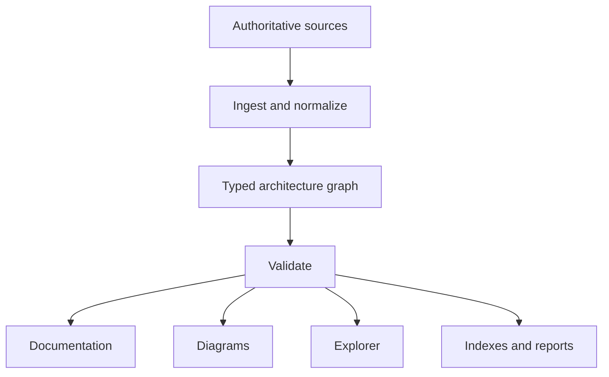

# MSYS2 Architecture Knowledge Base

The MSYS2 Architecture Knowledge Base (AKB) is a documentation-as-code project
for the MSYS2, MinGW-w64, GNU, LLVM, Windows, and Git for Windows ecosystems.
It treats architecture documentation as a set of generated, evidence-backed
views over a versioned machine-readable model.

## Governing principles

1. The authored model plus verified generated projections are the source of truth.
2. Every modeled object has a stable, linkable identifier.
3. Every nontrivial factual claim is traceable to evidence.
4. Generated views are reproducible and are not edited by hand.
5. Current state, historical state, variants, and uncertainty are explicit.
6. Architectural depth is navigable from ecosystem to source-unit level.
7. Content is designed for continuous refresh as upstream projects change.

## Project layout

| Path | Purpose |
| --- | --- |
| `charter/` | Governing scope, quality bar, and decisions |
| `model/` | Canonical entities, relationships, schemas, and controlled vocabularies |
| `docs/` | Authored narrative organized into 20 volumes |
| `evidence/` | Source registry, citations, snapshots, and provenance |
| `diagrams/` | Diagram specifications and generated visual outputs |
| `explorer/` | Interactive architecture explorer |
| `tools/` | Validation, ingestion, transformation, and generation |
| `generated/` | Reproducible indexes, reports, and derived data |
| `tests/` | Model, content, link, and generation tests |

## Architecture object identity

IDs are lowercase, immutable, globally unique, and namespaced:

```text
<kind>:<authority-or-domain>:<canonical-name>[@<variant>]
```

Examples:

```text
environment:msys2:ucrt64
runtime:msys2:msys-2.0.dll
package:msys2:mingw-w64-ucrt-x86_64-gcc
executable:msys2:/usr/bin/bash.exe
repository:msys2:ucrt64
library:windows:ucrt
```

Names and locations may change. IDs do not. Aliases and replacement
relationships preserve discoverability.

## Model-first workflow



## Validate and explore

Requires Python 3.11 or later and uses only the standard library:

```bash
python tools/akb.py validate
python tools/akb.py generate
python tools/akb.py all
python tools/build_explorer.py
```

Generated files are written beneath `generated/`; open
`generated/explorer/index.html` for the static, deep-linkable architecture
explorer. Its typed views include layers, packages, artifacts, libraries,
runtimes, toolchains, repositories, and objects with attached evidence. A
view projects by entity kind, by tag, or by both — see
[explorer domain views](docs/EXPLORER-DOMAIN-VIEWS.md).

The checked-in official catalog snapshot includes package, library-candidate,
and reverse-dependency-impact views in `generated/`. Start with the linked
[Level 0 and Level 1 diagrams](docs/DIAGRAM-HIERARCHY.md), then drill into the
Explorer or snapshot-qualified reports.

For a compact, stable entry for every composed object, use the generated
[object dossiers](generated/object-dossiers.md). Each dossier records the
object's identity, type, status, attached evidence references, and incoming
and outgoing relationship counts. An absent evidence reference is reported as
`none recorded`; it is not an assertion that the object has been verified.

### Start the Explorer

Generate the Explorer, then open the HTML file in a browser. No package
installation, build server, or database service is required:

```powershell
py -3 tools/build_explorer.py
Start-Process .\generated\explorer\index.html
```

For a local HTTP origin instead, serve the generated directory and browse to
the printed address:

```powershell
py -3 -m http.server 8000 --directory generated\explorer
```

## Continuous refresh

The package catalog and deep artifact inventory can be refreshed directly from
an MSYS2 installation:

```powershell
pwsh ./tools/Update-Akb.ps1 -Msys2Root C:\msys64
```

The refresh captures immutable evidence snapshots, verifies hashes and record
counts, updates the generated package and artifact projections, reports
additions, removals, version changes, artifact changes, DLL relationships, and
regenerates AKB views. See
[`docs/SELF-UPDATING-KNOWLEDGE-BASE.md`](docs/SELF-UPDATING-KNOWLEDGE-BASE.md).

The refresh also captures a bounded, non-secret runtime observation for the
selected MSYS2 environment. See
[`docs/RUNTIME-OBSERVATION-CONTRACT.md`](docs/RUNTIME-OBSERVATION-CONTRACT.md).
The collector/importer boundary is specified in
[`docs/DEEP-INVENTORY-CONTRACT.md`](docs/DEEP-INVENTORY-CONTRACT.md).

Large full-repository file projections can be retained locally rather than in
Git; see [`docs/LOCAL-EVIDENCE-RETENTION.md`](docs/LOCAL-EVIDENCE-RETENTION.md)
for their scope, regeneration path, and publication boundary.

### Offline and archive-based evidence

The same evidence pipeline can ingest package metadata and payloads without
installing them:

```powershell
py -3 tools/import_repository_db.py C:\cache\msys.db `
    --repository msys --output work\catalog-from-db
py -3 tools/import_package_catalog.py work\catalog-from-db

py -3 tools/analyze_package_archive.py C:\cache\sample.pkg.tar `
    --package sample --output work\sample-archive
py -3 tools/import_deep_inventory.py work\sample-archive
```

Repository databases are read in-stream and package payloads are statically
analyzed without installation or execution. See
[`docs/REPOSITORY-DATABASE-IMPORT.md`](docs/REPOSITORY-DATABASE-IMPORT.md) and
[`docs/PACKAGE-ARCHIVE-ANALYSIS.md`](docs/PACKAGE-ARCHIVE-ANALYSIS.md).

For statically discovered PKGBUILD sources, verify downloaded HTTP(S) payloads
against aligned SHA-256 declarations without executing or extracting them:

```powershell
py -3 tools/verify_recipe_sources.py work\inventory\recipes.jsonl `
    --output work\recipe-source-verification
```

See [`docs/RECIPE-SOURCE-VERIFICATION.md`](docs/RECIPE-SOURCE-VERIFICATION.md)
for outcomes and download bounds.

### Operations policy

The source registry and machine-readable refresh policy define per-source
cadence, retention, and alert thresholds. Validate policy changes with:

```bash
python tools/validate_refresh_policy.py
```

See [`docs/MULTI-SOURCE-REFRESH-POLICY.md`](docs/MULTI-SOURCE-REFRESH-POLICY.md).

## Current maturity

This repository is an evidence-backed architecture knowledge base with its
foundation, inventory pipeline, ecosystem model, runtime/package-management,
toolchain, Git for Windows, Explorer, and operations increments complete. It
includes the governing metamodel, reproducible projections, static explorer,
continuous refresh policy, and operational workflows. See the
[roadmap](ROADMAP.md) for the completed scope.
