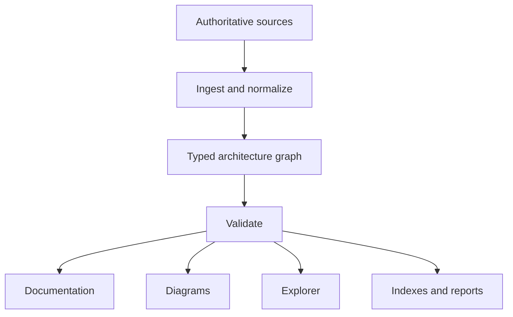

# MSYS2 Architecture Knowledge Base

The MSYS2 Architecture Knowledge Base (AKB) is a documentation-as-code project
for the MSYS2, MinGW-w64, GNU, LLVM, Windows, and Git for Windows ecosystems.
It treats architecture documentation as a set of generated, evidence-backed
views over a versioned machine-readable model.

## Governing principles

1. The authored model plus verified generated projections are the source of truth.
2. Every modeled object has a stable, linkable identifier.
3. Every nontrivial factual claim is traceable to evidence.
4. Generated views are reproducible and are not edited by hand.
5. Current state, historical state, variants, and uncertainty are explicit.
6. Architectural depth is navigable from ecosystem to source-unit level.
7. Content is designed for continuous refresh as upstream projects change.

## Project layout

| Path | Purpose |
| --- | --- |
| `charter/` | Governing scope, quality bar, and decisions |
| `model/` | Canonical entities, relationships, schemas, and controlled vocabularies |
| `docs/` | Authored narrative organized into 20 volumes |
| `evidence/` | Source registry, citations, snapshots, and provenance |
| `diagrams/` | Diagram specifications and generated visual outputs |
| `explorer/` | Interactive architecture explorer |
| `tools/` | Validation, ingestion, transformation, and generation |
| `generated/` | Reproducible indexes, reports, and derived data |
| `tests/` | Model, content, link, and generation tests |

## Architecture object identity

IDs are lowercase, immutable, globally unique, and namespaced:

```text
<kind>:<authority-or-domain>:<canonical-name>[@<variant>]
```

Examples:

```text
environment:msys2:ucrt64
runtime:msys2:msys-2.0.dll
package:msys2:mingw-w64-ucrt-x86_64-gcc
executable:msys2:/usr/bin/bash.exe
repository:msys2:ucrt64
library:windows:ucrt
```

Names and locations may change. IDs do not. Aliases and replacement
relationships preserve discoverability.

## Model-first workflow



## Initial commands

Requires Python 3.11 or later and uses only the standard library:

```bash
python tools/akb.py validate
python tools/akb.py generate
python tools/akb.py all
```

Generated files are written beneath `generated/`.

## Continuous refresh

The package and dependency catalog can be refreshed directly from an MSYS2
installation:

```powershell
pwsh ./tools/Update-Akb.ps1 -Msys2Root C:\msys64
```

The refresh captures immutable evidence snapshots, verifies hashes and record
counts, updates the generated catalog projection, reports additions, removals,
and version changes, and regenerates AKB views. See
[`docs/SELF-UPDATING-KNOWLEDGE-BASE.md`](docs/SELF-UPDATING-KNOWLEDGE-BASE.md).

## Current maturity

This foundation is **AKB Bootstrap 0.2**. It defines the governing charter,
information architecture, machine-readable metamodel, starter graph, evidence
rules, regeneration entry point, and first self-updating evidence pipeline.
Detailed ecosystem research and the interactive explorer are subsequent
controlled increments.
