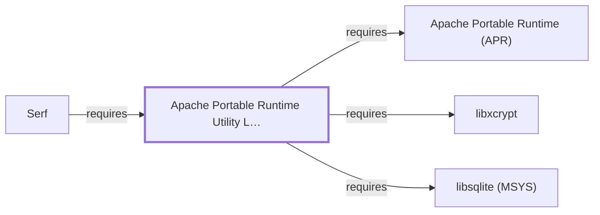

# APR-util (MSYS)

<!-- BEGIN GENERATED object-facts -->

| Model fact | Value |
| --- | --- |
| Object | `library:apache:apr-util@msys` |
| Kind | `library` |
| Status | `partial` |
| Confidence | `high` |
| Authority | Apache Software Foundation |
| Environments | `msys` |
| Upstream | <https://apr.apache.org/> |
| Packaged as | `package:msys2:apr-util` |
| Version (observed) | 1.6.3-2 |
| License (observed) | spdx:Apache-2.0 |
| Architecture (observed) | x86_64 |
| Installed size (observed) | 129.5 KB |

**Evidence on this object**

- `evidence:apache:apr-manual-2026-08-02` — Apache Portable Runtime (official project site) (`primary`, retrieved 2026-08-02)
- `evidence:catalog:current` — MSYS2 pacman package catalog (`observed`, retrieved 2026-07-29)

Generated from the composed model by `tools/build_object_facts.py`. Observed values come from the catalog snapshot and change when it is refreshed.
Edits between the surrounding markers are overwritten on the next build.

<!-- END GENERATED object-facts -->

## Purpose

This page documents `package:msys2:apr-util`, a companion library to
the [Apache Portable Runtime](APR-MSYS.md) providing higher-level
abstractions (XML parsing, database-access drivers, URI handling) built
on top of APR's own system abstractions. See the
[official APR project site](https://apr.apache.org/) for the full
reference.

## Architectural Classification

`library:apache:apr-util@msys` is packaged as `package:msys2:apr-util`
(version `1.6.3-2` in the current catalog snapshot, license
`Apache-2.0`), developed by the Apache Software Foundation. It belongs
to the MSYS environment.

## Responsibilities

- Providing database-access drivers (including SQLite, per Dependencies
  below), XML parsing helpers, and URI/date utility functions on top of
  APR's own cross-platform abstractions, consumed by
  [Serf](LIBSERF-MSYS.md) and `subversion`.

## Boundaries

APR-util provides higher-level utility abstractions specifically; the
underlying system-call abstraction layer (memory pools, file I/O,
threading) is provided by [APR](APR-MSYS.md) itself, which APR-util
depends on rather than duplicates.

## Interfaces

- The APR-util C API (`apr_dbd_*` database-driver functions,
  `apr_xml_*` XML parsing functions, `apr_uri_*` URI helpers), per the
  project documentation.

## Dependencies

The catalog snapshot records four `runtime-depends-on` edges for
`package:msys2:apr-util`; three are modeled in this knowledge base:

| Dependency | Package | Architectural reason |
| --- | --- | --- |
| [APR](APR-MSYS.md) | `package:msys2:apr` | APR-util is a companion library built directly atop APR's own abstractions. |
| [libsqlite (MSYS)](LIBSQLITE-MSYS.md) | `package:msys2:libsqlite` | Backs APR-util's optional SQLite database-access driver. |
| [libxcrypt](LIBXCRYPT.md) | `package:msys2:libxcrypt` | Backs `crypt()`-family password hashing used by APR-util's own password-handling utility functions. |

The fourth, `package:msys2:expat`, is **not** modeled as a dependency
edge from this entity: it is a distinct MSYS catalog package from
`package:msys2:libexpat` (already documented on
[Expat (MSYS)](EXPAT-MSYS.md)), the same kind of similarly-named-but-
separate meta-package distinction already drawn for `pcre`/`pcre2`
elsewhere in this volume (see [libbz2](LIBBZ2.md#reverse-dependencies)).
This page does not attribute the dependency to the Expat (MSYS) entity,
since it belongs to the separate, not-yet-modeled `expat` package
instead.

## Reverse Dependencies

The catalog snapshot records 3 relationships targeting
`package:msys2:apr-util`: `apr-util-devel`,
[Serf](LIBSERF-MSYS.md)
(`relationship:foundation-libraries:libserf-requires-apr-util`, added
2026-08-02), and `subversion` (not yet a modeled entity in this
knowledge base). See the
[reverse dependency impact analysis](REVERSE-DEPENDENCY-IMPACT-ANALYSIS.md)
for the current full list.

## Configuration

APR-util has no persistent configuration file of its own; its behavior
is determined entirely by how the calling program uses its API.

## Initialization and Execution Flow

As a library, APR-util has no independent process lifecycle: it
initializes and executes within the process of whatever program links
against it — [Serf](LIBSERF-MSYS.md) and, transitively, `subversion` in
this dependency chain.

## Runtime Behavior

APR-util's database-driver abstraction dispatches to whichever backend
(SQLite, per Dependencies above) is configured at build or runtime by
the consuming program.

## Compatibility and Variants

Whether other native environments (UCRT64, CLANG64, i686) in this
catalog package APR-util separately was not confirmed while writing
this page; this is recorded as an open item rather than assumed either
way.

## Security Considerations

As a dependency of Serf's HTTP/WebDAV transport, a defect here could
touch network-facing code paths; this page does not assert this
specific package version's mitigation status. See
[Threat Model and Supply Chain](THREAT-MODEL-AND-SUPPLY-CHAIN.md) for
the project's general supply-chain posture; no version-qualified CVE
review has been performed for the recorded `1.6.3-2` version.

## Failure Modes and Diagnostics

A dependent program's database-driver or XML-parsing failure should be
checked against APR-util's own error codes before being treated as a
defect in the consuming program's own logic.

## Evidence, Assumptions, and Open Questions

Utility-abstraction scope is backed by the official APR project site
(`evidence:apache:apr-manual-2026-08-02`), the same evidence record
[APR](APR-MSYS.md) cites. Package identity, version, license, and three
of four recorded dependency edges are backed by the pacman catalog
snapshot (`evidence:catalog:current`). Open: whether other native
environments package APR-util separately was not confirmed; the
`expat` sub-dependency is a distinct, not-yet-modeled catalog package
(see Dependencies above); and `subversion` is not yet a modeled entity
in this knowledge base.

<!-- BEGIN GENERATED dependency-subgraph -->

## Dependency Diagram

Dependencies and dependents of `library:apache:apr-util@msys` in the composed graph: 1 dependent and 3 dependencies.

Generated from the composed model by `tools/build_object_diagrams.py`.
Edits between the surrounding markers are overwritten on the next build.

<!-- END GENERATED dependency-subgraph -->

## Related Objects

- [MSYS2 Library Architecture](LIBRARIES-ARCHITECTURE.md)
- [APR](APR-MSYS.md)
- [libsqlite (MSYS)](LIBSQLITE-MSYS.md)
- [libxcrypt](LIBXCRYPT.md)
- [Expat (MSYS)](EXPAT-MSYS.md)
- [Serf](LIBSERF-MSYS.md)
