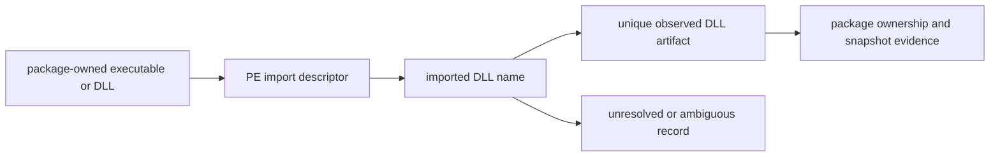

# Binary-to-DLL Dependency Graph Model

The binary-to-DLL graph is derived from PE import descriptors in verified
artifact observations. It models static import declarations, not a claim that
the Windows loader resolved a particular DLL during a particular execution.

| Graph object | Identity rule | Evidence rule | Excluded conclusion |
| --- | --- | --- | --- |
| Importing binary | Package-owned artifact path plus observed hash/snapshot | PE analysis of available bytes | Runtime execution or successful load |
| Imported DLL name | Case-normalized name from PE descriptor | Original descriptor retained in inventory | Unique filesystem target |
| DLL artifact target | Unique candidate artifact in the same qualified projection | Package ownership and byte observation | Loader selection across `PATH`, app-local, or system locations |
| `imports-dll` edge | Importing artifact to uniquely resolved DLL artifact | Source/target plus snapshot evidence | ABI compatibility, symbol availability, or transitive closure |
| Unresolved record | Descriptor that lacks a safe unique target | Snapshot, reason, and candidate set when applicable | A fabricated graph edge |

## Projection Rules

1. Emit `imports-dll` only when the importing artifact and a unique observed
   target can be resolved in the same qualified inventory projection.
2. Keep duplicate DLL basenames, API-set names, delay-load behavior, missing
   bytes, and targets outside the collected scope as explicit unresolved or
   ambiguous records.
3. Maintain directional import edges; generate reverse consumers at query time
   rather than storing duplicate inverse edges.
4. Keep PE imports separate from package dependencies, link inputs, and
   observed loader modules. Each answers a different compatibility question.
5. Bind all binary-derived metadata to the artifact hash and parser version;
   a package upgrade invalidates any unqualified binary assertion.

## Diagnostic Sequence

1. Identify the exact executable or DLL by path, package, snapshot, and hash.
2. Read its PE import descriptors without executing it.
3. Resolve candidate targets only within the qualified artifact projection.
4. Inspect unresolved records before reporting a missing or ambiguous DLL.
5. Use controlled runtime observation separately when the question is actual
   loader behavior rather than static dependency declaration.

## Related Views

- [Package-to-file inventory](PACKAGE-FILE-INVENTORY.md)
- [Deep inventory evidence contract](DEEP-INVENTORY-CONTRACT.md)
- [Git for Windows transport boundaries](GIT-FOR-WINDOWS-TRANSPORT-BOUNDARIES.md)
