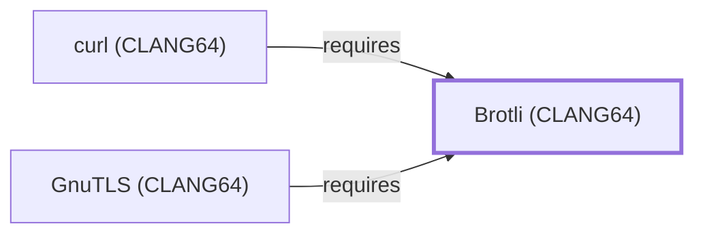

# Brotli (CLANG64)

<!-- BEGIN GENERATED object-facts -->

| Model fact | Value |
| --- | --- |
| Object | `library:google:brotli@clang64` |
| Kind | `library` |
| Status | `partial` |
| Confidence | `high` |
| Authority | Google |
| Environments | `clang64` |
| Upstream | <https://github.com/google/brotli> |
| Packaged as | `package:msys2:mingw-w64-clang-x86_64-brotli` |
| Version (observed) | 1.2.0-1 |
| License (observed) | spdx:MIT |
| Architecture (observed) | any |
| Installed size (observed) | 2.1 MB |

**Evidence on this object**

- `evidence:catalog:current` — MSYS2 pacman package catalog (`observed`, retrieved 2026-07-29)
- `evidence:google:brotli-manual-2026-07-30` — Brotli (GitHub project page) (`primary`, retrieved 2026-07-30)

Generated from the composed model by `tools/build_object_facts.py`. Observed values come from the catalog snapshot and change when it is refreshed.
Edits between the surrounding markers are overwritten on the next build.

<!-- END GENERATED object-facts -->

## Purpose

This page documents `package:msys2:mingw-w64-clang-x86_64-brotli`, the
CLANG64-environment build of Google's Brotli general-purpose
compression library — a separately built, separate catalog entity
from [Brotli (UCRT64)](BROTLI-UCRT64.md) and [Brotli (MSYS)](BROTLI.md).
See the [official Brotli project page](https://github.com/google/brotli)
for the full reference.

## Architectural Classification

`library:google:brotli@clang64` is packaged as
`package:msys2:mingw-w64-clang-x86_64-brotli` (version `1.2.0-1` in the
current catalog snapshot, license `MIT`) — the same version number as
the UCRT64 and MSYS siblings, but a separately built, separate catalog
entity. It belongs to the CLANG64 environment.

## Responsibilities

- Providing Brotli compression and decompression for CLANG64-native
  consumers, the same role
  [Brotli (UCRT64)](BROTLI-UCRT64.md#responsibilities) documents for
  its own environment.

## Boundaries

This page's package serves CLANG64-environment consumers specifically;
[curl (UCRT64)](CURL-UCRT64.md) instead depends on
[Brotli (UCRT64)](BROTLI-UCRT64.md#reverse-dependencies) — the two are
not interchangeable, matching the same distinction already drawn
throughout this volume for MSYS/UCRT64/CLANG64 sibling triples.

## Interfaces

- A C API (`BrotliDecoderDecompress`, `BrotliEncoderCompress`, and
  streaming variants) for Brotli compression and decompression, the
  same interface [Brotli (UCRT64)](BROTLI-UCRT64.md#interfaces)
  documents, per the documentation.

## Dependencies

The catalog snapshot records no `runtime-depends-on` edges for
`package:msys2:mingw-w64-clang-x86_64-brotli` beyond standard toolchain
runtime support — the same zero-dependency footprint already documented
for [Brotli (UCRT64)](BROTLI-UCRT64.md#dependencies).

## Reverse Dependencies

The catalog snapshot records 19 relationships targeting
`package:msys2:mingw-w64-clang-x86_64-brotli`. Two are now modeled in
this knowledge base: [curl (CLANG64)](CURL-CLANG64.md)
(`relationship:foundation-libraries:curl-clang64-requires-brotli-clang64`,
added 2026-08-02) and [GnuTLS (CLANG64)](GNUTLS-CLANG64.md)
(`relationship:foundation-libraries:gnutls-clang64-requires-brotli-clang64`,
added 2026-08-02). The remaining ~17 recorded dependents (a broad mix
of other CLANG64 packages including `arrow`, `android-tools`, `exiv2`,
`freetype`, and others) are not individually modeled as entities in
this knowledge base; see the
[reverse dependency impact analysis](REVERSE-DEPENDENCY-IMPACT-ANALYSIS.md)
for the current full list.

## Configuration

Brotli has no persistent configuration file; compression level and
parameters are set entirely through its C API by the calling program.

## Initialization and Execution Flow

As a library, Brotli has no independent process lifecycle: it
initializes and executes within the process of whatever program links
against it. As a native MinGW-w64 library, this process model is
Windows-facing directly rather than mediated by `msys-2.0.dll`.

## Runtime Behavior

Identical functional behavior to [Brotli (UCRT64)](BROTLI-UCRT64.md);
see that page for detail not specific to the CLANG64/UCRT64 packaging
distinction.

## Compatibility and Variants

The CLANG64, UCRT64, and MSYS Brotli packages are three separately
versioned catalog entities (see Architectural Classification); code
built against one is not automatically compatible with another without
matching the correct package/environment.

## Security Considerations

Decompressing untrusted Brotli-encoded data is a documented general
source of decompression-related risk (such as decompression-bomb
resource exhaustion); this page does not assert this specific package
version's mitigation status. See
[Threat Model and Supply Chain](THREAT-MODEL-AND-SUPPLY-CHAIN.md) for
the project's general supply-chain posture; no version-qualified CVE
review has been performed for the recorded `1.2.0-1` version.

## Failure Modes and Diagnostics

A dependent program's Brotli decompression failure should be checked
against the input data's actual compression format before being
treated as a Brotli defect, the same triage order documented for
[Brotli (UCRT64)](BROTLI-UCRT64.md#failure-modes-and-diagnostics).

## Evidence, Assumptions, and Open Questions

Brotli compression scope is backed by the official Brotli project page
(`evidence:google:brotli-manual-2026-07-30`), the same evidence record
[Brotli (UCRT64)](BROTLI-UCRT64.md) cites. Package identity, version,
and license are backed by the pacman catalog snapshot
(`evidence:catalog:current`). Open: the ~17 remaining recorded reverse dependents
are not individually modeled in this knowledge base.

<!-- BEGIN GENERATED dependency-subgraph -->

## Dependency Diagram

Dependencies and dependents of `library:google:brotli@clang64` in the composed graph: 2 dependents and 0 dependencies.

Generated from the composed model by `tools/build_object_diagrams.py`.
Edits between the surrounding markers are overwritten on the next build.

<!-- END GENERATED dependency-subgraph -->

## Related Objects

- [MSYS2 Library Architecture](LIBRARIES-ARCHITECTURE.md)
- [Brotli (UCRT64)](BROTLI-UCRT64.md)
- [Brotli (MSYS)](BROTLI.md)
- [curl (CLANG64)](CURL-CLANG64.md)
- [GnuTLS (CLANG64)](GNUTLS-CLANG64.md)
