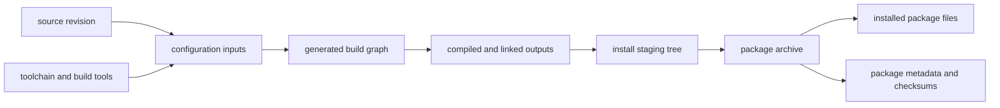

# Generated Artifact and Build-Flow Mappings

Build-flow mappings explain how a selected source revision and configuration
produce observed outputs without collapsing distinct stages into one
``built-from`` assertion. The canonical graph keeps the recipe, package
artifact, and installed artifact separate.

The [Level 6 toolchain flow](../diagrams/level-6-toolchain-build-flow.svg)
links this model to toolchain, artifact, and evidence Explorer views.

| Stage | Mapping object | Evidence needed | Do not infer |
| --- | --- | --- | --- |
| Source selection | Upstream revision and downstream patch set | Commit/tag, patch list, retrieval identity | That a source tree matches a released binary |
| Configuration | Environment, generator, toolchain file, flags, and dependency selection | Effective configuration files, command line, tool versions | That default tool settings were used |
| Build graph | Makefiles, `build.ninja`, or generator-native graph | Generated graph and declared inputs | That every declared rule executed |
| Compile and link | Object files, libraries, executables, and linker inputs | Build log plus output hashes and PE/archive analysis | Runtime DLL resolution from link metadata alone |
| Install staging | Prefix-relative files prepared for packaging | Staging manifest and ownership mapping | That staging files equal deployed files |
| Package archive | Versioned distributable package and metadata | Archive checksum, signature/provenance, package file list | That repository metadata proves archive bytes |
| Installed files | Files deployed by a particular transaction | Local package database and static artifact observation | That an installed file was generated by the current build |

## Canonical Mapping Rules

1. Use directional, snapshot-bound relationships: recipe-to-package,
   package-to-archive, and package-to-installed-artifact are not substitutes
   for one another.
2. Link a generated output to its configuration and toolchain only when the
   build record identifies the exact run; otherwise retain it as an unresolved
   or lower-confidence association.
3. Model compile-time dependency declarations, link inputs, package
   dependencies, and observed DLL imports as separate edge classes.
4. Normalize paths relative to the selected build, staging, or package root.
   Do not retain machine-specific absolute paths as portable architecture facts.
5. Treat reproducibility as a comparison result over qualified builds and
   output hashes, not a promise from a recipe or build-system choice.

## Collection Sequence

1. Identify source, patches, environment, toolchain, and configuration inputs.
2. Preserve generated build-graph files before executing or packaging outputs.
3. Hash compiled/linked outputs and inspect their static format metadata.
4. Capture the staging manifest, package archive identity, and installed-file
   observation as independent evidence records.
5. Import only verified observations so all graph facts reference their
   snapshot and retain unresolved mappings where proof is incomplete.

## Worked example: zlib, reaching and stopping at Compile and link

[Source code organization](SOURCE-CODE-ORGANIZATION.md#bounded-provenance-slice-zlib)
already records a controlled local build attempt that exercises three of
this table's stages, previously not cross-linked from here:

| Stage | What was actually done |
| --- | --- |
| Source selection | The retained `zlib/PKGBUILD` declared `zlib-1.3.2.tar.xz` and a SHA-256; a local retrieval of that exact URL matched the declared digest — Source selection evidence, not proof the installed DLL was built from it (see the linked page's own caveat). |
| Configuration | The recipe's two local patches matched their declared SHA-256 values and were verified before application. |
| Build graph / Compile and link | A controlled local build applied both patches successfully, then **failed** compiling `gzlib.c` under MSYS GCC `15.3.0`, which referenced `lseek` without a visible declaration — a version-qualified failed-build observation, not evidence the recipe or installed DLL is invalid. |
| Install staging / Package archive / Installed files | Not reached by this attempt; the installed `zlib 1.3.2-1` and `/usr/bin/msys-z.dll` observed separately are ownership evidence only, per this table's own "Do not infer" column — this attempt does not connect them to the failed local build. |

This is exactly the failure mode Canonical Mapping Rule 5 anticipates:
the attempt stopped mid-pipeline, so no reproducibility comparison over
qualified output hashes is possible here, and none is claimed. It
remains this knowledge base's only concrete instance of this page's
methodology; every other documented package/library still has only the
abstract stage table above, no worked attempt.

## Related Views

- [Build system role model](BUILD-SYSTEM-ROLE-MODEL.md)
- [Toolchain role model](TOOLCHAIN-ROLE-MODEL.md)
- [Deep inventory evidence contract](DEEP-INVENTORY-CONTRACT.md)
- [Source code organization](SOURCE-CODE-ORGANIZATION.md)
