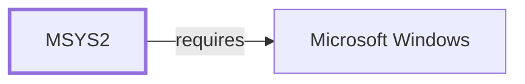

# Which Build Systems the Ecosystem Actually Uses

[The build-system role model](BUILD-SYSTEM-ROLE-MODEL.md) describes what
each build system is for. This page measures which ones the ecosystem
actually reaches for, counted from build- and check-time dependency
declarations in the recipe projection on 2026-08-03.

Counts collapse the five `${MINGW_PACKAGE_PREFIX}` environment variants, so
`mingw-w64-ucrt-x86_64-cmake` and its siblings are one tool.

## The ranking

| Declarations | Build system |
| ---: | --- |
| 4,382 | `ninja` |
| 4,110 | `cmake` |
| 2,575 | `autotools` |
| 2,106 | `pkgconf` |
| 1,010 | `meson` |
| 143 | `make` |
| 28 | `libtool` |
| 14 | `scons` |
| 8 | `waf` |

**Ninja outranks CMake**, which is the shape you would expect once you
notice that ninja is a backend rather than a peer: both CMake and Meson
generate ninja files by default in this ecosystem, so ninja accumulates
declarations from recipes whose *authored* build system is something else.
Reading this table as "ninja is the most popular build system" would invert
what it shows.

**`make` at 143 is not evidence that Make is unused.** Recipes declare
`autotools`, which pulls make transitively; a recipe using autotools has no
reason to name make separately. Absence from a declaration list is not
absence from a build, the same caveat that applies to every count in this
knowledge base derived from `makedepends`.

The three authored build systems, ranked honestly: **CMake 4,110, autotools
2,575, Meson 1,010.** CMake is roughly 1.6× autotools and 4× Meson.

## A quarter of this ecosystem is Python packaging

The build-dependency ranking overall is not led by build systems at all:

| Rank | Declarations | Package |
| ---: | ---: | --- |
| 1 | 4,947 | `gcc` |
| 2 | 4,678 | `clang` |
| 3 | 4,382 | `ninja` |
| 4 | 4,110 | `cmake` |
| 5 | 4,107 | `python-installer` |
| 6 | 4,056 | `python-build` |
| 7 | 3,118 | `python-setuptools` |
| 8 | 2,575 | `autotools` |

**Python packaging tooling occupies ranks 5, 6, and 7 — above autotools.**

That is not an artefact of counting. **4,028 of 15,711 packages, 25.6% of
the catalog, are named `python-*`** — 997 distinct projects before
environment expansion. Of the 4,107 packages that build-depend on
`python-installer`, 3,878 are themselves `python-*` and 229 are not,
including `grpc`, `onnxruntime`, and `dtc`.

So the largest single category of software in MSYS2 by package count is
Python libraries, and the modern PEP 517 toolchain — `python-build`,
`python-installer`, `python-hatchling` at 485 — is as load-bearing here as
any C build system. A description of this ecosystem as a C/C++ toolchain
distribution with some scripting attached does not survive the count.

## What this does not establish

Every figure is a **declaration**, not an observation of a build. No build
was executed to produce this page.

Counts are floors, for the reason
[the library family classification](LIBRARY-FAMILY-CLASSIFICATION.md)
records: a tool needed at both build and run time is declared once, in
`depends`, so `makedepends` under-reports.

Package counts are not project counts. The 25.6% Python figure counts
catalog packages; collapsing environment variants gives 997 distinct Python
projects, and both numbers are true of different questions.

Nothing here measures which build system a package's source *contains* —
only what its recipe declares it needs. A project shipping both
`CMakeLists.txt` and `configure` is counted once, by whichever the recipe
uses.

## Related views

- [Build system role model](BUILD-SYSTEM-ROLE-MODEL.md)
- [Build artifact flow mappings](BUILD-ARTIFACT-FLOW-MAPPINGS.md)
- [Source code organization](SOURCE-CODE-ORGANIZATION.md)
- [The shape of the dependency graph](DEPENDENCY-GRAPH-SHAPE.md)

<!-- BEGIN GENERATED dependency-subgraph -->

## Dependency Diagram

Dependencies and dependents of `ecosystem:msys2:msys2` in the composed graph: 0 dependents and 1 dependency.

Generated from the composed model by `tools/build_object_diagrams.py`.
Edits between the surrounding markers are overwritten on the next build.

<!-- END GENERATED dependency-subgraph -->
