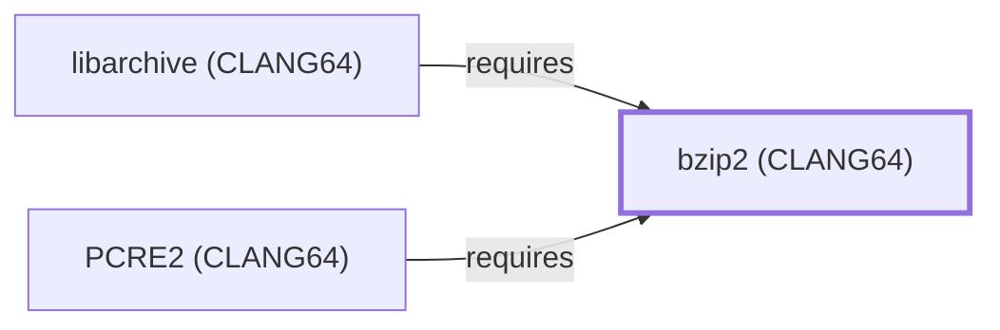

# bzip2 (CLANG64)

<!-- BEGIN GENERATED object-facts -->

| Model fact | Value |
| --- | --- |
| Object | `library:bzip2:bzip2@clang64` |
| Kind | `library` |
| Status | `partial` |
| Confidence | `high` |
| Authority | Julian Seward |
| Environments | `clang64` |
| Upstream | <https://sourceware.org/bzip2/> |
| Packaged as | `package:msys2:mingw-w64-clang-x86_64-bzip2` |
| Version (observed) | 1.0.8-3 |
| License (observed) | custom |
| Architecture (observed) | any |
| Installed size (observed) | 404.3 KB |

**Evidence on this object**

- `evidence:bzip2:project-site-2026-07-30` — bzip2 and libbzip2 (official project site) (`primary`, retrieved 2026-07-30)
- `evidence:catalog:current` — MSYS2 pacman package catalog (`observed`, retrieved 2026-07-29)

Generated from the composed model by `tools/build_object_facts.py`. Observed values come from the catalog snapshot and change when it is refreshed.
Edits between the surrounding markers are overwritten on the next build.

<!-- END GENERATED object-facts -->

## Purpose

This page documents `package:msys2:mingw-w64-clang-x86_64-bzip2`, the
CLANG64-environment build of bzip2 — the Burrows-Wheeler compression
codec. Unlike the MSYS environment's CLI/`libbz2` split (see
[bzip2 (MSYS)](BZIP2.md) and [libbz2](LIBBZ2.md)), this CLANG64
package bundles both the CLI tool and its library together in one
package, the same non-split pattern documented for
[OpenSSL (CLANG64)](OPENSSL-CLANG64.md). It is the base of a chain
this batch modeled toward
[libarchive (CLANG64)](LIBARCHIVE-CLANG64.md). See the
[official bzip2 project site](https://sourceware.org/bzip2/) for the
full reference.

## Architectural Classification

`library:bzip2:bzip2@clang64` is packaged as
`package:msys2:mingw-w64-clang-x86_64-bzip2` (version `1.0.8-3` in the
current catalog snapshot, license `custom`), authored by Julian
Seward. It belongs to the CLANG64 environment.

## Responsibilities

- Providing Burrows-Wheeler compression and decompression as both a
  linked library and a CLI tool, consumed by
  [PCRE2 (CLANG64)](PCRE2-CLANG64.md) and
  [libarchive (CLANG64)](LIBARCHIVE-CLANG64.md).

## Boundaries

This page's package serves CLANG64-environment consumers specifically;
[bzip2 (MSYS)](BZIP2.md) and [libbz2](LIBBZ2.md) instead serve
MSYS-environment consumers as a split CLI/library pair — the two are
not interchangeable, matching the same distinction already drawn
throughout this volume for MSYS/UCRT64/CLANG64 sibling packages.

## Interfaces

- The bzip2 C API (`BZ2_bzCompress`, `BZ2_bzDecompress`, and related
  functions), the same interface [libbz2](LIBBZ2.md#interfaces)
  documents, per the documentation.

## Dependencies

The catalog snapshot records no `runtime-depends-on` edges for
`package:msys2:mingw-w64-clang-x86_64-bzip2` beyond standard toolchain
runtime support.

## Reverse Dependencies

The catalog snapshot records 48 relationships targeting
`package:msys2:mingw-w64-clang-x86_64-bzip2`. Two are now modeled in
this knowledge base: [PCRE2 (CLANG64)](PCRE2-CLANG64.md)
(`relationship:foundation-libraries:pcre2-clang64-requires-bzip2-clang64`,
added 2026-08-02) and [libarchive (CLANG64)](LIBARCHIVE-CLANG64.md)
(`relationship:foundation-libraries:libarchive-clang64-requires-bzip2-clang64`,
added 2026-08-02). The remaining ~46 recorded dependents (a broad mix
of CLANG64 packages including `adios2`, `arrow`, `boost-libs`, and
many others) are not individually modeled in this knowledge base; see
the [reverse dependency impact analysis](REVERSE-DEPENDENCY-IMPACT-ANALYSIS.md)
for the current full list.

## Configuration

bzip2 has no persistent configuration file; behavior is controlled
entirely through command-line flags or its C API by the calling
program.

## Initialization and Execution Flow

The CLI is an invoke-run-exit process; the library has no independent
process lifecycle and instead initializes and executes within the
process of whatever program links against it — PCRE2 (CLANG64) or
libarchive (CLANG64) in this dependency chain. As a native MinGW-w64
package, this process model is Windows-facing directly rather than
mediated by `msys-2.0.dll`.

## Runtime Behavior

Identical functional behavior to [bzip2 (MSYS)](BZIP2.md#runtime-behavior)
and [libbz2](LIBBZ2.md#runtime-behavior); see those pages for detail
not specific to the CLANG64 packaging distinction.

## Compatibility and Variants

The CLANG64 package bundles CLI and library together, unlike the
MSYS environment's split; the compressed `.bz2` format itself is
portable across all packagings.

## Security Considerations

Decompressing an untrusted bzip2 stream carries the same general
decompression-scale risk documented for
[bzip2 (MSYS)](BZIP2.md#security-considerations); see
[Threat Model and Supply Chain](THREAT-MODEL-AND-SUPPLY-CHAIN.md) for
the project's general supply-chain posture. No version-qualified CVE
review has been performed for the recorded `1.0.8-3` version.

## Failure Modes and Diagnostics

A dependent program's bzip2 decompression failure should be checked
against the input data's actual bzip2-format validity before being
treated as a defect in the consuming program.

## Evidence, Assumptions, and Open Questions

The compression model is backed by the official bzip2 project site
(`evidence:bzip2:project-site-2026-07-30`), the same evidence record
[bzip2 (MSYS)](BZIP2.md) cites. Package identity, version, license, and
both recorded dependent edges are backed by the pacman catalog
snapshot (`evidence:catalog:current`). Open: the ~46 remaining recorded
reverse dependents are not individually modeled in this knowledge
base.

<!-- BEGIN GENERATED dependency-subgraph -->

## Dependency Diagram

Dependencies and dependents of `library:bzip2:bzip2@clang64` in the composed graph: 2 dependents and 0 dependencies.

Generated from the composed model by `tools/build_object_diagrams.py`.
Edits between the surrounding markers are overwritten on the next build.

<!-- END GENERATED dependency-subgraph -->

## Related Objects

- [MSYS2 Library Architecture](LIBRARIES-ARCHITECTURE.md)
- [bzip2 (MSYS)](BZIP2.md)
- [bzip2 (UCRT64)](BZIP2-UCRT64.md)
- [libbz2](LIBBZ2.md)
- [PCRE2 (CLANG64)](PCRE2-CLANG64.md)
- [libarchive (CLANG64)](LIBARCHIVE-CLANG64.md)
