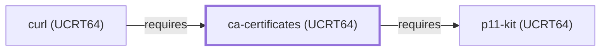

# ca-certificates (UCRT64)

<!-- BEGIN GENERATED object-facts -->

| Model fact | Value |
| --- | --- |
| Object | `library:mozilla:ca-certificates@ucrt64` |
| Kind | `library` |
| Status | `partial` |
| Confidence | `high` |
| Authority | Mozilla |
| Environments | `ucrt64` |
| Upstream | <https://www.mozilla.org/en-US/about/governance/policies/security-group/certs/> |
| Packaged as | `package:msys2:mingw-w64-ucrt-x86_64-ca-certificates` |
| Version (observed) | 20250419-1 |
| License (observed) | MPL;GPL |
| Architecture (observed) | any |
| Installed size (observed) | 1069.58 KiB |

**Evidence on this object**

- `evidence:catalog:current` — MSYS2 pacman package catalog (`observed`, retrieved 2026-08-05)
- `evidence:mozilla:ca-certificates-manual-2026-07-30` — Mozilla CA Certificate Program (`primary`, retrieved 2026-07-30)

Generated from the composed model by `tools/build_object_facts.py`. Observed values come from the catalog snapshot and change when it is refreshed.
Edits between the surrounding markers are overwritten on the next build.

<!-- END GENERATED object-facts -->

## Purpose

This page documents the **UCRT64-environment** ca-certificates package
specifically — a curated bundle of common Certificate Authority root
certificates — depended on by [curl (UCRT64)](CURL-UCRT64.md) to back
TLS certificate-chain verification, closing one of the sub-dependencies
that page's own Dependencies section had left explicitly unmodeled.
See the
[official Mozilla CA certificate policy page](https://www.mozilla.org/en-US/about/governance/policies/security-group/certs/)
for the source of this bundle.

## Architectural Classification

`library:mozilla:ca-certificates@ucrt64` is packaged in the UCRT64
environment as `package:msys2:mingw-w64-ucrt-x86_64-ca-certificates`
(version `20250419-1` in the current catalog snapshot, license
`MPL;GPL`) — a separately built, separate catalog entity from
[ca-certificates (MSYS)](CA-CERTIFICATES.md)'s `ca-certificates`
package. This is the package [curl (UCRT64)](CURL-UCRT64.md) — a
UCRT64-native component itself — actually depends on.

## Responsibilities

- Providing a curated, regularly-updated bundle of trusted root CA
  certificates, consumed by [curl (UCRT64)](CURL-UCRT64.md#dependencies)
  and [OpenSSL (UCRT64)](OPENSSL-UCRT64.md#dependencies) (as an
  optional dependency) to verify TLS certificate chains against a
  trusted root store.

## Boundaries

This page's package serves UCRT64-environment consumers specifically;
[curl (MSYS)](CURL.md) and [libcurl (MSYS)](LIBCURL.md) instead depend
on [ca-certificates (MSYS)](CA-CERTIFICATES.md#reverse-dependencies) —
the two are not interchangeable, matching the same distinction already
made throughout this volume for MSYS/UCRT64 sibling pairs.

## Interfaces

No programmatic API; ca-certificates provides a static certificate
bundle file (typically `cacert.pem` or equivalent) that consuming TLS
libraries read at runtime, the same non-code interface documented for
[ca-certificates (MSYS)](CA-CERTIFICATES.md#interfaces).

## Dependencies

The UCRT64 `package:msys2:mingw-w64-ucrt-x86_64-ca-certificates`
declares one `runtime-depends-on` edge:
[p11-kit (UCRT64)](P11-KIT-UCRT64.md)
(`relationship:foundation-libraries:ca-certificates-ucrt64-requires-p11-kit-ucrt64`,
added 2026-07-30 — closing an item this page had previously left
explicitly unmodeled).

## Reverse Dependencies

**Correction, 2026-07-30**: this page previously stated 10 relationships;
the catalog snapshot actually records **12** targeting
`package:msys2:mingw-w64-ucrt-x86_64-ca-certificates`, including two
previously omitted from the named list below (`curl-gnutls` and
`openssl`, alongside `libressl`, which was also omitted). One is now
modeled in this knowledge base: [curl (UCRT64)](CURL-UCRT64.md)
(`relationship:foundation-libraries:curl-ucrt64-requires-ca-certificates-ucrt64`).
The remaining recorded dependents (`git` — a separate UCRT64-native
git package, distinct from this knowledge base's MSYS
[Git](GIT-MSYS-PACKAGE.md) entity — `mono`, `neon`,
`perl-lwp-protocol-https`, `pidgin`, `python-httplib2`, `qca-qt5`,
`qca-qt6`, `curl-gnutls`, `libressl`, and `openssl`) are not
individually modeled in this knowledge base; see
the [reverse dependency impact analysis](REVERSE-DEPENDENCY-IMPACT-ANALYSIS.md)
for the current full list.

## Configuration

No user-facing configuration; the bundle is updated by upstream Mozilla
releases and repackaged for MSYS2, the same convention documented for
[ca-certificates (MSYS)](CA-CERTIFICATES.md#configuration).

## Initialization and Execution Flow

As a static data package, ca-certificates has no process lifecycle of
its own: it is read from disk by whatever TLS library or program
consumes it — [curl (UCRT64)](CURL-UCRT64.md) in this dependency
chain, typically at TLS-handshake time.

## Runtime Behavior

Identical functional role to
[ca-certificates (MSYS)](CA-CERTIFICATES.md#runtime-behavior); see that
page for detail not specific to the UCRT64/MSYS packaging distinction.

## Compatibility and Variants

The UCRT64 and MSYS ca-certificates packages are separately versioned
catalog entities (see Architectural Classification); a certificate
bundle update to one does not automatically apply to the other without
matching the correct package/environment.

## Security Considerations

The trustworthiness of every TLS connection verified against this
bundle depends on the currency and integrity of its contents; this
page does not assert this specific package version's freshness beyond
its recorded catalog version. See
[Threat Model and Supply Chain](THREAT-MODEL-AND-SUPPLY-CHAIN.md) for
the project's general supply-chain posture.

## Failure Modes and Diagnostics

A curl TLS certificate-verification failure ("unable to get local
issuer certificate" or similar) should be checked against this
package's bundle currency before being treated as a curl defect, the
same triage order documented for
[ca-certificates (MSYS)](CA-CERTIFICATES.md#failure-modes-and-diagnostics).

## Evidence, Assumptions, and Open Questions

Trusted root certificate bundle scope is backed by the official
Mozilla CA certificate policy page
(`evidence:mozilla:ca-certificates-manual-2026-07-30`), the same
evidence record [ca-certificates (MSYS)](CA-CERTIFICATES.md) cites.
Package identity, version, license, and the one modeled dependent edge
are backed by the pacman catalog snapshot (`evidence:catalog:current`).
Open, and explicitly out of scope for this page: the remaining
recorded dependents not individually modeled, and header-level API
surface / PE import/export-level evidence, per the
[Library Family Classification](LIBRARY-FAMILY-CLASSIFICATION.md)
methodology.

<!-- BEGIN GENERATED dependency-subgraph -->

## Dependency Diagram

Dependencies and dependents of `library:mozilla:ca-certificates@ucrt64` in the composed graph: 1 dependent and 1 dependency.

Generated from the composed model by `tools/build_object_diagrams.py`.
Edits between the surrounding markers are overwritten on the next build.

<!-- END GENERATED dependency-subgraph -->

## Related Objects

- [MSYS2 Library Architecture](LIBRARIES-ARCHITECTURE.md)
- [ca-certificates (MSYS)](CA-CERTIFICATES.md)
- [curl (UCRT64)](CURL-UCRT64.md)
- [OpenSSL (UCRT64)](OPENSSL-UCRT64.md)
- [p11-kit (UCRT64)](P11-KIT-UCRT64.md)
- [ca-certificates (CLANG64)](CA-CERTIFICATES-CLANG64.md)
