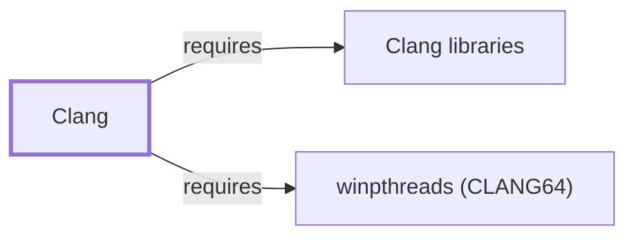

# Clang

<!-- BEGIN GENERATED object-facts -->

| Model fact | Value |
| --- | --- |
| Object | `component:llvm:clang` |
| Kind | `component` |
| Status | `partial` |
| Confidence | `high` |
| Authority | LLVM Project |
| Environments | `clang64` |
| Upstream | <https://clang.llvm.org/> |
| Packaged as | `package:msys2:mingw-w64-clang-x86_64-clang` |
| Version (observed) | 22.1.8-2 |
| License (observed) | spdx:Apache-2.0;WITH;LLVM-exception |
| Architecture (observed) | any |
| Installed size (observed) | 281.99 MiB |

**Evidence on this object**

- `evidence:catalog:current` — MSYS2 pacman package catalog (`observed`, retrieved 2026-08-05)
- `evidence:llvm:clang-manual-2026-07-30` — Clang Documentation (`primary`, retrieved 2026-07-30)

Generated from the composed model by `tools/build_object_facts.py`. Observed values come from the catalog snapshot and change when it is refreshed.
Edits between the surrounding markers are overwritten on the next build.

<!-- END GENERATED object-facts -->

## Purpose

Clang is the C language family (C/C++/Objective-C) frontend for LLVM and
the default compiler driver for LLVM-oriented MinGW-w64 environments
(CLANG64, CLANGARM64). This page documents its architectural role and its
default invocation of [LLD](LLD.md); see the
[official Clang documentation](https://clang.llvm.org/docs/) for the full
language and option reference.

## Architectural Classification

`component:llvm:clang` is packaged per native environment: this page cites
the CLANG64 build, `package:msys2:mingw-w64-clang-x86_64-clang` (version
`22.1.8-2` in the current catalog snapshot, license
`Apache-2.0 WITH LLVM-exception`). Per the
[MSYS2 Toolchain Role Model](TOOLCHAIN-ROLE-MODEL.md), Clang is the
LLVM-oriented compiler driver counterpart to [GCC](GNU-GCC.md)'s role in
GCC-oriented environments; CLANGARM64 has its own separately versioned
Clang package for AArch64, not covered individually here.

## Responsibilities

- Driving the compilation pipeline for C/C++, invoking [LLD](LLD.md) as its
  default backend linker in this environment
  (`relationship:toolchain:clang-invokes-lld`).

## Boundaries

Like [GCC](GNU-GCC.md), this CLANG64 package does **not** depend on
`msys-2.0.dll`: native MinGW-w64 toolchain output and the compiler itself
run against Windows-facing runtime behavior directly, per the
[MSYS2 and MinGW-w64 role model](MSYS2-AND-MINGW-W64-ROLE-MODEL.md). Clang
targets the UCRT and libc++ by default in this environment, a distinct CRT
and C++ library pairing from [GCC](GNU-GCC.md)'s UCRT64/libstdc++ pairing,
per [Runtime Environments](RUNTIME-ENVIRONMENTS.md).

## Interfaces

- The `clang`/`clang++` command-line driver, largely GCC-compatible flag
  syntax by design (`-c`/`-S`/`-E`, `-O`-level optimization, `-std=`), plus
  the `cc` virtual-capability alias this package provides, per the
  documentation.

## Dependencies

The catalog snapshot records seven `runtime-depends-on` edges for
`package:msys2:mingw-w64-clang-x86_64-clang`:

| Dependency | Package | Architectural reason |
| --- | --- | --- |
| Clang's own libraries | `mingw-w64-clang-x86_64-clang-libs` | Clang's own shared libraries (parsing, semantic analysis, code generation), separated from the CLI driver package. Documented fully in [Clang libraries](CLANG-LIBS.md). |
| Compiler runtime support | `mingw-w64-clang-x86_64-compiler-rt` | LLVM's compiler runtime support library (analogous in role to GCC's `libgcc`), providing low-level runtime routines for compiled programs. |
| Backend linker | `mingw-w64-clang-x86_64-lld` | Invoked as Clang's default backend linker (`relationship:toolchain:clang-invokes-lld`), documented fully in [LLD](LLD.md). |
| LLVM command-line tools | `mingw-w64-clang-x86_64-llvm-tools` | Auxiliary LLVM tools (such as `llvm-ar`, `llvm-objdump`) used alongside the compiler. |
| Target C runtime and headers | `mingw-w64-clang-x86_64-crt`, `mingw-w64-clang-x86_64-headers` | The MinGW-w64 CRT and Windows API headers this build targets (UCRT for this environment). |
| Threading | `mingw-w64-clang-x86_64-winpthreads` | Backs POSIX-threads-style threading support for produced programs, the same dependency documented for [GCC](GNU-GCC.md#dependencies). Documented fully in [winpthreads (CLANG64)](WINPTHREADS-CLANG64.md). |

**Correction, 2026-07-30**: the winpthreads dependency above was cited
by package name in this table since this page's first publication, but
had never been backed by a corresponding `requires` graph edge —
`relationship:toolchain:clang-requires-winpthreads-clang64` is now
added to close the gap, the same graph-completeness pattern found for
GCC and Binutils in this session.

An optional dependency on the full `mingw-w64-clang-x86_64-llvm` package
extends this installation with the broader LLVM tool suite beyond what
`llvm-tools` alone provides, when installed.

## Reverse Dependencies

The snapshot records 12 relationships targeting
`package:msys2:mingw-w64-clang-x86_64-clang` — the highest
reverse-dependency count of any toolchain component documented in this
volume so far. See the
[reverse dependency impact analysis](REVERSE-DEPENDENCY-IMPACT-ANALYSIS.md)
for the current full list.

## Configuration

Clang is configured per-invocation via command-line flags rather than a
persistent configuration file, the same model documented for
[GCC](GNU-GCC.md#configuration); `CFLAGS`/`CXXFLAGS`/`LDFLAGS` are a common
build-system convention rather than a Clang-mandated mechanism.

## Initialization and Execution Flow

Clang's driver is an invoke-run-exit process that spawns [LLD](LLD.md) as a
backend child process for linking, the LLVM-oriented parallel to
[GCC](GNU-GCC.md#initialization-and-execution-flow)'s invocation of
[GNU Binutils](GNU-BINUTILS.md). As a native MinGW-w64 program, this
process adaptation is Windows-facing directly rather than mediated by
`msys-2.0.dll`, per the Boundaries section above.

## Runtime Behavior

The [MSYS2 Toolchain Role Model](TOOLCHAIN-ROLE-MODEL.md#controlled-local-build-observations)'s
controlled local build observation recorded on 2026-07-30 that CLANG64
Clang compiled and executed a fixed one-line C program successfully on the
x86_64 observation host. This proves only that exact compiler/environment/
source combination, not general build-pipeline behavior, per that page's
own stated boundary.

## Compatibility and Variants

Clang's flag syntax is largely GCC-compatible by design, but object files
and static libraries produced in CLANG64 (libc++, UCRT) are not
link-compatible with [GCC](GNU-GCC.md)'s UCRT64 output (libstdc++) without
rebuilding, per [Runtime Environments](RUNTIME-ENVIRONMENTS.md#compatibility-and-migration).

## Security Considerations

No Clang-specific vulnerability review has been performed for this volume;
compiler defects that miscompile security-relevant code are the same
general toolchain risk class already noted for [GCC](GNU-GCC.md#security-considerations).
See [Threat Model and Supply Chain](THREAT-MODEL-AND-SUPPLY-CHAIN.md) for
the project's general supply-chain posture; no version-qualified CVE review
has been performed for the recorded `22.1.8-2` version.

## Failure Modes and Diagnostics

Cross-environment link failures (mixing CLANG64 and UCRT64 objects) follow
the same [Runtime Environments](RUNTIME-ENVIRONMENTS.md#compatibility-and-migration)
guidance already cited for GCC; a plain linker error should first be
checked against [LLD](LLD.md#failure-modes-and-diagnostics) since Clang
invokes it as its backend.

## Evidence, Assumptions, and Open Questions

Compiler-driver and invocation behavior are backed by the official Clang
documentation (`evidence:llvm:clang-manual-2026-07-30`). Package identity,
version, license, and all recorded dependency edges are backed by the
pacman catalog snapshot (`evidence:catalog:current`). No open items beyond
the general version-qualified security review noted above.

<!-- BEGIN GENERATED dependency-subgraph -->

## Dependency Diagram

Dependencies and dependents of `component:llvm:clang` in the composed graph: 0 dependents and 2 dependencies.

Generated from the composed model by `tools/build_object_diagrams.py`.
Edits between the surrounding markers are overwritten on the next build.

<!-- END GENERATED dependency-subgraph -->

## Related Objects

- [MSYS2 Toolchain Role Model](TOOLCHAIN-ROLE-MODEL.md)
- [LLD](LLD.md)
- [LLDB](LLDB.md)
- [GCC](GNU-GCC.md)
- [Runtime Environments](RUNTIME-ENVIRONMENTS.md)
- [Clang libraries](CLANG-LIBS.md)
- [winpthreads (CLANG64)](WINPTHREADS-CLANG64.md)
