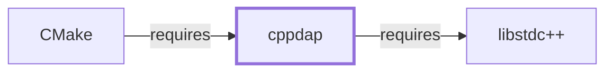

# cppdap

<!-- BEGIN GENERATED object-facts -->

| Model fact | Value |
| --- | --- |
| Object | `library:google:cppdap` |
| Kind | `library` |
| Status | `partial` |
| Confidence | `high` |
| Authority | Google |
| Environments | `ucrt64` |
| Upstream | <https://github.com/google/cppdap> |
| Packaged as | `package:msys2:mingw-w64-ucrt-x86_64-cppdap` |
| Version (observed) | 1.65-1 |
| License (observed) | spdx:Apache-2.0 |
| Architecture (observed) | any |
| Installed size (observed) | 5514.99 KiB |

**Evidence on this object**

- `evidence:catalog:current` — MSYS2 pacman package catalog (`observed`, retrieved 2026-08-05)
- `evidence:google:cppdap-manual-2026-07-30` — cppdap (GitHub project page) (`primary`, retrieved 2026-07-30)

Generated from the composed model by `tools/build_object_facts.py`. Observed values come from the catalog snapshot and change when it is refreshed.
Edits between the surrounding markers are overwritten on the next build.

<!-- END GENERATED object-facts -->

## Purpose

cppdap is a C++ library implementing the Debug Adapter Protocol (DAP), the
protocol IDEs use to communicate with debuggers and debugger-like tools in
an editor-agnostic way. This page documents its architectural role as a
directly-declared dependency of [CMake](CMAKE.md), which uses it to expose
CMake script execution itself to a DAP-compatible debugger; see the
[official cppdap project page](https://github.com/google/cppdap) for the
full API reference.

## Architectural Classification

`library:google:cppdap` is packaged per native environment: this page
cites the UCRT64 build,
`package:msys2:mingw-w64-ucrt-x86_64-cppdap` (version `1.65-1` in the
current catalog snapshot), authored by Google. It belongs to the UCRT64
environment and, like [CMake](CMAKE.md#architectural-classification)
itself and the rest of Volume 8's toolchain components, does not depend
on `msys-2.0.dll`, per the
[MSYS2 and MinGW-w64 role model](MSYS2-AND-MINGW-W64-ROLE-MODEL.md).

## Responsibilities

- Implementing the Debug Adapter Protocol as a C++ library, consumed by
  [CMake](CMAKE.md)'s `--debugger` DAP server, which lets IDEs debug
  `CMakeLists.txt` script execution the same way they would debug
  compiled code.

## Boundaries

cppdap provides the DAP protocol implementation specifically; it does not
implement CMake's own script-execution debugging logic — that logic lives
in CMake itself, with cppdap providing only the protocol transport and
message-framing layer between CMake and a DAP-compatible IDE. cppdap
already appeared by package name in
[CMake's dependency table](CMAKE.md#dependencies) before this page
existed.

## Interfaces

- A C++ API for implementing a DAP server or client, including message
  serialization and the standard DAP request/response/event message
  types, per the documentation.

## Dependencies

The UCRT64 `package:msys2:mingw-w64-ucrt-x86_64-cppdap` declares a
dependency on `mingw-w64-ucrt-x86_64-gcc-libs` only — the GCC runtime
support libraries. This page originally reasoned gcc-libs was not a
library-family dependency distinct enough to warrant its own page;
[libstdc++](LIBSTDCXX.md) now documents that package, so the edge is
modeled (`relationship:foundation-libraries:cppdap-requires-libstdcxx`,
added 2026-07-30).

## Reverse Dependencies

The catalog snapshot records 1 relationship targeting
`package:msys2:mingw-w64-ucrt-x86_64-cppdap`:
`package:msys2:mingw-w64-ucrt-x86_64-cmake`
(`relationship:toolchain:cmake-requires-cppdap` in this knowledge base's
graph) — the narrowest reverse-dependency footprint of any library added
in this batch, reflecting DAP-debugging support as a comparatively
niche CMake feature relative to its other dependencies.

## Configuration

cppdap has no persistent configuration file of its own; DAP server/client
behavior is controlled entirely through its C++ API by the calling
program.

## Initialization and Execution Flow

As a library, cppdap has no independent process lifecycle: it initializes
and executes within the process of whatever program links against it —
[CMake](CMAKE.md) in this dependency chain, specifically when CMake's
`--debugger` flag is used. As a native MinGW-w64 library, this process
model is Windows-facing directly rather than mediated by `msys-2.0.dll`.

## Runtime Behavior

cppdap's DAP server only becomes active when CMake is explicitly invoked
with its `--debugger` flag; it plays no role in an ordinary
`cmake`/`cmake --build` invocation.

## Compatibility and Variants

Whether other native environments (CLANG64, i686) in this catalog package
cppdap separately was not confirmed while writing this page; this is
recorded as an open item rather than assumed either way.

## Security Considerations

cppdap is not itself a security-sensitive component in the usual sense
(no network exposure, no cryptography); its DAP server is a
developer-facing debugging interface, not part of CMake's ordinary build
execution path. See
[Threat Model and Supply Chain](THREAT-MODEL-AND-SUPPLY-CHAIN.md) for the
project's general supply-chain posture; no version-qualified CVE review
has been performed for the recorded `1.65-1` version.

## Failure Modes and Diagnostics

A DAP-debugger connection failure when using CMake's `--debugger` flag
should first be checked against the IDE's own DAP client configuration
before being treated as a cppdap or CMake defect.

## Evidence, Assumptions, and Open Questions

Debug Adapter Protocol implementation scope is backed by the official
cppdap project page (`evidence:google:cppdap-manual-2026-07-30`),
matching the `project_url` already recorded for
`package:msys2:mingw-w64-ucrt-x86_64-cppdap` in the catalog. Package
identity, version, and the recorded dependency/dependent edges are backed
by the pacman catalog snapshot (`evidence:catalog:current`). Open:
whether other native environments package cppdap separately was not
confirmed. Also explicitly out of scope for this page: header-level API
surface and PE import/export-level evidence, per the
[Library Family Classification](LIBRARY-FAMILY-CLASSIFICATION.md)
methodology.

<!-- BEGIN GENERATED dependency-subgraph -->

## Dependency Diagram

Dependencies and dependents of `library:google:cppdap` in the composed graph: 1 dependent and 1 dependency.

Generated from the composed model by `tools/build_object_diagrams.py`.
Edits between the surrounding markers are overwritten on the next build.

<!-- END GENERATED dependency-subgraph -->

## Related Objects

- [MSYS2 Library Architecture](LIBRARIES-ARCHITECTURE.md)
- [CMake](CMAKE.md)
- [Toolchain Role Model](TOOLCHAIN-ROLE-MODEL.md)
