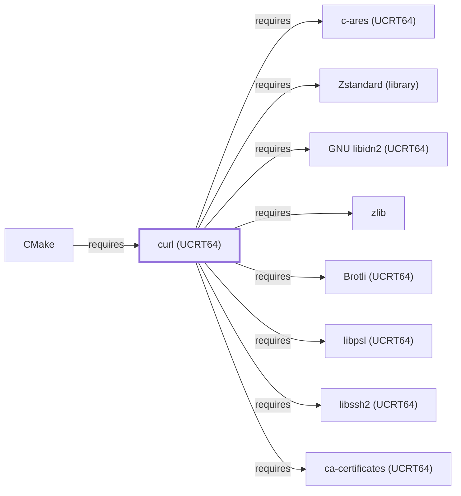

# curl (UCRT64)

<!-- BEGIN GENERATED object-facts -->

| Model fact | Value |
| --- | --- |
| Object | `library:curl:curl@ucrt64` |
| Kind | `library` |
| Status | `partial` |
| Confidence | `high` |
| Authority | curl project |
| Environments | `ucrt64` |
| Upstream | <https://curl.se/> |
| Packaged as | `package:msys2:mingw-w64-ucrt-x86_64-curl` |
| Version (observed) | 8.21.0-2 |
| License (observed) | spdx:MIT |
| Architecture (observed) | any |
| Installed size (observed) | 4.4 MB |

**Evidence on this object**

- `evidence:catalog:current` — MSYS2 pacman package catalog (`observed`, retrieved 2026-07-29)
- `evidence:curl:project-site-2026-07-30` — curl (official project site) (`primary`, retrieved 2026-07-30)

Generated from the composed model by `tools/build_object_facts.py`. Observed values come from the catalog snapshot and change when it is refreshed.
Edits between the surrounding markers are overwritten on the next build.

<!-- END GENERATED object-facts -->

## Purpose

This page documents the **UCRT64-environment** curl package
specifically — a multi-protocol file-transfer CLI/library — depended
on by [CMake](CMAKE.md) to back `file(DOWNLOAD)` and
`ExternalProject`'s network-fetch operations. **Correction, 2026-07-30**:
[CMake's own dependency table](CMAKE.md#dependencies) had claimed this
dependency was "the same library documented fully in [curl](CURL.md)"
— a false claim, since [curl (MSYS)](CURL.md) documents a separate,
MSYS-packaged CLI tool, not this UCRT64-native package. See the
[official curl project site](https://curl.se/) for the full reference.

## Architectural Classification

`library:curl:curl@ucrt64` is packaged in the UCRT64 environment as
`package:msys2:mingw-w64-ucrt-x86_64-curl` (version `8.21.0-2` in the
current catalog snapshot, license `MIT`) — a separately built, separate
catalog entity from both [curl (MSYS)](CURL.md)'s `curl` package and
[libcurl (MSYS)](LIBCURL.md)'s `libcurl` package. Like the MSYS
package, this UCRT64 build bundles both a CLI tool and its transfer
library in one package rather than splitting them, per the MSYS2
packaging convention for this project.

## Responsibilities

- Providing multi-protocol (HTTP/HTTPS/FTP/and others) file-transfer
  functionality as both a CLI tool and linkable library, consumed by
  [CMake](CMAKE.md#dependencies) for its built-in network-fetch
  features.

## Boundaries

This page's package serves UCRT64-environment consumers specifically;
[GnuPG's](GNUPG.md) `dirmngr` and the general MSYS-environment `curl`
CLI instead depend on the MSYS-packaged
[libcurl](LIBCURL.md#reverse-dependencies) and [curl](CURL.md) packages
— the two are not interchangeable, matching the same distinction
already made throughout this volume for MSYS/UCRT64/CLANG64 sibling
groups.

## Interfaces

- The curl CLI (`curl <url>`) and the libcurl C API (`curl_easy_init`,
  `curl_easy_perform`, and related functions), the same interfaces
  [curl (MSYS)](CURL.md#interfaces) and
  [libcurl (MSYS)](LIBCURL.md#interfaces) document, per the
  documentation.

## Dependencies

The UCRT64 `package:msys2:mingw-w64-ucrt-x86_64-curl` declares twelve
`runtime-depends-on` edges — **all twelve now have `requires` edges to
their own UCRT64-native library pages**, completing full dependency
coverage for this package: [zlib](ZLIB.md) (HTTP
`Content-Encoding: gzip`/`deflate` support,
`relationship:foundation-libraries:curl-ucrt64-requires-zlib`),
[Zstandard (library)](LIBZSTD.md) (HTTP `Content-Encoding: zstd`
support, `relationship:foundation-libraries:curl-ucrt64-requires-zstd`),
[OpenSSL (UCRT64)](OPENSSL-UCRT64.md) (HTTPS/TLS support,
`relationship:foundation-libraries:curl-ucrt64-requires-openssl-ucrt64`
— the widest reverse-dependency footprint of any library added this
session at 124 recorded dependents),
[Brotli (UCRT64)](BROTLI-UCRT64.md) (HTTP `Content-Encoding: br`
support, `relationship:foundation-libraries:curl-ucrt64-requires-brotli-ucrt64`),
[libssh2 (UCRT64)](LIBSSH2-UCRT64.md) (`sftp://`/`scp://` support,
`relationship:foundation-libraries:curl-ucrt64-requires-libssh2-ucrt64`),
[c-ares (UCRT64)](C-ARES-UCRT64.md) (asynchronous DNS resolution,
`relationship:foundation-libraries:curl-ucrt64-requires-c-ares-ucrt64`
— the first page in this knowledge base for any c-ares package),
[GNU libidn2 (UCRT64)](GNU-LIBIDN2-UCRT64.md) (internationalized
domain name processing,
`relationship:foundation-libraries:curl-ucrt64-requires-libidn2-ucrt64`),
[libpsl (UCRT64)](LIBPSL-UCRT64.md) (Public Suffix List
cookie-domain-scoping safety,
`relationship:foundation-libraries:curl-ucrt64-requires-libpsl-ucrt64`),
[ca-certificates (UCRT64)](CA-CERTIFICATES-UCRT64.md) (TLS
certificate-chain verification,
`relationship:foundation-libraries:curl-ucrt64-requires-ca-certificates-ucrt64`),
[libnghttp2 (UCRT64)](LIBNGHTTP2-UCRT64.md) (HTTP/2 support,
`relationship:foundation-libraries:curl-ucrt64-requires-libnghttp2-ucrt64`),
[libngtcp2 (UCRT64)](LIBNGTCP2-UCRT64.md) (QUIC transport,
`relationship:foundation-libraries:curl-ucrt64-requires-libngtcp2-ucrt64`),
and [libnghttp3 (UCRT64)](LIBNGHTTP3-UCRT64.md) (HTTP/3 support,
`relationship:foundation-libraries:curl-ucrt64-requires-libnghttp3-ucrt64`).
This mirrors the same full-coverage milestone
[libcurl (MSYS)](LIBCURL.md#dependencies) reached earlier this session.

## Reverse Dependencies

The catalog snapshot records 67 relationships targeting
`package:msys2:mingw-w64-ucrt-x86_64-curl` — the widest
reverse-dependency footprint of any library added in this batch. One is
now modeled in this knowledge base: [CMake](CMAKE.md)
(`relationship:toolchain:cmake-requires-curl-ucrt64`). The remaining
~66 recorded dependents (a broad mix of UCRT64 packages including
`gdal`, `git` (a separate UCRT64-native git package, distinct from this
knowledge base's MSYS [Git](GIT-MSYS-PACKAGE.md) entity), `gnupg` (a
separate UCRT64-native gnupg package, distinct from this knowledge
base's MSYS [GnuPG](GNUPG.md) entity), `octave`, `poppler`, and `qemu`)
are not individually modeled in this knowledge base; see the
[reverse dependency impact analysis](REVERSE-DEPENDENCY-IMPACT-ANALYSIS.md)
for the current full list.

## Configuration

curl has no persistent configuration file by default; a `.curlrc` file
is read if present, the same convention documented for
[curl (MSYS)](CURL.md#configuration).

## Initialization and Execution Flow

The CLI is an invoke-run-exit process; the library has no independent
process lifecycle and instead initializes and executes within the
process of whatever program links against it — [CMake](CMAKE.md) in
this dependency chain. As a native MinGW-w64 package, this process
model is Windows-facing directly rather than mediated by
`msys-2.0.dll`.

## Runtime Behavior

Identical functional behavior to [curl (MSYS)](CURL.md) and
[libcurl (MSYS)](LIBCURL.md); see those pages for protocol-level detail
not specific to the UCRT64/MSYS packaging distinction.

## Compatibility and Variants

The UCRT64 and MSYS curl packages are separately versioned catalog
entities (see Architectural Classification); code or scripts relying on
one are not automatically compatible with the other without matching
the correct package/environment.

## Security Considerations

curl handles network transfers of potentially untrusted data and TLS
certificate validation; this page does not assert this specific package
version's security posture. See
[Threat Model and Supply Chain](THREAT-MODEL-AND-SUPPLY-CHAIN.md) for
the project's general supply-chain posture; no version-qualified CVE
review has been performed for the recorded `8.21.0-2` version.

## Failure Modes and Diagnostics

A CMake `file(DOWNLOAD)` or `ExternalProject` network-fetch failure
should be checked with curl's own verbose/trace diagnostics before
being treated as a CMake defect, the same triage order documented for
[curl (MSYS)](CURL.md#failure-modes-and-diagnostics).

## Evidence, Assumptions, and Open Questions

Multi-protocol file-transfer scope is backed by the official curl
project site (`evidence:curl:project-site-2026-07-30`), the same
evidence record [curl (MSYS)](CURL.md) and
[libcurl (MSYS)](LIBCURL.md) cite, matching the `project_url` already
recorded for `package:msys2:mingw-w64-ucrt-x86_64-curl` in the catalog.
Package identity, version, license, and all twelve modeled
dependency/dependent edges are backed by the pacman catalog snapshot
(`evidence:catalog:current`). Open, and explicitly out of scope for
this page: the ~66 remaining recorded reverse dependents not
individually modeled, and header-level API surface / PE
import/export-level evidence, per the
[Library Family Classification](LIBRARY-FAMILY-CLASSIFICATION.md)
methodology.

<!-- BEGIN GENERATED dependency-subgraph -->

## Dependency Diagram

Dependencies and dependents of `library:curl:curl@ucrt64` in the composed graph: 1 dependent and 12 dependencies, of which 4 are omitted here for legibility.

Generated from the composed model by `tools/build_object_diagrams.py`.
Edits between the surrounding markers are overwritten on the next build.

<!-- END GENERATED dependency-subgraph -->

## Related Objects

- [MSYS2 Library Architecture](LIBRARIES-ARCHITECTURE.md)
- [curl (MSYS)](CURL.md)
- [libcurl (MSYS)](LIBCURL.md)
- [CMake](CMAKE.md)
- [zlib](ZLIB.md)
- [Zstandard (library)](LIBZSTD.md)
- [OpenSSL (UCRT64)](OPENSSL-UCRT64.md)
- [Brotli (UCRT64)](BROTLI-UCRT64.md)
- [libssh2 (UCRT64)](LIBSSH2-UCRT64.md)
- [c-ares (UCRT64)](C-ARES-UCRT64.md)
- [GNU libidn2 (UCRT64)](GNU-LIBIDN2-UCRT64.md)
- [libpsl (UCRT64)](LIBPSL-UCRT64.md)
- [ca-certificates (UCRT64)](CA-CERTIFICATES-UCRT64.md)
- [libnghttp2 (UCRT64)](LIBNGHTTP2-UCRT64.md)
- [libngtcp2 (UCRT64)](LIBNGTCP2-UCRT64.md)
- [libnghttp3 (UCRT64)](LIBNGHTTP3-UCRT64.md)
- [curl (CLANG64)](CURL-CLANG64.md)
