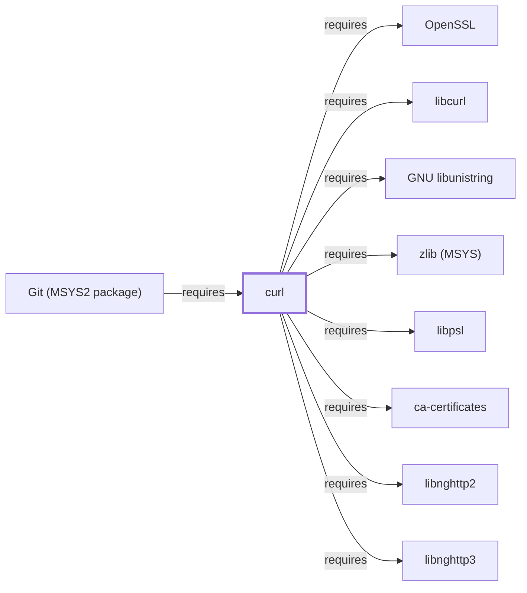

# curl

<!-- BEGIN GENERATED object-facts -->

| Model fact | Value |
| --- | --- |
| Object | `component:curl:curl` |
| Kind | `component` |
| Status | `partial` |
| Confidence | `high` |
| Authority | Daniel Stenberg / curl project |
| Environments | `msys` |
| Upstream | <https://curl.se/> |
| Packaged as | `package:msys2:curl` |
| Version (observed) | 8.21.0-1 |
| License (observed) | spdx:MIT |
| Architecture (observed) | x86_64 |
| Installed size (observed) | 1015.1 KB |

**Evidence on this object**

- `evidence:catalog:current` — MSYS2 pacman package catalog (`observed`, retrieved 2026-07-29)
- `evidence:curl:project-site-2026-07-30` — curl (official project site) (`primary`, retrieved 2026-07-30)

Generated from the composed model by `tools/build_object_facts.py`. Observed values come from the catalog snapshot and change when it is refreshed.
Edits between the surrounding markers are overwritten on the next build.

<!-- END GENERATED object-facts -->

## Purpose

Curl is a multi-protocol command-line file-transfer client, and it is the
transport backing [Git](GIT-MSYS-PACKAGE.md)'s HTTP(S) remote URLs. This
page documents its architectural role and unusually wide dependency
footprint; see the [official curl project site](https://curl.se/) for the
full protocol and option reference.

## Architectural Classification

`component:curl:curl` is packaged as `package:msys2:curl` (version
`8.21.0-1` in the current catalog snapshot, license `MIT`), authored by
Daniel Stenberg and the curl project. It belongs to the MSYS environment
and is split from its transfer library, `libcurl`, following the same
library/CLI split pattern documented for [OpenSSL](OPENSSL.md#architectural-classification).

## Responsibilities

- Command-line multi-protocol file transfer (HTTP(S), FTP, and others
  depending on build configuration).
- Backing [Git](GIT-MSYS-PACKAGE.md)'s `https://` remote URLs
  (`relationship:ssh-curl-git:git-requires-curl`).

## Boundaries

Curl implements transfer protocols and delegates the underlying TLS/crypto
work to [OpenSSL](OPENSSL.md) rather than implementing it independently,
the same delegation pattern documented for
[OpenSSH](OPENSSH.md#boundaries).

## Interfaces

- `-O`/`-o` (save output), `-L` (follow redirects), `-H` (custom headers),
  `-X` (HTTP method), per the project documentation. The package also
  `provides`/`conflicts`/`replaces` a `wcurl` alias, a convenience wrapper
  for common download use cases documented upstream.

## Dependencies

The catalog snapshot records nine `runtime-depends-on` edges for
`package:msys2:curl` — the widest dependency footprint of any single-purpose
CLI tool documented in this batch, reflecting curl's multi-protocol design:

| Dependency | Package | Architectural reason |
| --- | --- | --- |
| TLS/cryptography | `package:msys2:openssl` | Backs HTTPS and other TLS-secured transfers (`relationship:ssh-curl-git:curl-requires-openssl`). |
| Transfer library | `package:msys2:libcurl` | The `curl` CLI links against `libcurl`, its own shared transfer library, the CLI/library split noted above. Documented fully in [libcurl](LIBCURL.md). |
| Certificate trust store | `package:msys2:ca-certificates` | Backs TLS certificate-chain verification against a trusted root store. Documented fully in [ca-certificates](CA-CERTIFICATES.md). |
| HTTP/2 support | `package:msys2:libnghttp2` | Backs the HTTP/2 protocol. Documented fully in [libnghttp2](LIBNGHTTP2.md). |
| HTTP/3 support | `package:msys2:libnghttp3` | Backs the HTTP/3 protocol (which runs over QUIC rather than TCP). Documented fully in [libnghttp3](LIBNGHTTP3.md). |
| QUIC transport | `package:msys2:libngtcp2` | Backs the QUIC transport protocol underlying HTTP/3, alongside `libnghttp3` above. Documented fully in [libngtcp2](LIBNGTCP2.md). |
| Public Suffix List | `package:msys2:libpsl` | Backs correct cookie-domain-scoping decisions using the Public Suffix List, preventing cookies from being set for overly broad domain suffixes. Documented fully in [libpsl](LIBPSL.md). |
| Unicode string handling | `package:msys2:libunistring` | Backs Unicode-aware string processing, for example in internationalized domain names. Documented fully in [GNU libunistring](GNU-LIBUNISTRING.md). |
| Compression | `package:msys2:zlib` | Backs transparent decompression of `Content-Encoding: gzip`/`deflate` HTTP responses. Documented fully in [zlib (MSYS)](ZLIB-MSYS.md). |

## Reverse Dependencies

The snapshot records 8 relationships targeting `package:msys2:curl`. See
the [reverse dependency impact analysis](REVERSE-DEPENDENCY-IMPACT-ANALYSIS.md)
for the current full list.

## Configuration

`~/.curlrc` sets default options for interactive use; most configuration in
practice is per-invocation via command-line flags, consistent with most
other tools documented earlier in this volume rather than a rich standing
configuration model like [OpenSSH](OPENSSH.md#configuration)'s.

## Initialization and Execution Flow

Curl is an invoke-run-exit process per invocation, adapted from POSIX
semantics onto Windows process primitives by `msys-2.0.dll` per
[MSYS Runtime Initialization](MSYS-RUNTIME-INITIALIZATION.md).

## Runtime Behavior

Which protocol stack a given curl invocation actually exercises (HTTP/1.1,
HTTP/2, or HTTP/3-over-QUIC) depends on server negotiation and the request
target, not solely on the client's declared capabilities; the presence of
the HTTP/3/QUIC dependencies above confirms this build supports negotiating
up to HTTP/3 where the server offers it.

## Compatibility and Variants

Curl's build-time protocol/feature set varies across distributions;
consuming a curl feature (such as HTTP/3) assumed universally present in
every curl build is a common portability mistake this build's dependency
list rules out for this specific package, but not necessarily for other
platforms' curl packages.

## Security Considerations

Curl handles untrusted network content and TLS trust decisions directly;
the Public Suffix List (`libpsl`) dependency specifically defends against a
documented class of cookie-scoping vulnerabilities. See
[Threat Model and Supply Chain](THREAT-MODEL-AND-SUPPLY-CHAIN.md) for the
project's general supply-chain posture; no version-qualified CVE review has
been performed for the recorded `8.21.0-1` version.

## Failure Modes and Diagnostics

`-v`/`--trace` are the documented diagnostic flags for protocol-negotiation
and TLS-handshake failures; certificate-verification failures should first
be checked against the `ca-certificates` trust store before assuming a
server-side misconfiguration.

## Evidence, Assumptions, and Open Questions

Protocol and option semantics are backed by the official curl project site
(`evidence:curl:project-site-2026-07-30`), matching the `project_url`
already recorded for `package:msys2:curl` in the catalog. Package identity,
version, license, and all nine dependency edges are backed by the pacman
catalog snapshot (`evidence:catalog:current`). No open items beyond the
general version-qualified security review noted above.

<!-- BEGIN GENERATED dependency-subgraph -->

## Dependency Diagram

Dependencies and dependents of `component:curl:curl` in the composed graph: 1 dependent and 10 dependencies, of which 2 are omitted here for legibility.

Generated from the composed model by `tools/build_object_diagrams.py`.
Edits between the surrounding markers are overwritten on the next build.

<!-- END GENERATED dependency-subgraph -->

## Related Objects

- [GNU Userland Role Model](GNU-USERLAND-ROLE-MODEL.md)
- [OpenSSL](OPENSSL.md)
- [Git (MSYS2 package)](GIT-MSYS-PACKAGE.md)
- [OpenSSH](OPENSSH.md)
- [libnghttp2](LIBNGHTTP2.md)
- [libnghttp3](LIBNGHTTP3.md)
- [libngtcp2](LIBNGTCP2.md)
- [libpsl](LIBPSL.md)
- [GNU libunistring](GNU-LIBUNISTRING.md)
- [libcurl](LIBCURL.md)
- [zlib (MSYS)](ZLIB-MSYS.md)
- [ca-certificates](CA-CERTIFICATES.md)
- [curl (CLANG64)](CURL-CLANG64.md)
