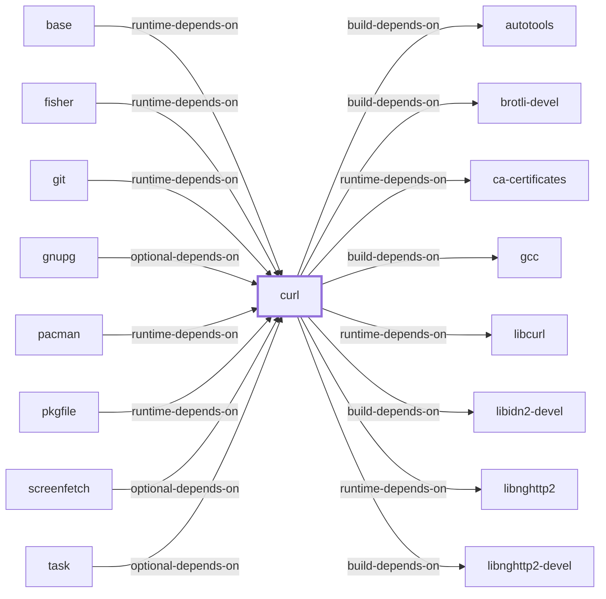

# The Deep-Inventory Blocker

## Why this page exists

Nine roadmap items are unchecked, and they have been unchecked while
everything around them closed. Left unexplained, that reads as neglect.
It is not: **they all need a session on a Windows host with MSYS2
installed to run `tools/Collect-AkbDeepInventory.ps1`, and no session has
done that beyond the two-package run already recorded.**

A Windows host with MSYS2 is no longer hypothetical. A 2026-07-31 session
installed MSYS2 at `C:\msys64`, ran two logged pacman transactions, and a
2026-07-30 session reached compile, link, and execution on a real zlib
build — evidence recorded in Volumes 3, 7, 14, and 19. What those sessions
did not do is run the deep-inventory collector across the installed
package set, which is the specific act these nine items wait on. The
sessions that author this page run in Linux containers and cannot run it.

A gap with a named cause is a different kind of gap from one without, and
the charter asks for coverage gaps to be measured and visible rather than
merely absent. This page names the cause once so the nine items can be
read correctly.

## The nine items

From [`ROADMAP.md`](../ROADMAP.md):

**Increment 1 — collection**

1. Extract installed and repository package-file manifests
2. Extract PE imports, exports, subsystem, architecture, and debug metadata
3. Extract static/import archive members
4. Index headers, pkg-config files, and CMake metadata
5. Extract and analyze uninstalled binary payloads from package archives
6. Run deep inventory across the installed package set

**Increment 5 — the views built on that collection**

7. Package-to-file inventory
8. Binary-to-DLL dependency graph
9. Header and metadata indexes

Items 7–9 are strictly downstream: they are projections of data items 1–6
would produce. Closing them without closing 1–6 would mean generating
reports over two packages and calling the ecosystem covered.

## What is blocked, precisely

Not the capability. `tools/deep_inventory.py` parses PE headers itself —
machine type, subsystem, imports, exports — with no third-party modules,
and `tools/Collect-AkbDeepInventory.ps1` drives it. The pipeline is built
and tested; `Build the deep-inventory collection pipeline` is a closed
roadmap item and its tests are in the suite.

What is blocked is **execution**, and the reason is specific:

```powershell
$pacman = Join-Path $Msys2Root "usr\bin\pacman.exe"
```

The collector asks `pacman` which files each installed package owns, then
opens those files and reads their headers. That requires:

- a Windows host, because the artifacts are PE binaries in an MSYS2
  installation;
- MSYS2 actually installed on it, because the file manifests come from
  pacman's local database rather than from anything downloadable;
- the packages of interest installed, because the manifest is of what is
  *there*.

None of those is a software dependency that could be added. They are
properties of the machine. The MSYS2 installation at `C:\msys64` recorded
in Volume 7 satisfies all three; what has not happened is a session on
that host invoking this collector at scale. The sessions that author this
page run in Linux containers, where the first condition fails outright.

## What the two observed packages already show

`model/inventory/current.json` holds one real collection run, snapshot
`20260729T122657Z`, covering **2 of 15,711 packages** — 0.013% per
`generated/coverage-assessment.json`. The two are well chosen, and what
they demonstrate is exactly what scale would generalise:

| Package | Side | What its imports show |
| --- | --- | --- |
| `curl` | MSYS | `/usr/bin/curl.exe` imports `msys-2.0.dll`, `msys-curl-4.dll`, `msys-z.dll`, and `kernel32.dll` |
| `mingw-w64-ucrt-x86_64-zlib` | native | `/ucrt64/bin/zlib1.dll` imports the `api-ms-win-crt-*` UCRT façade DLLs, and no `msys-2.0.dll` |

That single table is the `msys-2.0.dll` boundary **observed rather than
asserted**. Everywhere else in this knowledge base, the MSYS/native
distinction rests on documentation and on package naming. Here it rests on
what the binaries actually import — and the two sides come out exactly as
the documentation says they should.

The run produced 533 filesystem paths, 13 DLLs, 13 `imports-dll` edges,
and one each of executable, import library, static library, header, and
pkg-config module. Scaled to the catalog, that is the difference between a
dependency graph of declared package relationships and one of actual
binary linkage.

## What closing it would change

Not just the nine items. Six statements elsewhere in this knowledge base
are currently qualified by the absence of this data:

- **The MSYS/native boundary** is asserted per package from naming and
  documentation, and could be verified per binary.
- **Library rankings** measure declared runtime dependencies. Actual
  linkage differs — a package can declare a dependency it does not link,
  and link one it does not declare.
- **Git for Windows DLL loading** ([the page](GIT-FOR-WINDOWS-DLL-LOADING.md))
  has one binary analysed — a 2026-07-30 PE-import parse of `git.exe`
  found 10 imported DLLs, 4 MSYS-derived — and stops at mechanism for
  every other binary the distribution ships.
- **Migration step 6** in [the migration guide](DEVELOPER-MIGRATION.md) —
  check the produced binary's imports — is a recommendation this knowledge
  base cannot demonstrate.
- **Header-only library usage**, which
  [the logging category page](LIBRARY-CATEGORY-LOGGING.md) names as one of
  three candidate explanations for that category's low dependent counts,
  is testable only with header indexes.
- **The LLVM tool inventory** on [the LLVM page](LLVM.md) lists what
  upstream ships rather than what MSYS2's `llvm-tools` package installs.

## What would unblock it

One session on the Windows host that already carries the `C:\msys64`
installation, running:

```powershell
pwsh ./tools/Update-Akb.ps1 -Msys2Root C:\msys64
```

or the collector alone for a scoped run. The results import through
`tools/import_deep_inventory.py` into `model/inventory/current.json`, which
composes into the graph exactly as the existing two-package snapshot does.

The scale of the run is a policy choice rather than a technical one:
`-InventoryScope repositories` covers repository-wide file ownership,
against the installed set alone. See
[AKB developer workflow](DEVELOPER-WORKFLOW.md).

## Standing statement

Until that run happens, every one of the nine items stays unchecked, and
that is correct rather than regrettable. A checked box removes an item from
the backlog; ticking these would remove the largest remaining gap in this
knowledge base from view while it is still entirely open.

<!-- BEGIN GENERATED dependency-subgraph -->

## Dependency Diagram



Dependencies and dependents of `package:msys2:curl` in the composed graph: 8 dependents and 22 dependencies, of which 14 are omitted here for legibility.

Generated from the composed model by `tools/build_object_diagrams.py`.
Edits between the surrounding markers are overwritten on the next build.

<!-- END GENERATED dependency-subgraph -->

## Related Objects

- [Package-to-file inventory](PACKAGE-FILE-INVENTORY.md)
- [Binary-to-DLL dependency graph](BINARY-DLL-DEPENDENCY-GRAPH.md)
- [Header and development-metadata indexes](HEADER-AND-METADATA-INDEXES.md)
- [AKB developer workflow](DEVELOPER-WORKFLOW.md)
- [Library Family Classification](LIBRARY-FAMILY-CLASSIFICATION.md)
