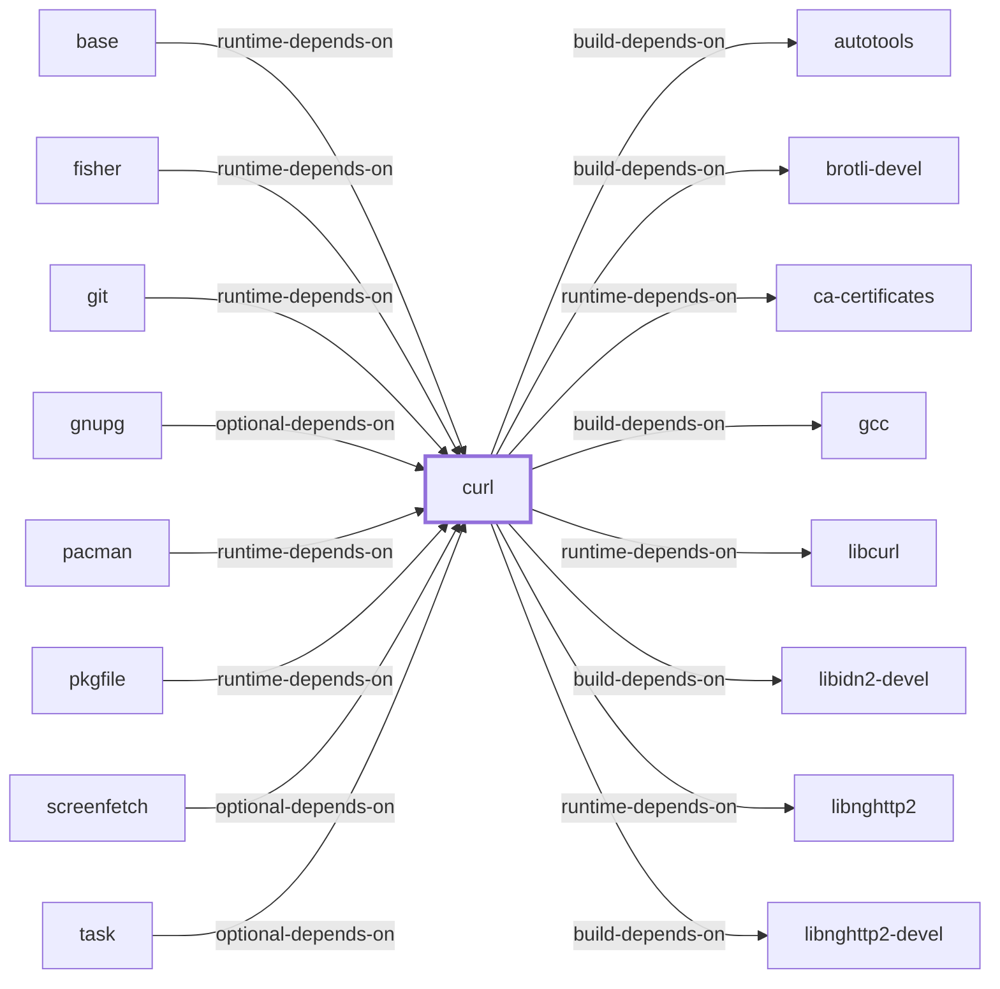

# The Deep-Inventory Blocker

## Why this page exists

Nine roadmap items were unchecked while everything around them closed. This
page named the cause once so they could be read as a known gap rather than
neglect: **they all needed a session on a Windows host with MSYS2 installed
to run `tools/Collect-AkbDeepInventory.ps1`.**

**That session happened on 2026-08-05**, against MSYS2 installed at
`C:\tools\lang\msys64`, and it found the collector itself could not run: a
PowerShell parameter-binding defect in `tools/catalog-msys2-packages.ps1`
rejected `pacman -Si`'s own blank-line-separated output outright, so the
catalog step this pipeline depends on had never completed against a real
installation. That is fixed. With it fixed, the run completed: 15,728
catalog packages, and a deep-inventory pass across all 90 packages installed
in this host's `msys` environment — 15,240 artifacts, 1,831 PE-import
records, 53,797 PE-export records, and 2,178 archive members read directly
from disk. Two of the nine items close on that evidence; see
[the nine items](#the-nine-items).

The other seven stay open, and the reason changed. It is no longer *no
session has run the collector* — one has. It is now **this host's installed
package set is too narrow**: all 90 installed packages are the base `msys`
environment, and none of the `ucrt64`, `clang64`, `clangarm64`, `mingw64`,
or `mingw32` toolchain environments are installed here. Headers, static and
import libraries, and pkg-config metadata live overwhelmingly in those
environments' `-devel`-style packages, not in the MSYS base system, so the
counts below fall short of the thresholds `model/roadmap-claims.json` binds
these items to even though the collector ran cleanly end to end.

A gap with a named cause is a different kind of gap from one without, and
the charter asks for coverage gaps to be measured and visible rather than
merely absent. This page states the current cause so the seven open items
can be read correctly.

## The nine items

From [`ROADMAP.md`](../ROADMAP.md), with status as of the 2026-08-05 run:

**Increment 1 — collection**

1. Extract installed and repository package-file manifests — **open**, 90 of
   the required 100 observed packages
2. Extract PE imports, exports, subsystem, architecture, and debug
   metadata — **closed**, 186 DLL artifacts with parsed PE metadata
3. Extract static/import archive members — **open**, 4 static-library and 3
   import-library entities against a required 25 each
4. Index headers, pkg-config files, and CMake metadata — **open**, 91
   headers and 6 pkg-config modules against required minimums of 100 and 25
5. Extract and analyze uninstalled binary payloads from package archives —
   **not closed on this run**; its claim (`generated/binary-dependency-report.md`
   ≥ 200 lines) now passes, but only because this run's *installed*-scope
   collection populated that file — the claim does not actually distinguish
   installed-scope from archive-payload-scope evidence, so checking it here
   would credit the wrong work. The claim needs tightening before this item
   can be honestly ticked from an archive-analysis run.
6. Run deep inventory across the installed package set — **open**, same
   90-of-100 shortfall as item 1

**Increment 5 — the views built on that collection**

7. Package-to-file inventory — **open**, same 90-of-100 shortfall
8. Binary-to-DLL dependency graph — **closed**, 1,843 `imports-dll` edges
   generated from the new PE-import data
9. Header and metadata indexes — **open**, `generated/development-artifact-catalog.md`
   holds 112 of the required 200 lines

Items 7–9 are downstream projections of items 1–6. Item 8 closes ahead of 1,
3, 4, 6, and 7 because it depends only on installed-scope PE imports, which
this run collected in full; the others additionally need archive members,
headers, and pkg-config metadata that live mostly in toolchain environments
not installed on this host.

## What is blocked, precisely

Execution is no longer blocked. `tools/deep_inventory.py` parses PE headers
itself — machine type, subsystem, imports, exports — with no third-party
modules, and `tools/Collect-AkbDeepInventory.ps1` drives it through
`pacman`. The 2026-08-05 session ran it against MSYS2 at
`C:\tools\lang\msys64` and it completed, after fixing a real defect in
`tools/catalog-msys2-packages.ps1`: `ConvertFrom-PacmanInfo` declared its
`-Lines` parameter `[Parameter(Mandatory)][string[]]`, and PowerShell
rejects a mandatory string-array argument outright if *any* element is an
empty string — which every blank line separating `pacman -Si` records is.
The catalog collector could not have completed against a real pacman
database before this fix, on any PowerShell version; reproduced identically
on PowerShell 7.5.4 and Windows PowerShell 5.1.

What remains blocked is **package-set breadth**. The collector reads what
`pacman` says is installed:

```powershell
$pacman = Join-Path $Msys2Root "usr\bin\pacman.exe"
```

and this host has 90 packages installed, all of them the base `msys`
environment. None of `ucrt64`, `clang64`, `clangarm64`, `mingw64`, or
`mingw32` — the environments that carry headers, static and import
libraries, and pkg-config metadata for the native toolchains — are
installed. That is a property of this host's package selection, not of the
collector: `-InventoryScope repositories` would broaden file *ownership*
manifests to every package in the enabled repositories, but binary and
metadata analysis still needs the file's bytes present on disk, so it
would not by itself raise the header, static-library, import-library, or
pkg-config counts below. Installing a representative sample of toolchain
packages would.

## What the 2026-08-05 run shows

`model/inventory/current.json` now holds four accumulated snapshots: the
three archive-payload snapshots described below, plus one `scope=installed`
snapshot (`20260805T142415Z-78a81cbd4091`) covering **90 of 15,728
packages** — 0.57% per `generated/coverage-assessment.json`, up from
0.013%. It added 174 DLL artifacts with parsed PE metadata and 1,843
`imports-dll` edges, mostly resolving to `/usr/bin/msys-2.0.dll`:

| Package | Side | What its imports show |
| --- | --- | --- |
| `curl` | MSYS | `/usr/bin/curl.exe` imports `msys-2.0.dll`, `msys-curl-4.dll`, `msys-z.dll`, and `kernel32.dll` |
| `mingw-w64-ucrt-x86_64-zlib` | native | `/ucrt64/bin/zlib1.dll` imports the `api-ms-win-crt-*` UCRT façade DLLs, and no `msys-2.0.dll` (retained from the earlier archive-payload snapshot; this host has no `ucrt64` packages installed to observe directly) |
| *(494 MSYS binaries)* | MSYS | import `/usr/bin/msys-2.0.dll` directly — the fan-in `generated/binary-dependency-report.md` now measures rather than estimates |

The `msys-2.0.dll` boundary is now **observed at MSYS-side scale, not just
asserted or spot-checked**: every MSYS-side binary this host has installed
was parsed, not just `curl`. The native side of that same boundary is still
a single retained example, because no native-environment package is
installed here to parse.

## What closing it would change

Six statements elsewhere in this knowledge base are qualified by data this
page tracks. One is now stronger; five are unchanged, because they need
either native-side binaries, headers, or pkg-config metadata this host does
not have installed:

- **The MSYS/native boundary** — the MSYS side is now verified per binary
  at the scale of this host's installed set (494 binaries); the native side
  remains one retained example.
- **Library rankings** measure declared runtime dependencies. Actual
  linkage differs — a package can declare a dependency it does not link,
  and link one it does not declare. Unchanged: this host's installed set is
  MSYS-only, and library rankings compare across both sides.
- **Git for Windows DLL loading** ([the page](GIT-FOR-WINDOWS-DLL-LOADING.md))
  still has one binary analysed — a 2026-07-30 PE-import parse of `git.exe`
  found 10 imported DLLs, 4 MSYS-derived — and stops at mechanism for every
  other binary the distribution ships. Git for Windows is a separate
  distribution from this host's MSYS2 installation.
- **Migration step 6** in [the migration guide](DEVELOPER-MIGRATION.md) —
  check the produced binary's imports — is still a recommendation this
  knowledge base cannot demonstrate on a native-toolchain build.
- **Header-only library usage**, which
  [the logging category page](LIBRARY-CATEGORY-LOGGING.md) names as one of
  three candidate explanations for that category's low dependent counts, is
  testable only with header indexes. This run added headers only from the
  MSYS base set: 91 of the 100 the roadmap threshold requires, still short.
- **The LLVM tool inventory** on [the LLVM page](LLVM.md) lists what
  upstream ships rather than what MSYS2's `llvm-tools` package installs.
  `llvm-tools` ships under `clang64`/`clangarm64`, not installed here.

## What would unblock the rest

Not a session — this host already ran the collector successfully. What is
missing is toolchain-environment packages to observe. Two options:

- Install a representative sample of `ucrt64`/`clang64`/`mingw64` packages
  (their `-devel` variants in particular, for headers, static libraries,
  and pkg-config files) and re-run
  `pwsh ./tools/Update-Akb.ps1 -Msys2Root C:\tools\lang\msys64`. This
  directly raises the header, static-library, import-library, and
  pkg-config counts, and pushes observed packages past the 100 threshold
  four items are gated on (90 today).
- Run with `-InventoryScope repositories` for repository-wide file
  *ownership* breadth. This does not analyze files that are not present on
  disk, so it would not by itself close the header/library/pkg-config
  items, but it broadens the package-manifest items. See
  [AKB developer workflow](DEVELOPER-WORKFLOW.md).

## Why the refresh accumulates

`Update-Akb.ps1` imports with `--accumulate`, and that flag is load-bearing
rather than incidental.

`model/inventory/current.json` held three accumulated `scope=package-archive`
snapshots before this run — downloaded payloads for zlib, curl, and zstd,
analysed byte by byte — and now holds a fourth, `scope=installed`, snapshot:

| Snapshot | Scope | Artifacts |
| --- | --- | ---: |
| `20260729T115414Z-93c5b258a95b` | package-archive | 6 |
| `20260729T122656Z-dfc0f9333b82` | package-archive | 532 |
| `20260729T122657Z-eac21b0c1bb8` | package-archive | 11 |
| `20260805T142415Z-78a81cbd4091` | installed | 15,240 |

A host refresh collecting `scope=installed` through pacman is a different
collection modality from the archive-payload snapshots above it, **not a
newer version of the same observation**, and it cannot reproduce
archive-payload analysis of packages that are not installed. Importing
without `--accumulate` would have replaced the prior 552 accumulated
entities with only this run's collection, and dropped the
`evidence:inventory:current` record that this page and
[the reverse-dependency analysis](REVERSE-DEPENDENCY-IMPACT-ANALYSIS.md)
both cite — so `akb.py validate-docs` would fail immediately afterwards, on
a tree whose operator did nothing wrong.

`tests/test_refresh_generators.py` fails the build if that flag is dropped.

**The cost, stated rather than hidden.** An accumulated projection only
grows. A file removed from a package keeps its entity forever, and nothing
retires it. What makes that honest rather than silent is that every entity
carries the snapshot evidence it came from, so an object observed once in
July and never again is visibly attributed to that July snapshot. Retiring
stale objects needs a reconciliation pass that does not exist yet, and
until it does, entity counts in this projection are a high-water mark and
not a current inventory.

## Standing statement

Two of the nine items closed on 2026-08-05 evidence; see
[the nine items](#the-nine-items) for which and why. The remaining seven
stay unchecked, and that is correct rather than regrettable: their claims
need package-set breadth this host's installed set does not have, and a
checked box removes an item from the backlog — ticking these now would
remove a real, still-open gap from view.

<!-- BEGIN GENERATED dependency-subgraph -->

## Dependency Diagram



Dependencies and dependents of `package:msys2:curl` in the composed graph: 8 dependents and 22 dependencies, of which 14 are omitted here for legibility.

Generated from the composed model by `tools/build_object_diagrams.py`.
Edits between the surrounding markers are overwritten on the next build.

<!-- END GENERATED dependency-subgraph -->

## Related Objects

- [Package-to-file inventory](PACKAGE-FILE-INVENTORY.md)
- [Binary-to-DLL dependency graph](BINARY-DLL-DEPENDENCY-GRAPH.md)
- [Header and development-metadata indexes](HEADER-AND-METADATA-INDEXES.md)
- [AKB developer workflow](DEVELOPER-WORKFLOW.md)
- [Library Family Classification](LIBRARY-FAMILY-CLASSIFICATION.md)
