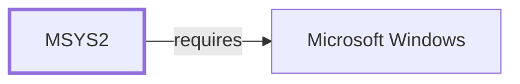

# The Shape of the Dependency Graph

[The reverse-dependency and impact-analysis model](REVERSE-DEPENDENCY-IMPACT-ANALYSIS.md)
states how dependency reachability should be interpreted. This page states
what the graph actually looks like once it has been built, measured on
2026-08-03 against the composed model: 16,514 entities and 141,518
relationships, of which 108,770 are dependency edges.

## Edge composition

| Relationship | Count | Share of dependency edges |
| --- | ---: | ---: |
| `build-depends-on` | 60,703 | 55.8% |
| `runtime-depends-on` | 41,061 | 37.8% |
| `optional-depends-on` | 3,623 | 3.3% |
| `check-depends-on` | 3,383 | 3.1% |

**Build-time edges are the majority of this graph**, and until 2026-08-02
none of them existed: `tools/import_repository_db.py` read `%DEPENDS%` and
`%OPTDEPENDS%` and dropped the other two fields. Every dependency statement
made in this knowledge base before that date described 41% of the graph
while reading as though it described all of it.

## The two graphs share no leaders

Ranking packages by how many others depend on them, build-time and
runtime-time produce **entirely disjoint top tens** — zero overlap:

| # | Build + check | Runtime + optional |
| ---: | --- | --- |
| 1 | `mingw-w64-ucrt-x86_64-gcc` | `mingw-w64-ucrt-x86_64-python` |
| 2 | `mingw-w64-clang-x86_64-clang` | `mingw-w64-clang-x86_64-python` |
| 3 | `mingw-w64-clang-aarch64-clang` | `mingw-w64-clang-aarch64-python` |
| 4 | `mingw-w64-x86_64-gcc` | `mingw-w64-x86_64-python` |
| 5 | `mingw-w64-ucrt-x86_64-ninja` | `mingw-w64-ucrt-x86_64-zlib` |
| 6 | `mingw-w64-clang-x86_64-ninja` | `mingw-w64-clang-x86_64-zlib` |
| 7 | `mingw-w64-clang-aarch64-ninja` | `mingw-w64-clang-aarch64-zlib` |
| 8 | `mingw-w64-ucrt-x86_64-cmake` | `mingw-w64-x86_64-zlib` |
| 9 | `mingw-w64-clang-x86_64-cmake` | `perl` |
| 10 | `mingw-w64-clang-aarch64-cmake` | `mingw-w64-ucrt-x86_64-glib2` |

Compilers and build systems on one side, language runtimes and compression
on the other. They are not two views of one ranking; they are two different
questions with two different answers, and "what is this ecosystem's most
important package" has no single answer without saying which.

The single most depended-upon package by any measure is
`mingw-w64-clang-x86_64-clang` at 2,303 build-time dependents. The
most depended-upon at runtime is `mingw-w64-ucrt-x86_64-python` at 1,241.

## Dependency cycles are real, and mostly self-hosting

A dependency graph is often assumed acyclic. This one is not.

```
gcc -> mpc-devel -> mpfr-devel -> gmp-devel -> gcc
gcc -> mpc-devel -> mpfr-devel -> gcc
gcc -> mpc-devel -> gcc
```

That is the GCC bootstrap cycle: GCC build-depends on GMP, MPFR, and MPC,
which are themselves built with GCC. Runtime cycles exist too, including
`openssl -> ca-certificates -> openssl`.

**Fourteen edges are self-loops** — a package declaring itself. Thirteen
are `build-depends-on` and they are genuine self-hosting declarations
rather than modelling errors:

| Recipe | Declares |
| --- | --- |
| `mingw-w64-gcc/PKGBUILD` | `mingw-w64-*-gcc` |
| `llvm/PKGBUILD` | `clang` |
| `mingw-w64-vala/PKGBUILD` | `mingw-w64-*-vala` |

A compiler written in the language it compiles depends on a previous copy
of itself to build. The fourteenth is `lz4` declaring a *runtime*
dependency on itself, which comes from the repository database rather than
a recipe and has no equivalent explanation here.

Anything that topologically orders this graph — a build scheduler, an
impact analysis, a rebuild-ordering tool — has to handle cycles and
self-loops explicitly. Assuming a DAG will not fail loudly; it will produce
a plausible ordering that is wrong.

## Distribution

- **14,809 packages declare at least one dependency**; 9,443 are depended
  upon by at least one other.
- **806 packages have no dependency edge in either direction.** They are
  neither built from anything modelled here nor used by anything modelled
  here.
- The largest declared dependency list belongs to
  `mingw-w64-*-gst-plugins-bad` at 125 edges, followed by `vtk` at 90. The
  four environment variants of gst-plugins-bad occupy the top four places,
  which is the `${MINGW_PACKAGE_PREFIX}` fan-out described in
  [source code organization](SOURCE-CODE-ORGANIZATION.md) showing up in the
  dependency graph as apparent duplication.

## What this does not establish

Every edge here is **declared**, not observed. A package can declare a
dependency it does not link against, and link one it does not declare.
Establishing the latter needs PE import analysis at catalog scale, which
[the deep-inventory blocker](DEEP-INVENTORY-BLOCKER.md) records as
outstanding — the binary-linkage graph currently covers 2 of 15,711
packages.

A build-time count remains a floor rather than a measure. MSYS2 recipes
declare a library needed at both build and run time once, in `depends`, so
absence from `makedepends` is not evidence of non-use.

The 806 packages with no edges are not proven isolated. They are packages
no retained edge names, which includes anything whose recipe declared
nothing resolvable.

## Related views

- [Reverse dependency and impact analysis](REVERSE-DEPENDENCY-IMPACT-ANALYSIS.md)
- [Library family classification](LIBRARY-FAMILY-CLASSIFICATION.md)
- [Source code organization](SOURCE-CODE-ORGANIZATION.md)

<!-- BEGIN GENERATED dependency-subgraph -->

## Dependency Diagram



Dependencies and dependents of `ecosystem:msys2:msys2` in the composed graph: 0 dependents and 1 dependency.

Generated from the composed model by `tools/build_object_diagrams.py`.
Edits between the surrounding markers are overwritten on the next build.

<!-- END GENERATED dependency-subgraph -->
