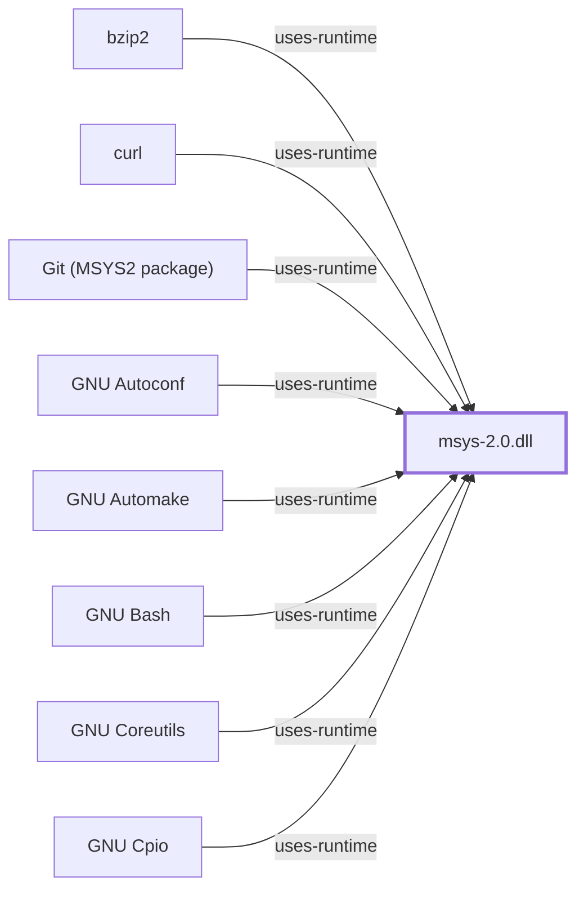

# Debugging on MSYS2

Part 3 of the [Developer Guide](DEVELOPER-GUIDE.md).

## The rule that governs everything below

**Debug a program with a debugger from its own side.** An MSYS-side
program is debugged by the MSYS `gdb`; a native program is debugged by the
native `gdb` from the matching environment. The debugger has to understand
the process's address space, its runtime, and its path namespace, and
those differ across the boundary.

This is the same boundary as everywhere else in the ecosystem: does the
program link `msys-2.0.dll`?

## Getting symbols

Distribution packages are built for distribution, not for debugging.
Upstream's suggested route to symbols is to rebuild:

> To get you started, you can try just re-building an existing package.
> This may also be helpful if you need to diagnose an issue and need the
> debugging symbols.

That is the documented path: clone the recipe repository, run `makepkg`,
install the result. See [Packaging for MSYS2](DEVELOPER-PACKAGING.md).

For your own code, build with `-g` and do not strip. The
`-Og` optimisation level keeps debuggability while retaining most
optimisation, and is generally preferable to `-O0` for reproducing a bug
that only appears in optimised builds.

## Just-in-time debugging

This is where MSYS2 differs most from both Linux and plain Windows, and
the differences are documented upstream. There are three distinct cases
and they need three different mechanisms.

### Case 1 — MSYS-side process crashes

The MSYS runtime has its own hook. Set the `MSYS` environment variable's
`error_start` setting to a Windows-form path to the debugger:

```sh
export MSYS="error_start:$(cygpath -w /usr/bin/gdb)"
./crashy.exe
```

Note the `cygpath -w`. The runtime setting takes a **Windows** path even
though it is set from a POSIX shell — a direct consequence of the two
filesystem namespaces described in
[MSYS Path Conversion](MSYS-PATH-CONVERSION.md).

### Case 2 — native process crashes

Native processes use the Windows `AeDebug` mechanism, registered under
`HKLM\SOFTWARE\Microsoft\Windows NT\CurrentVersion\AeDebug`. MSYS2 ships
`regtool` to write it, and this requires Administrator:

```sh
regtool add -w '/HKLM/SOFTWARE/Microsoft/Windows NT/CurrentVersion/AeDebug'
regtool set -w '/HKLM/SOFTWARE/Microsoft/Windows NT/CurrentVersion/AeDebug/Auto' 1
```

with the `Debugger` value set to the native `gdb` invoked with
`attach %ld`, `signal-event %ld`, and `continue`. Upstream publishes the
exact quoting for both the 64-bit (`-w`) and 32-bit (`-W`) registry views;
the two views are separate registrations and a 32-bit crash will not find
a 64-bit-only registration.

This edits a machine-wide registry key that determines what runs when
*any* Windows program crashes. It is a system-wide change, not a
per-project one.

### Case 3 — native process started from an MSYS2 process

This is the case that silently does nothing, and it is worth knowing
before you spend an hour on it. Upstream:

> When a native process which was started (possibly indirectly) from an
> MSYS2 process (such as `bash`) crashes, it does not invoke the registered
> debugger (or Windows Error Reporting), unless the `SetErrorMode`
> `SEM_NOGPFAULTERRORBOX` flag was cleared in the meantime (`SetErrorMode`
> flags are inherited from a parent process by default).

So a correctly-registered `AeDebug` debugger will simply not fire for
anything launched from your shell. The fix, from `msys2-runtime` 3.2.0-2:

```sh
export MSYS=winjitdebug
exec bash
./crashy.exe
```

The `exec bash` is required, not decorative — upstream notes "the option
needs to be set in the parent process, so bash needs to be restarted".

## Debugging across the fork boundary

The MSYS `fork` is not a kernel `fork`. It is the multi-step
copy-and-synchronise sequence documented in
[Ecosystem Performance Architecture](ECOSYSTEM-PERFORMANCE-ARCHITECTURE.md),
and that has consequences a debugger user will meet:

- **A `fork` can fail rather than be slow.** The documented failure modes
  — `unable to remap somedll to same address as parent`, `couldn't
  allocate heap`, `resource temporarily unavailable` — are address-space
  problems caused by DLLs injected into every process, typically security
  software. A `fork` failure that reproduces on one machine and not
  another is an environment difference, not a code bug.
- **PIDs are invented.** Because Windows has no `exec`, the MSYS runtime
  maintains its own PIDs, and a process that `exec`s several times has
  several Windows PIDs behind one MSYS PID. A debugger attaching by
  Windows PID and a shell reporting an MSYS PID are not talking about the
  same number.

## Signals

Signal delivery is emulated by the runtime rather than provided by the
kernel; see [MSYS Signal Manager](MSYS-SIGNAL-MANAGER.md). The
2026-07-30 bounded probes confirmed `USR1` delivery on MSYS 3.6.10 x86_64
as an exact command outcome. That is the extent of what this knowledge
base has observed about signals — it establishes that the case worked,
not POSIX parity.

Native programs have no POSIX signal layer at all. A native program does
not receive `SIGUSR1` because nothing implements it.

## Terminal and PTY effects on debugging

A debugger is an interactive program, and interactivity crosses the
console boundary. MSYS-side programs expect a PTY; the Windows console is
not one. `winpty` exists to bridge that gap, and its absence is the usual
cause of a debugger that appears to hang with no prompt. The mechanism is
[MSYS PTY and Console](MSYS-PTY-AND-CONSOLE.md).

## What is not established here

- **None of the above has been executed by this knowledge base.** No
  MSYS2 host has been available; every command is quoted or adapted from
  upstream documentation.
- The `regtool` invocations are reproduced from upstream with their exact
  quoting preserved where shown; they have not been run, and they modify
  machine-wide state.
- No claim is made about LLDB's behavior on the MSYS side. LLDB ships in
  the CLANG64 environment as a native debugger; whether it handles
  MSYS-side processes is unestablished here.

<!-- BEGIN GENERATED dependency-subgraph -->

## Dependency Diagram



Dependencies and dependents of `runtime:msys2:msys-2.0.dll` in the composed graph: 72 dependents and 0 dependencies, of which 64 are omitted here for legibility.

Generated from the composed model by `tools/build_object_diagrams.py`.
Edits between the surrounding markers are overwritten on the next build.

<!-- END GENERATED dependency-subgraph -->

## Related Objects

- [Developer Guide](DEVELOPER-GUIDE.md)
- [MSYS Process Manager](MSYS-PROCESS-MANAGER.md)
- [MSYS Signal Manager](MSYS-SIGNAL-MANAGER.md)
- [MSYS PTY and Console](MSYS-PTY-AND-CONSOLE.md)
- [Packaging for MSYS2](DEVELOPER-PACKAGING.md)
