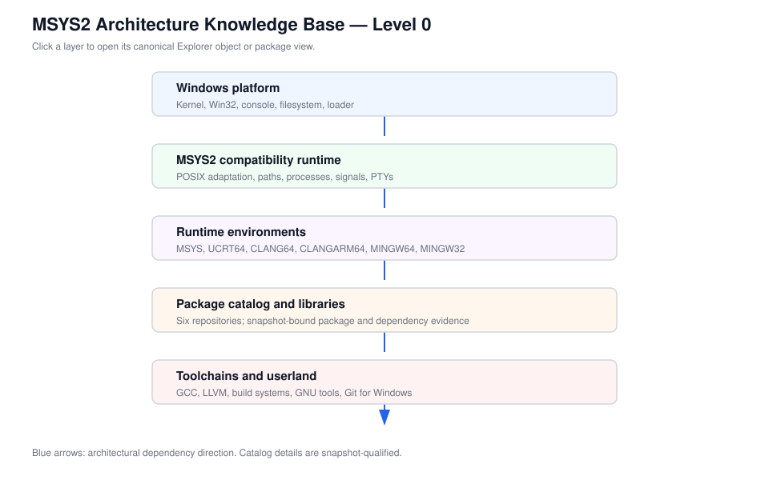
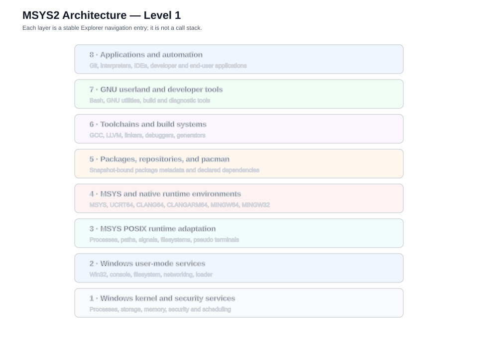

# Linked Diagram Hierarchy

The Level 0 ecosystem diagram is a stable entry point into the Explorer. It
uses direct links for canonical objects and routes to the generated runtime,
package, and toolchain views. Higher levels must preserve this contract: each
node links to a stable object route or an explicitly snapshot-qualified view.

The diagram is conceptual. Package and dependency counts are not encoded in
the diagram itself; consult the generated catalog views for snapshot evidence.
