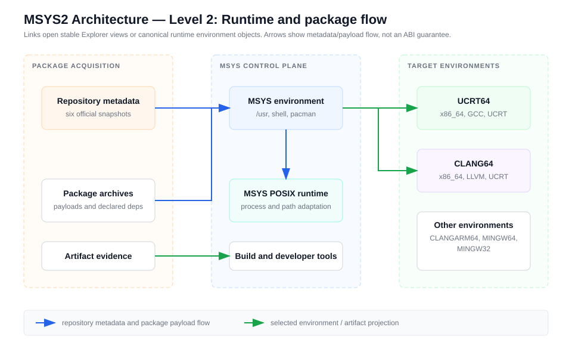
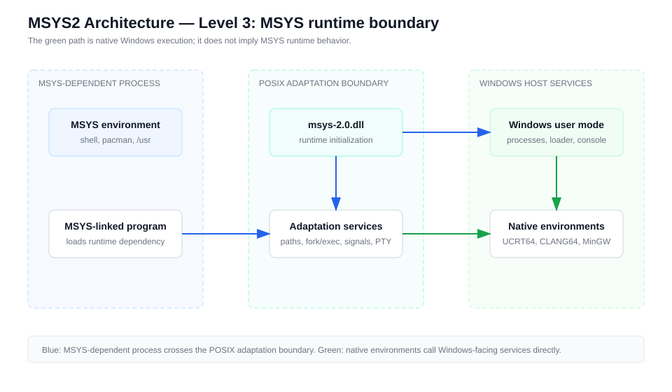
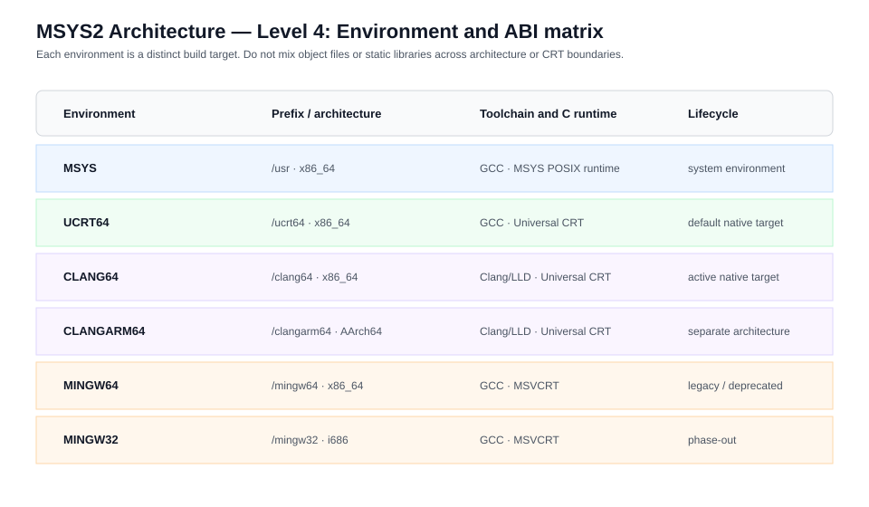
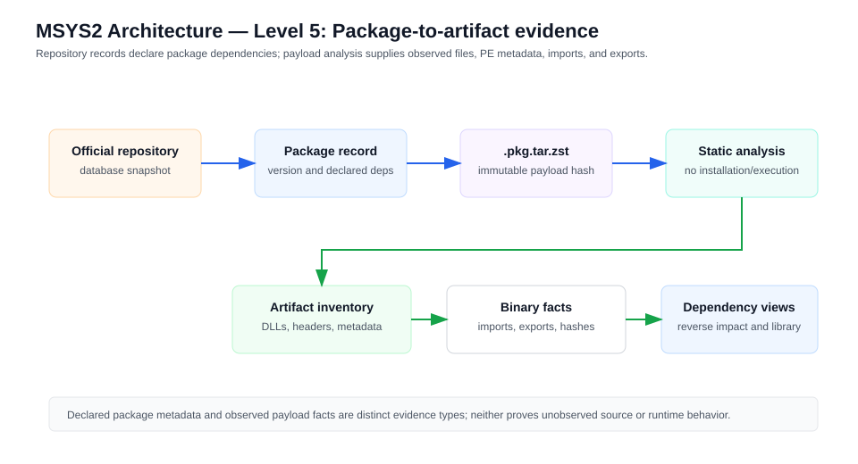
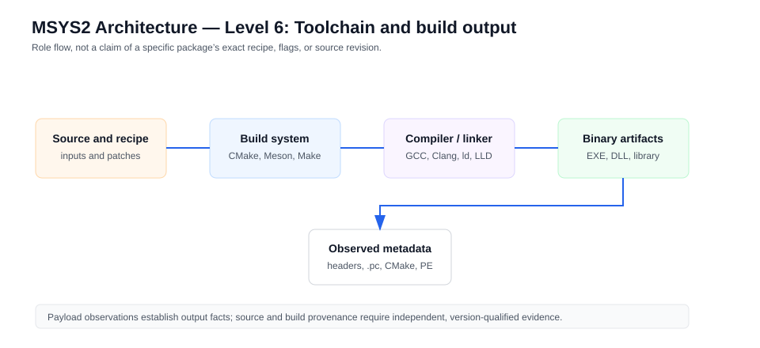
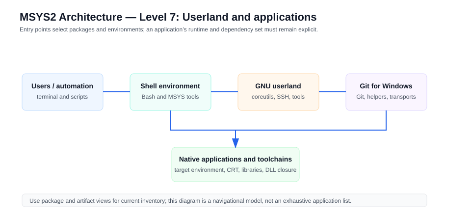

# Linked Diagram Hierarchy

The Level 0 ecosystem diagram is a stable entry point into the Explorer. It
uses direct links for canonical objects and routes to the generated runtime,
package, and toolchain views. Higher levels must preserve this contract: each
node links to a stable object route or an explicitly snapshot-qualified view.

The diagram is conceptual. Package and dependency counts are not encoded in
the diagram itself; consult the generated catalog views for snapshot evidence.

## Interactive graph view

A 2026-07-31 update added a real, interactive, zoomable graphical view to
the generated explorer (`tools/build_explorer.py`), closing this
volume's previously open "zoomable graphical exploration" gap. It uses
a locally vendored copy of D3 v7 (`tools/vendor/d3.v7.min.js`, ISC
licensed, copied into `generated/explorer/d3.v7.min.js` on every build
so the explorer stays fully offline and self-contained like every other
generated artifact) to render a real canvas-based force-directed graph
with pan, zoom, and drag.

Because the full composed graph (16,000+ entities, 77,000+ relationships
as of this snapshot) is far too dense for one readable force-directed
layout, two bounded entry points are provided rather than one
unscoped render:

- **`#/graph/<view>`** — renders one of the explorer's existing named
  views (`layers`, `packages`, `artifacts`, `libraries`, `runtimes`,
  `toolchains`, `repositories`, `evidenced`), each already scoped to a
  bounded subset of kinds. An `__all__` pseudo-view exists for every
  object; above an 800-node cap it requires an explicit "Render
  anyway" confirmation rather than silently attempting a slow,
  unreadable layout.
- **`#/graph-node/<id>`** — seeds a graph on one object and its direct
  neighbors; selecting a node and clicking "Expand selected" pulls in
  that node's further neighbors client-side (no page navigation),
  bounded by the same 800-node cap. Every object detail page links here
  via "View in graph."

This is a real, testable rendering surface (`tests/test_explorer.py`
verifies the vendored file is copied byte-identical and the generated
page references the real D3 API), not a mockup; it has not yet been
visually verified in a live browser session in this authoring
environment (no connected browser tooling was available), so genuine
interactive behavior — force-layout convergence, drag responsiveness,
zoom/pan smoothness at scale — remains unverified beyond code-level
inspection and JS syntax validation.
