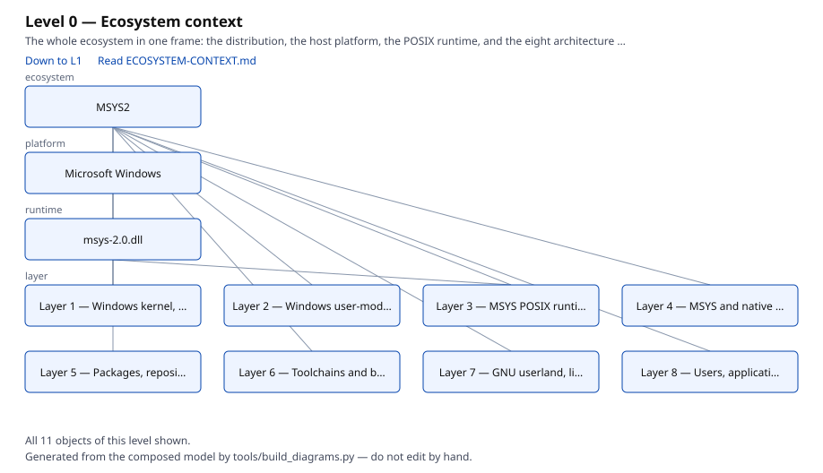
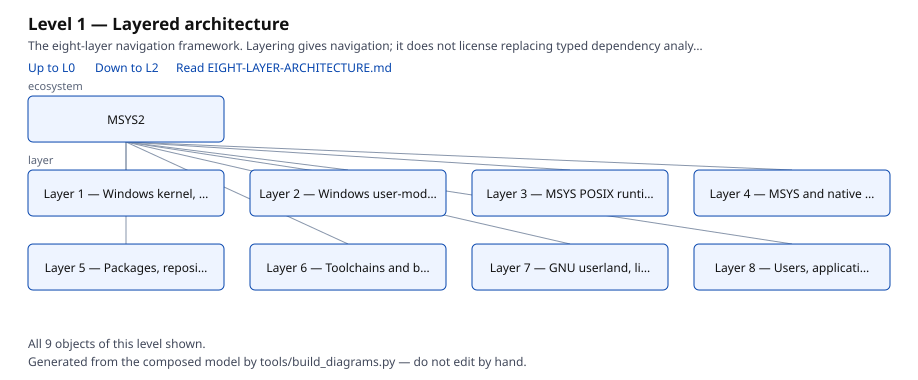
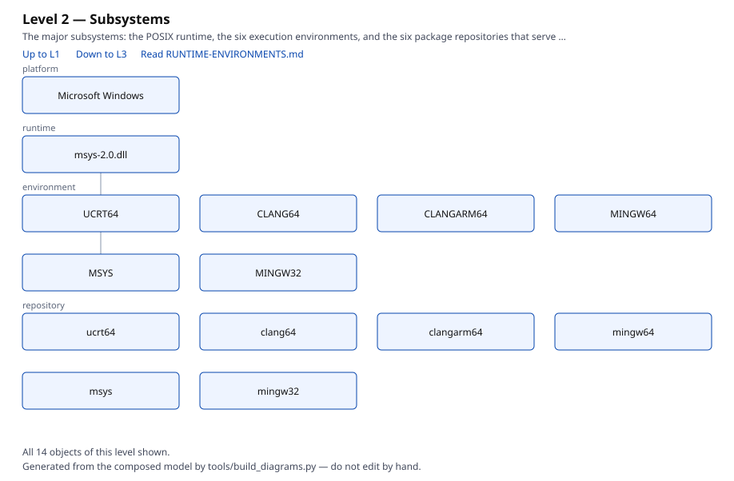
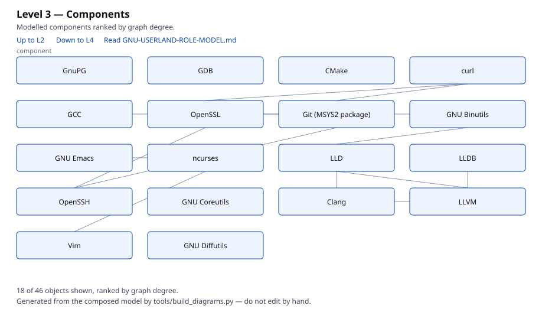
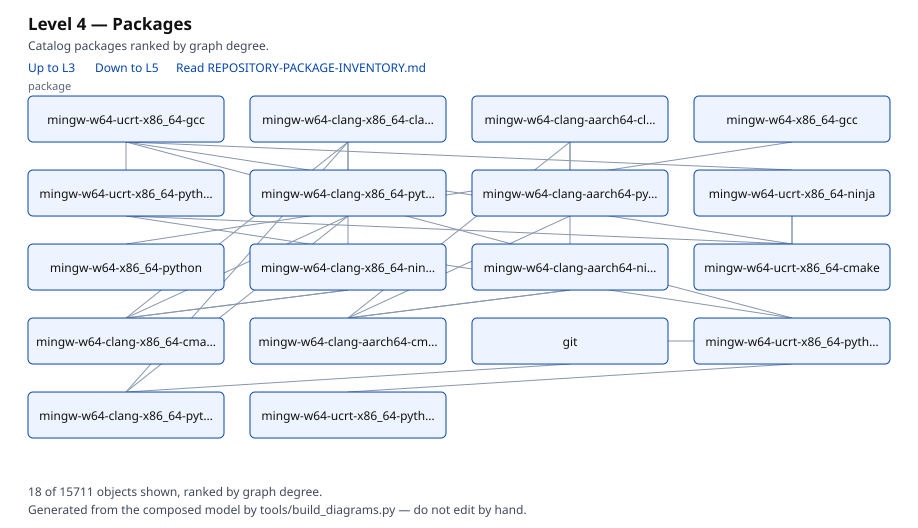
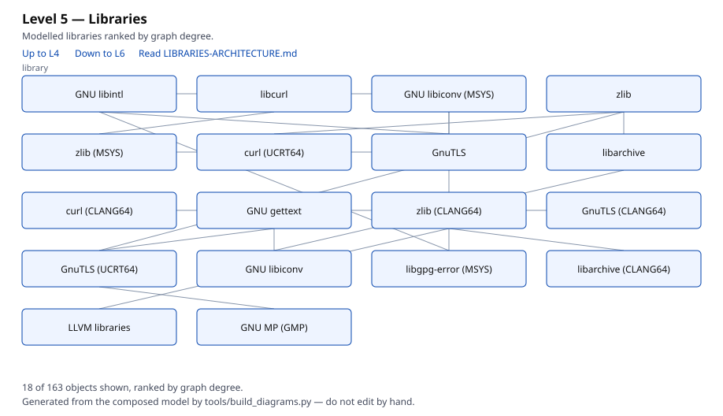
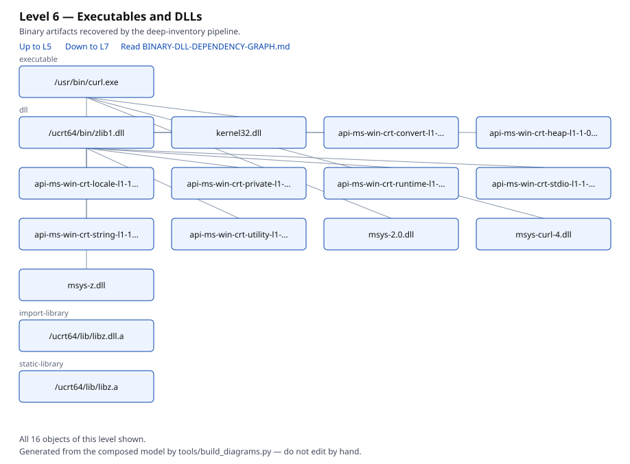
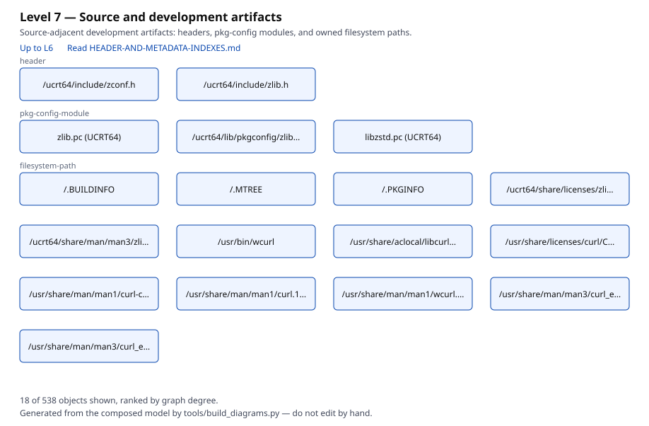

# Linked Diagram Hierarchy

## Purpose

Eight levels of drill-down, generated from the composed model by
`tools/build_diagrams.py`. Each level narrows the frame by one step and
carries three artifacts built from the same selection:
`level-N.svg` for navigation, `level-N.puml` (PlantUML) and `level-N.dot`
(Graphviz) as reusable sources.

Each SVG links **up** to the level above, **down** to the level below, out to
its canonical documentation page, and from every node to that object's route
in the architecture explorer.

## The ladder

| Level | Subject | Diagram | Sources | Canonical page |
| ---: | --- | --- | --- | --- |
| 0 | Ecosystem context | [SVG](../diagrams/level-0.svg) | [puml](../diagrams/level-0.puml) · [dot](../diagrams/level-0.dot) | [Ecosystem context](ECOSYSTEM-CONTEXT.md) |
| 1 | Layered architecture | [SVG](../diagrams/level-1.svg) | [puml](../diagrams/level-1.puml) · [dot](../diagrams/level-1.dot) | [Eight-layer architecture](EIGHT-LAYER-ARCHITECTURE.md) |
| 2 | Subsystems | [SVG](../diagrams/level-2.svg) | [puml](../diagrams/level-2.puml) · [dot](../diagrams/level-2.dot) | [Runtime environments](RUNTIME-ENVIRONMENTS.md) |
| 3 | Components | [SVG](../diagrams/level-3.svg) | [puml](../diagrams/level-3.puml) · [dot](../diagrams/level-3.dot) | [GNU userland role model](GNU-USERLAND-ROLE-MODEL.md) |
| 4 | Packages | [SVG](../diagrams/level-4.svg) | [puml](../diagrams/level-4.puml) · [dot](../diagrams/level-4.dot) | [Repository package inventory](REPOSITORY-PACKAGE-INVENTORY.md) |
| 5 | Libraries | [SVG](../diagrams/level-5.svg) | [puml](../diagrams/level-5.puml) · [dot](../diagrams/level-5.dot) | [Libraries architecture](LIBRARIES-ARCHITECTURE.md) |
| 6 | Executables and DLLs | [SVG](../diagrams/level-6.svg) | [puml](../diagrams/level-6.puml) · [dot](../diagrams/level-6.dot) | [Binary-to-DLL dependency graph](BINARY-DLL-DEPENDENCY-GRAPH.md) |
| 7 | Source and development artifacts | [SVG](../diagrams/level-7.svg) | [puml](../diagrams/level-7.puml) · [dot](../diagrams/level-7.dot) | [Header and metadata indexes](HEADER-AND-METADATA-INDEXES.md) |

The previews below are clickable — the inline image is a static raster of the
diagram, and following the link opens the SVG with its hyperlinks live.

[](../diagrams/level-0.svg)

[](../diagrams/level-1.svg)

[](../diagrams/level-2.svg)

[](../diagrams/level-3.svg)

[](../diagrams/level-4.svg)

[](../diagrams/level-5.svg)

[](../diagrams/level-6.svg)

[](../diagrams/level-7.svg)

## Selection and truncation

Levels 0–2 show every object of their kinds. Levels 3–7 are capped at 18
objects, ranked by graph degree and broken by identifier so a rebuild against
an unchanged snapshot is byte-identical.

Every capped diagram states its own cap in the rendered footer — for example
*"18 of 156 objects shown, ranked by graph degree"*. A diagram that shows a
subset must say so on its face; silent truncation reads as complete coverage.

Level 7 is thin because the deep-inventory pipeline has been run against 2 of
15,711 packages. It renders the artifacts that exist rather than implying a
source-level model that does not.

## Correction, 2026-08-02

This page previously embedded eight hand-authored SVGs with markdown image
syntax. Three defects, all now fixed:

1. **No drill-down chain.** None of the eight diagrams linked to any other
   diagram; all 51 hyperlinks pointed into the explorer. The charter's
   requirement that "every diagram should hyperlink to related diagrams" was
   unmet. Each level now links to its parent and child.
2. **Level semantics did not match the charter ladder.** Level 4 was an
   environment matrix (charter L2), level 5 a package-to-artifact flow
   (charter L4), and no diagram existed for the library, executable, or
   source levels at all. The ladder above follows the charter.
3. **Hyperlinks were inert.** Markdown `` loads an SVG as an image, and
   hyperlinks inside an image do not activate in any browser — so every link
   in every diagram was unreachable from this page. The previews are now
   wrapped in links to the SVG itself.

The retired hand-authored files (`level-0-ecosystem.svg` through
`level-7-userland-applications.svg`) remain in git history.

## Regeneration

```bash
python tools/build_diagrams.py
```

Diagrams are generated artifacts. Editing `diagrams/*.svg` by hand will be
overwritten on the next build, and CI regenerates them before
`git diff --exit-code`.

## Related Objects

- [Explorer domain views](EXPLORER-DOMAIN-VIEWS.md)
- [Eight-layer architecture](EIGHT-LAYER-ARCHITECTURE.md)
- [Charter drift assessment](CHARTER-DRIFT-ASSESSMENT.md)
