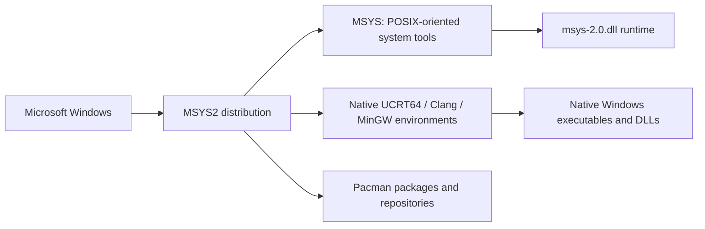
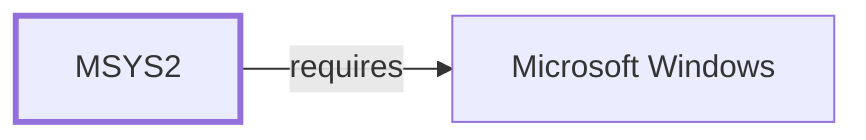

# MSYS2 Ecosystem Context

## Purpose

MSYS2 is a software distribution and native-build platform for Windows. It combines a small POSIX-oriented MSYS subsystem with native Windows development environments, package repositories, and reproducible package-building tooling.

## L0 Context

The MSYS environment supports package management, shell scripting, and POSIX-dependent tooling. Native environments produce Windows programs that do not depend on `msys-2.0.dll`; they remain distinct by target architecture, CRT, ABI, toolchain, and package prefix.

## Boundaries

- MSYS2 is the distribution; MSYS is one subsystem and environment.
- MinGW-w64 is a native-Windows toolchain foundation, not a replacement for the MSYS runtime or the distribution’s package-management layer.
- Generated package and runtime observations describe state; this page records the reviewed architectural boundary.

## Evidence and Gaps

The context is based on the [official MSYS2 introduction](https://www.msys2.org/wiki/MSYS2-introduction/), retrieved 2026-07-28. L1 layering and L2 domain decomposition remain separate planned increments.

<!-- BEGIN GENERATED dependency-subgraph -->

## Dependency Diagram

Dependencies and dependents of `ecosystem:msys2:msys2` in the composed graph: 0 dependents and 1 dependency.

Generated from the composed model by `tools/build_object_diagrams.py`.
Edits between the surrounding markers are overwritten on the next build.

<!-- END GENERATED dependency-subgraph -->
