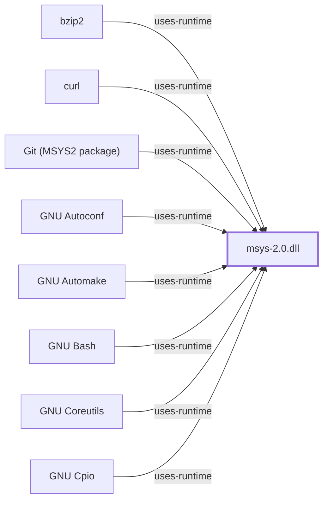

# MSYS2 Ecosystem Performance Architecture

## Scope and Honest Limits

This page analyses the cost structure of the MSYS2 ecosystem's four
recognised hot paths: `fork` emulation, path translation, mount-table
lookup, and pacman transaction cost.

**It contains no MSYS2 timings.** No Windows host running MSYS2 was
available to this knowledge base, so nothing here is a measurement of
MSYS2. What it is instead:

- **Mechanism-derived cost analysis.** Where upstream documents the
  algorithm, the cost follows from the algorithm. The `fork` sequence
  below is quoted, not inferred, and its cost properties — no
  copy-on-write, four synchronisation points, full data segment copy —
  are properties of the published sequence.
- **Observed structural metrics.** The pacman section uses counts taken
  from this repository's own catalog projection, which is a real
  observation of the real MSYS2 package catalog.
- **Named gaps.** Each section closes by stating the measurement that
  would replace reasoning with evidence.

A separate page, [AKB Performance Experiments](PERFORMANCE-EXPERIMENTS.md),
benchmarks *this repository's tooling*. It is not about MSYS2 and should
not be read as if it were.

The standing caveat for the whole page: the MSYS2 runtime is a fork of
Cygwin, and Cygwin's documentation establishes the *derived* design.
MSYS2 diverges from Cygwin precisely in path translation and mount
behavior, which are two of the four hot paths analysed here. Cygwin
statements are load-bearing for `fork`; they are directional only for
path and mount cost.

## Hot Path 1 — `fork` Emulation

### The published sequence

Windows provides no `fork`. The Cygwin runtime, from which MSYS2's is
derived, synthesises one. The upstream description is explicit that this
is not a copy-on-write implementation:

> Cygwin `fork()` essentially works like a non-copy on write version of
> `fork()` (like old Unix versions used to do). Because of this it can be
> a little slow. In most cases, you are better off using the spawn family
> of calls if possible.

The sequence, as published, is:

1. Parent reserves a process-table slot for the child.
2. Parent creates the child **suspended** via `CreateProcess`, passing
   the same image path it was itself invoked with.
3. Parent `setjmp`s its own context and publishes the jump buffer in the
   shared memory area common to all Cygwin tasks.
4. Parent copies its `.data` and `.bss` into the suspended child's
   address space.
5. Parent resumes the child and blocks on a mutex.
6. Child discovers it was forked and `longjmp`s through the saved buffer.
7. Child signals the parent's mutex, then blocks on a second mutex.
8. Parent copies its **stack and heap** into the child, releases the
   child's mutex, and returns from `fork`.
9. Child wakes, recreates any memory-mapped regions passed through the
   shared area, and returns from `fork`.

### What the sequence costs

Each numbered property below is a consequence of the sequence above, not
an independent claim:

| Property | Consequence |
| --- | --- |
| No copy-on-write | Cost scales with the parent's **resident data**, not with what the child touches. A large parent pays for the whole image whether or not the child reads it. |
| Two mutex round-trips (steps 5–8) | Two forced context switches per `fork`, serialised. Upstream names this as the target of unrealised optimisation. |
| Full `CreateProcess` in step 2 | A `fork` costs at least a Windows process creation, before any copying. |
| Address-space reproduction | The child must map the same DLLs at the same addresses; when it cannot, `fork` **fails** rather than degrading. |

That last row is why the cost is not purely a speed question. Upstream
documents the failure modes directly — `unable to remap somedll to same
address as parent`, `couldn't allocate heap`, `resource temporarily
unavailable` — and attributes them to third-party DLLs injected into
every process (the "BLODA" class, typically security software). The
mitigation upstream recommends is address-space headroom: "With the
bigger address space `fork()` is less likely to fail."

Two conclusions follow that a caller can act on:

- **`fork` cost is not amortisable.** It is paid per call, in full, with
  no lazy-copy escape.
- **`fork` reliability is environment-coupled.** The same binary on two
  Windows hosts with different security agents has different `fork`
  behavior, and the failure is not a slowdown.

### The one published number

Upstream publishes exactly one quantified performance figure, for the
`spawn` substitution rather than for `fork` itself:

> Changing the compiler's driver program to call `spawn` instead of
> `fork` was a trivial change and increased compilation speeds by twenty
> to thirty percent in our tests.

Read carefully, that is a 20–30% improvement in *compilation wall-clock*
from removing `fork` from one hot loop — which bounds `fork`'s share of
that workload from below, and says nothing about any other workload.
It is a Cygwin figure, on unstated hardware, at an unstated date. It is
cited here because it is the only number the upstream project stands
behind, and because a page about performance that cites none is worse.

Upstream's own forward-looking statement is unambiguous:

> `fork` will almost certainly always be inefficient under Win32.

### The trade this implies

`spawn`/`posix_spawn` maps onto the Win32 API directly; `fork`/`exec`
does not. Any MSYS-side workload dominated by process creation — shell
scripts, `configure` runs, recursive `make`, anything that forks per
input line — is paying the emulation on every iteration, and the
architectural remedy is to stop forking rather than to make forking
faster.

The cost does **not** apply to native builds. A MinGW-w64 program does
not link `msys-2.0.dll` and never enters this path. This is the single
most consequential performance fact in the ecosystem: the same source
compiled for UCRT64 rather than MSYS does not pay any of the above.

### What would settle it

Measured `fork` latency on an MSYS host as a function of parent RSS,
compared against `posix_spawn` at the same RSS, with and without a
security agent loaded. None of that is held here.

## Hot Path 2 — Path Translation

Every path crossing the MSYS boundary is rewritten. Upstream states the
direction plainly: "Paths coming into the DLL are translated from POSIX to
Win32."

The cost properties that follow from the documented mechanism:

- **Per-call, not per-process.** Translation happens at the API boundary,
  so a program making many small path-taking calls pays repeatedly.
- **Prefix-matched against the mount table.** See Hot Path 3 — the two are
  the same cost in practice.
- **Not free for native children.** When an MSYS process launches a native
  Windows program, arguments that look like paths are converted so the
  native program receives something it can open. That conversion is
  argument-vector work on every such launch, and it is the layer where
  MSYS2 diverges most from Cygwin.

Upstream also documents a mount-option lever with a directly stated
performance rationale — executability determination:

> Files ending in certain extensions (`.exe`, `.com`, `.lnk`) are assumed
> to be executable. Files whose first two characters are `#!`, `MZ`, or
> `:\n` are also considered to be executable.

and the mitigation:

> The `exec` option is used to instruct Cygwin that the mounted file is
> "executable" […] This option allows other files to be marked as
> executable and avoids the overhead of opening each file to check for
> "magic" bytes. The `cygexec` option is very similar to `exec`, but also
> prevents Cygwin from setting up commands and environment variables for a
> normal Windows program, adding another small performance gain.

That is a concrete, documented I/O cost: on a filesystem without usable
permission bits, deciding whether a file is executable requires **opening
it and reading two bytes**. A `PATH` search across such a mount opens
files rather than stat-ing them. The `binary` default is likewise
described as chosen "for performance reasons".

**What would settle it**: the effective MSYS2 mount table on a real
install, and translation latency measured across mount-table depth. This
knowledge base holds neither — MSYS2's `/etc/fstab` has never been
captured here, and its defaults are known to differ from Cygwin's.

## Hot Path 3 — Mount-Table Lookup

The lookup rule is documented exactly:

> Whenever Cygwin generates a Win32 path from a POSIX one, it uses the
> longest matching prefix in the mount table.

Longest-prefix matching over an unindexed table is linear in the number
of mount entries, and it cannot short-circuit on first match — the
longest match may be the last entry examined. So the cost is:

- proportional to **mount-table size**, on every translation;
- unaffected by which entry eventually wins;
- multiplied by the call rate from Hot Path 2.

Upstream adds a scope limit that materially shrinks the surface:

> This translation is normally only used when trying to derive the POSIX
> equivalent current directory. Otherwise, the handling of MS-DOS
> filenames bypasses the mount table.

That is the Win32→POSIX direction. The POSIX→Win32 direction — the one
taken on essentially every file operation from an MSYS program — is not
so limited.

The related pathology upstream documents is worth naming because its
symptom is indistinguishable from general slowness:

> If suddenly every command takes a very long time, then something is
> probably attempting to access a network share. […] Using `//c` means to
> contact the network server `c`, which will slow things down
> tremendously if it does not exist.

A single malformed `PATH` element turns every command lookup into a
network timeout. This is a **configuration** hot path, not a code one,
and it is the highest-severity/lowest-effort item on this page.

**What would settle it**: MSYS2's shipped mount table and `cygdrive`
prefix, and translation latency as a function of entry count. Not held
here. See [MSYS Mount Manager](MSYS-MOUNT-MANAGER.md) for what is.

## Hot Path 4 — pacman Transaction Cost

This is the one section resting on observation rather than reasoning.
The numbers below come from this repository's catalog projection
(`model/catalog/current.json`, snapshot `20260729T113151Z`), which is a
direct reading of the real MSYS2 package databases.

### Observed graph shape

| Metric | Value |
| --- | --- |
| Packages in the enabled repositories | 15,711 |
| Repositories | 6 |
| Dependency edges (`runtime-depends-on` + `optional-depends-on`) | 44,683 |
| Mean out-degree across all packages | 2.84 |
| Packages declaring at least one dependency | 12,159 |
| Median out-degree among those | 2 |
| Maximum out-degree | 75 (`mingw-w64-*-vlc`, all three variants) |
| Maximum in-degree | 999 (`mingw-w64-ucrt-x86_64-python`) |

### What that shape implies for a transaction

- **Resolution is sparse, not dense.** A mean out-degree of 2.84 over
  15,711 nodes means dependency closure for a typical package walks tens
  of nodes, not thousands. Transaction planning cost is dominated by
  database load, not by graph traversal.
- **The load step is the fixed cost.** pacman reads the sync databases
  for every enabled repository before it can resolve anything. That cost
  is paid identically whether the transaction installs one package or a
  hundred, which is why batching installs is cheaper than looping.
- **In-degree, not out-degree, drives upgrade blast radius.** `python`
  at 999 dependents means a Python rebuild is a 999-package
  reverse-dependency event. The four `python` variants and the `zlib`
  variants are the ecosystem's genuine hubs; the extremes on the
  out-degree side (`vlc` at 75) are unremarkable by comparison.
- **Variant multiplication is real and structural.** The top six
  most-depended-on packages are four `python` builds and two `zlib`
  builds — the *same* upstream software, once per environment. The
  catalog is roughly an order of magnitude smaller in distinct upstream
  projects than in packages.

### The costs not captured

pacman's documented transaction phases include signature verification and
hook execution, both of which run per transaction and neither of which is
visible in the graph shape above. Signature policy in particular is
per-repository and configurable, and this knowledge base has not
established MSYS2's effective setting — see
[pacman Package Signing](PACMAN-PACKAGE-SIGNING.md). File extraction
cost is likewise absent: the deep-inventory pipeline that would yield
per-package file counts has run against 2 of 15,711 packages.

**What would settle it**: transaction wall-clock decomposed into database
load, resolution, download, verification, extraction, and hooks, on a
real install. The pipeline to collect it exists; the host to run it on
does not.

## Ranked Findings

1. **Use a native environment when the workload forks.** UCRT64 or
   CLANG64 binaries never enter the emulation path at all. This dominates
   every other item here.
2. **Check `PATH` for `//server` elements before investigating anything
   else.** Documented upstream, catastrophic, and free to rule out.
3. **Prefer `posix_spawn` to `fork`/`exec` in MSYS-side code.** The only
   published number in this analysis is a 20–30% compilation improvement
   from exactly this substitution.
4. **Batch pacman transactions.** Database load is a fixed per-transaction
   cost over six repositories and 15,711 packages.
5. **Treat `fork` failures as environment problems, not code problems.**
   The documented cause is address-space interference from injected DLLs.

## Standing Gap

Every item in Hot Paths 1–3, and the transaction decomposition in Hot
Path 4, requires a Windows host running MSYS2. This knowledge base has
never had one; the five bounded probes of 2026-07-30 established command
outcomes, not timings. Until that host exists, this page is a cost model
with named uncertainty rather than a performance report, and it is
labelled `partial` for that reason.

<!-- BEGIN GENERATED dependency-subgraph -->

## Dependency Diagram

Dependencies and dependents of `runtime:msys2:msys-2.0.dll` in the composed graph: 72 dependents and 0 dependencies, of which 64 are omitted here for legibility.

Generated from the composed model by `tools/build_object_diagrams.py`.
Edits between the surrounding markers are overwritten on the next build.

<!-- END GENERATED dependency-subgraph -->

## Related Objects

- [MSYS Process Manager](MSYS-PROCESS-MANAGER.md)
- [MSYS Path Conversion](MSYS-PATH-CONVERSION.md)
- [MSYS Mount Manager](MSYS-MOUNT-MANAGER.md)
- [pacman Transactions](PACMAN-TRANSACTIONS.md)
- [AKB Performance Experiments](PERFORMANCE-EXPERIMENTS.md)
