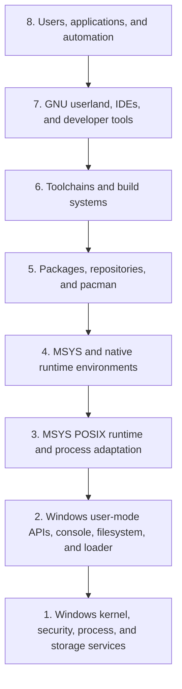

# MSYS2 Eight-Layer Architecture

## Purpose

This L1 view provides a stable navigation framework. It is not a strict
containment or call stack: package, build, ABI, and provenance relationships
cross layers and remain typed graph edges.

| Layer | Responsibility | Canonical follow-on volume | Evidence-qualified drill-down |
| ---: | --- | --- | --- |
| 1 | Windows kernel services, processes, storage, security | 2 | [Windows platform boundaries](WINDOWS-PLATFORM-BOUNDARIES.md) |
| 2 | Win32-facing APIs, console/ConPTY, loader, filesystem | 2 | [Windows platform boundaries](WINDOWS-PLATFORM-BOUNDARIES.md), [MSYS runtime behavior map](MSYS-RUNTIME-BEHAVIOR-MAP.md) (Windows-facing boundary column) |
| 3 | `msys-2.0.dll`, POSIX adaptation, paths, fork/exec | 3 | [MSYS runtime initialization](MSYS-RUNTIME-INITIALIZATION.md), [MSYS runtime behavior map](MSYS-RUNTIME-BEHAVIOR-MAP.md) |
| 4 | MSYS, UCRT64, CLANG64, CLANGARM64, MINGW64, MINGW32 | 4 | [Runtime environments](RUNTIME-ENVIRONMENTS.md) |
| 5 | pacman, repositories, metadata, transactions | 7 and 11 | [Pacman architecture](PACMAN-ARCHITECTURE.md), [Pacman repository trust model](PACMAN-REPOSITORY-TRUST-MODEL.md), [Repository package inventory](REPOSITORY-PACKAGE-INVENTORY.md) |
| 6 | GCC, LLVM, linkers, build systems, recipes | 8 and 14 | [Toolchain role model](TOOLCHAIN-ROLE-MODEL.md) (14 per-tool pages: [GCC](GNU-GCC.md), [Clang](CLANG.md), [GNU Binutils](GNU-BINUTILS.md), [LLD](LLD.md), [GDB](GNU-GDB.md), [LLDB](LLDB.md), [CMake](CMAKE.md), [Meson](MESON.md), [Ninja](NINJA.md), [pkgconf](PKGCONF.md), the Autotools family), [Build system role model](BUILD-SYSTEM-ROLE-MODEL.md), [Build-artifact flow mappings](BUILD-ARTIFACT-FLOW-MAPPINGS.md) |
| 7 | Shells, GNU tools, Git, libraries, development tools | 5, 6, and 9 | [GNU userland role model](GNU-USERLAND-ROLE-MODEL.md) (29 per-tool pages: [Bash](GNU-BASH.md), [Coreutils](GNU-COREUTILS.md), archive/compression tools, editors/pagers/terminals, [Git (MSYS2 package)](GIT-MSYS-PACKAGE.md), and more), [MSYS2 Library Architecture](LIBRARIES-ARCHITECTURE.md) ([zlib](ZLIB.md), [libstdc++](LIBSTDCXX.md), [libc++](LIBCXX.md), [GNU libiconv](GNU-LIBICONV.md), [GNU gettext](GNU-GETTEXT.md)) |
| 8 | Human and automated consumers of built/runtime artifacts | 1, 18, and 19 | [Developer/operator workflows](DEVELOPER-OPERATOR-WORKFLOWS.md) |

Layers 6 and 7 carry the deepest drill-downs in this knowledge base to
date: every compiler, linker, debugger, and build-system tool identified
for Layer 6, and every shell/coreutils/archive/editor/network tool
identified for Layer 7, now has an individually evidence-backed page.
Layers 1–3 (Windows kernel/API services and the MSYS runtime) remain the
shallowest layers by that per-object-page measure, but each now carries at
least one controlled, version-qualified local observation rather than
desk-researchable documentation alone: Layer 1/2's
[Windows platform boundaries](WINDOWS-PLATFORM-BOUNDARIES.md) page
records host edition, filesystem type, and symlink-privilege facts from
two separate observation sessions on this workstation, and Layer 3's
[MSYS runtime behavior map](MSYS-RUNTIME-BEHAVIOR-MAP.md) records
process/exec/signal/symlink probe outcomes from the isolated MSYS2
installation. Neither approaches Layers 6/7's per-object page depth; see
each linked page's own evidence boundary for what remains unobserved.

## Boundaries

MSYS runtime behavior belongs to Layer 3 and must not be assumed for native
Layer 4 outputs. Package ownership is Layer 5 evidence, not proof of Layer 3
runtime behavior. The layering gives navigation; it does not permit replacing
typed dependency analysis with adjacent-layer assumptions.

## Related Views

- [Ecosystem context](ECOSYSTEM-CONTEXT.md)
- [Runtime environments](RUNTIME-ENVIRONMENTS.md)
- [Master volume index](MASTER-VOLUME-INDEX.md)
