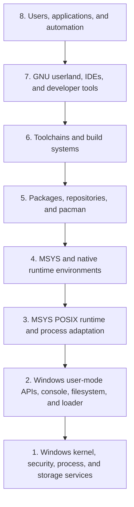

# MSYS2 Eight-Layer Architecture

## Purpose

This L1 view provides a stable navigation framework. It is not a strict
containment or call stack: package, build, ABI, and provenance relationships
cross layers and remain typed graph edges.

| Layer | Responsibility | Canonical follow-on volume |
| ---: | --- | --- |
| 1 | Windows kernel services, processes, storage, security | 2 |
| 2 | Win32-facing APIs, console/ConPTY, loader, filesystem | 2 |
| 3 | `msys-2.0.dll`, POSIX adaptation, paths, fork/exec | 3 |
| 4 | MSYS, UCRT64, CLANG64, CLANGARM64, MINGW64, MINGW32 | 4 |
| 5 | pacman, repositories, metadata, transactions | 7 and 11 |
| 6 | GCC, LLVM, linkers, build systems, recipes | 8 and 14 |
| 7 | Shells, GNU tools, Git, libraries, development tools | 5, 6, and 9 |
| 8 | Human and automated consumers of built/runtime artifacts | 1, 18, and 19 |

## Boundaries

MSYS runtime behavior belongs to Layer 3 and must not be assumed for native
Layer 4 outputs. Package ownership is Layer 5 evidence, not proof of Layer 3
runtime behavior. The layering gives navigation; it does not permit replacing
typed dependency analysis with adjacent-layer assumptions.

## Related Views

- [Ecosystem context](ECOSYSTEM-CONTEXT.md)
- [Runtime environments](RUNTIME-ENVIRONMENTS.md)
- [Master volume index](MASTER-VOLUME-INDEX.md)
