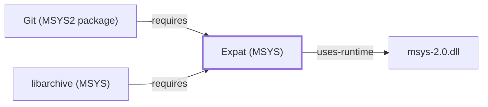

# Expat (MSYS)

<!-- BEGIN GENERATED object-facts -->

| Model fact | Value |
| --- | --- |
| Object | `library:libexpat:expat@msys` |
| Kind | `library` |
| Status | `partial` |
| Confidence | `high` |
| Authority | Expat maintainers |
| Environments | `msys` |
| Upstream | <https://libexpat.github.io/> |
| Packaged as | `package:msys2:libexpat` |
| Version (observed) | 2.8.2-1 |
| License (observed) | spdx:MIT |
| Architecture (observed) | x86_64 |
| Installed size (observed) | 161.27 KiB |

**Evidence on this object**

- `evidence:catalog:current` — MSYS2 pacman package catalog (`observed`, retrieved 2026-08-05)
- `evidence:libexpat:manual-2026-07-30` — Expat (official project site) (`primary`, retrieved 2026-07-30)

Generated from the composed model by `tools/build_object_facts.py`. Observed values come from the catalog snapshot and change when it is refreshed.
Edits between the surrounding markers are overwritten on the next build.

<!-- END GENERATED object-facts -->

## Purpose

This page documents the **MSYS-environment** Expat package specifically
— a stream-oriented XML parser library — depended on by
[Git](GIT-MSYS-PACKAGE.md) for `git-svn` and remote-helper XML handling,
already cited by package name on
[GIT-MSYS-PACKAGE.md](GIT-MSYS-PACKAGE.md#dependencies) before this page
existed. See the
[official Expat project page](https://libexpat.github.io/) for the full
reference.

## Architectural Classification

`library:libexpat:expat@msys` is packaged in the MSYS environment as
`package:msys2:libexpat` (version `2.8.2-1` in the current catalog
snapshot) — the same version number as the UCRT64 sibling documented on
[Expat (UCRT64)](EXPAT.md), but a separately built, separate catalog
entity. This is the package [Git](GIT-MSYS-PACKAGE.md) — an
MSYS-environment component itself — actually depends on.

## Responsibilities

- Providing stream-oriented XML parsing, consumed by
  [Git's](GIT-MSYS-PACKAGE.md) `git-svn` command and its remote-helper
  infrastructure for XML-format data handling.

## Boundaries

This page's package serves MSYS-environment consumers specifically;
[CMake](CMAKE.md), [GDB](GNU-GDB.md), and this knowledge base's other
UCRT64-native dependents instead link
[Expat (UCRT64)](EXPAT.md#reverse-dependencies) — the two are not
interchangeable, matching the same distinction already made throughout
this volume for MSYS/UCRT64 sibling pairs.

## Interfaces

- The Expat C API (`XML_ParserCreate`, `XML_Parse`, and related
  functions), the same interface [Expat (UCRT64)](EXPAT.md#interfaces)
  documents, per the documentation.

## Dependencies

The catalog snapshot records no `runtime-depends-on` edges for
`package:msys2:libexpat` beyond standard MSYS runtime support.

## Reverse Dependencies

The catalog snapshot records 13 relationships targeting
`package:msys2:libexpat`. Two are already modeled in this knowledge
base: `package:msys2:git`
(`relationship:ssh-curl-git:git-requires-expat-msys`) and
[libarchive (MSYS)](LIBARCHIVE-MSYS.md)
(`relationship:foundation-libraries:libarchive-msys-requires-expat`,
**correction, 2026-08-02**: this section had previously listed
`libarchive` among the not-individually-modeled dependents, when it was
in fact already modeled elsewhere in this knowledge base). The
remaining ~11 recorded dependents (`bsdcpio`, `bsdtar`, `cmake` — the
separate MSYS `cmake` package, distinct from the UCRT64 `cmake` package
[CMake's own page](CMAKE.md) documents — `elinks`, `lftp`, and others)
are not individually modeled in this
knowledge base; see the
[reverse dependency impact analysis](REVERSE-DEPENDENCY-IMPACT-ANALYSIS.md)
for the current full list.

## Configuration

Expat has no persistent configuration file; parsing behavior is
controlled entirely through its C API by the calling program.

## Initialization and Execution Flow

As a library, Expat has no independent process lifecycle: it initializes
and executes within the process of whatever program links against it —
[Git's](GIT-MSYS-PACKAGE.md) `git-svn` in this dependency chain. As an
MSYS-dependent library, this is adapted from POSIX semantics onto
Windows process primitives by `msys-2.0.dll` per
[MSYS Runtime Initialization](MSYS-RUNTIME-INITIALIZATION.md).

## Runtime Behavior

Identical functional behavior to [Expat (UCRT64)](EXPAT.md); see that
page for detail not specific to the MSYS/UCRT64 packaging distinction.
This package's role in Git is exercised only when `git-svn` or an
XML-handling remote helper is actually used, not during ordinary Git
operations.

## Compatibility and Variants

The MSYS and native (UCRT64/CLANG64/i686) Expat packages are separately
versioned catalog entities (see Architectural Classification); code
built against one is not automatically compatible with the other
without matching the correct environment.

## Security Considerations

XML parsing of untrusted input is a documented general source of parser
vulnerabilities (entity expansion attacks, malformed input handling);
this page does not assert this specific package version's mitigation
status. See [Threat Model and Supply Chain](THREAT-MODEL-AND-SUPPLY-CHAIN.md)
for the project's general supply-chain posture; no version-qualified
CVE review has been performed for the recorded `2.8.2-1` version.

## Failure Modes and Diagnostics

An XML-parsing failure in `git-svn` or a remote helper should be checked
against the actual XML input's well-formedness before being treated as
a Git defect.

## Evidence, Assumptions, and Open Questions

XML parsing scope is backed by the official Expat project page
(`evidence:libexpat:manual-2026-07-30`), the same evidence record
[Expat (UCRT64)](EXPAT.md) cites. Package identity, version, and the
modeled dependent edges are backed by the pacman catalog snapshot
(`evidence:catalog:current`). Open, and explicitly out of scope for
this page: the ~11 remaining recorded dependents not individually
modeled; `package:msys2:expat` — a distinct MSYS catalog package from
this page's `libexpat`, cited but deliberately declined as a
[APR-util](APR-UTIL-MSYS.md#dependencies) dependency edge per the same
`pcre`/`pcre2` meta-package precedent documented on
[libbz2](LIBBZ2.md#reverse-dependencies), and not itself modeled in
this knowledge base; and header-level API surface / PE import/export-level
evidence, per the
[Library Family Classification](LIBRARY-FAMILY-CLASSIFICATION.md)
methodology.

<!-- BEGIN GENERATED dependency-subgraph -->

## Dependency Diagram

Dependencies and dependents of `library:libexpat:expat@msys` in the composed graph: 2 dependents and 1 dependency.

Generated from the composed model by `tools/build_object_diagrams.py`.
Edits between the surrounding markers are overwritten on the next build.

<!-- END GENERATED dependency-subgraph -->

## Related Objects

- [MSYS2 Library Architecture](LIBRARIES-ARCHITECTURE.md)
- [Expat (UCRT64)](EXPAT.md)
- [Git (MSYS2 package)](GIT-MSYS-PACKAGE.md)
- [libarchive (MSYS)](LIBARCHIVE-MSYS.md)
- [APR-util](APR-UTIL-MSYS.md)
- [Expat (CLANG64)](EXPAT-CLANG64.md)
