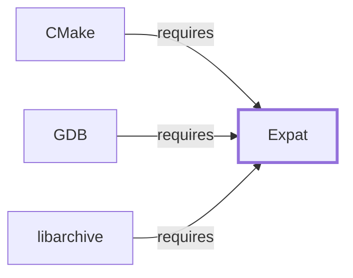

# Expat

## Purpose

Expat is a stream-oriented (SAX-style) XML parser library, and it is one of
two XML libraries this environment packages — the other being the
fuller-featured [libxml2](LIBXML2.md). This page documents its
architectural role and where it already appears elsewhere in this
knowledge base as a dependency; see the
[official Expat project site](https://libexpat.github.io/) for the API
reference.

## Architectural Classification

`library:libexpat:expat` is packaged per native environment: this page
cites the UCRT64 build, `package:msys2:mingw-w64-ucrt-x86_64-expat`
(version `2.8.2-1` in the current catalog snapshot, license `MIT`),
originally authored by James Clark. This page is scoped to Volume 6's
package/dependency-level evidence; the fuller
[Library Family Classification](LIBRARY-FAMILY-CLASSIFICATION.md)
methodology has not been applied here and remains open.

## Responsibilities

- Stream-oriented (event-driven, SAX-style) XML parsing: the caller
  registers callbacks for elements, text, and other XML constructs as the
  parser encounters them, rather than the parser building an in-memory
  document tree itself.

## Boundaries

Expat parses; it does not build a DOM tree or provide XPath/XSLT support,
unlike [libxml2](LIBXML2.md)'s broader feature set. [CMake](CMAKE.md#dependencies)
and [GDB](GNU-GDB.md#dependencies) both declare a direct dependency on
this UCRT64 package specifically for this lightweight parsing model.
[Git](GIT-MSYS-PACKAGE.md#dependencies) also depends on Expat for the
same reason, but on the separately packaged MSYS sibling,
[Expat (MSYS)](EXPAT-MSYS.md), not this UCRT64 package.

## Interfaces

- A C callback-based API (`XML_ParserCreate`, `XML_SetElementHandler`,
  `XML_Parse`) for streaming XML parsing, per the documentation. This page
  does not enumerate the header-level surface; that belongs to
  [Header and Development-Metadata Indexes](HEADER-AND-METADATA-INDEXES.md).

## Dependencies

The catalog snapshot records no `runtime-depends-on` edges for
`package:msys2:mingw-w64-ucrt-x86_64-expat` beyond its membership in the
UCRT64 repository and environment — a minimal dependency footprint
consistent with Expat's small, focused design.

## Reverse Dependencies

The snapshot records 38 relationships targeting
`package:msys2:mingw-w64-ucrt-x86_64-expat`, including the three tools
already cited above under Boundaries. See the
[reverse dependency impact analysis](REVERSE-DEPENDENCY-IMPACT-ANALYSIS.md)
for the current full list.

## Configuration

Expat has no persistent configuration file; parsing behavior (encoding
handling, namespace processing) is controlled through its C API parameters
at parser-creation time.

## Initialization and Execution Flow

As a library, Expat has no independent process lifecycle: it initializes
and executes within the process of whatever program links against it, the
same model documented for [zlib](ZLIB.md#initialization-and-execution-flow).

## Runtime Behavior

Because Expat is event-driven, a calling program's own callback logic
determines what happens with parsed XML content; Expat itself only
recognizes and reports XML structure, it does not interpret document
semantics.

## Compatibility and Variants

Expat's streaming model is a deliberate contrast to [libxml2](LIBXML2.md)'s
DOM-tree-building default mode; a program choosing between the two is
making a real architectural trade-off (memory/streaming versus
convenience/feature breadth), not picking between interchangeable options.

## Security Considerations

Expat parses untrusted XML input in several of its dependents; XML
parser vulnerabilities (such as entity-expansion denial-of-service) are a
well-documented general risk class for this category of library. See
[Threat Model and Supply Chain](THREAT-MODEL-AND-SUPPLY-CHAIN.md) for the
project's general supply-chain posture; no version-qualified CVE review has
been performed for the recorded `2.8.2-1` version.

## Failure Modes and Diagnostics

XML parse errors are reported through Expat's own error-code API
(`XML_GetErrorCode`); a dependent tool's XML-related failure should first
be checked against whether the input XML is well-formed before assuming a
defect in Expat or the dependent tool.

## Evidence, Assumptions, and Open Questions

The streaming-parser model is backed by the official Expat project site
(`evidence:libexpat:manual-2026-07-30`), matching the `project_url`
already recorded for `package:msys2:mingw-w64-ucrt-x86_64-expat` in the
catalog. Package identity, version, license, and reverse-dependency count
are backed by the pacman catalog snapshot (`evidence:catalog:current`).
Open, and explicitly out of scope for this page: header-level API surface
and PE import/export-level evidence, per the
[Library Family Classification](LIBRARY-FAMILY-CLASSIFICATION.md)
methodology.

<!-- BEGIN GENERATED dependency-subgraph -->

## Dependency Diagram

Dependencies and dependents of `library:libexpat:expat` in the composed graph: 3 dependents and 0 dependencies.

Generated from the composed model by `tools/build_object_diagrams.py`.
Edits between the surrounding markers are overwritten on the next build.

<!-- END GENERATED dependency-subgraph -->

## Related Objects

- [MSYS2 Library Architecture](LIBRARIES-ARCHITECTURE.md)
- [libxml2](LIBXML2.md)
- [CMake](CMAKE.md)
- [libarchive](LIBARCHIVE.md)
- [GDB](GNU-GDB.md)
- [Expat (MSYS)](EXPAT-MSYS.md)
- [Expat (CLANG64)](EXPAT-CLANG64.md)
