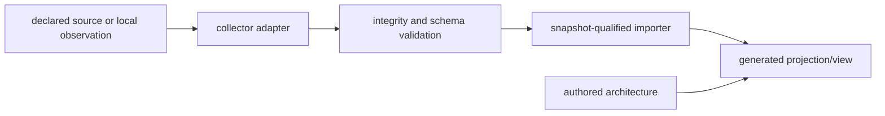

# Extension and Plugin Architecture

The AKB is extensible through collectors, importers, generators, schemas, and
documentation views. An extension is a bounded adapter around a declared input
contract; it must not silently elevate new data into reviewed architectural
facts.

| Extension point | Contract | Safety boundary |
| --- | --- | --- |
| Collector | Produces a documented, versioned observation format | Never execute untrusted package metadata or recipes merely to collect fields |
| Importer | Validates hashes, record counts, schema, and references | Preserve unknown/ambiguous data as explicit unresolved records |
| Vocabulary/schema | Adds typed entity/relationship kinds with validation | Do not repurpose an existing kind to make unrelated facts appear compatible |
| Generator | Derives indexes, reports, explorer routes, and diagrams from composed data | Generated output is not a hand-authored authority source |
| Documentation view | Explains scope, assumptions, and usage | Must distinguish observed data from architectural interpretation |
| External plugin | Isolated integration with declared credentials and permissions | Do not include secrets, arbitrary environment variables, or implicit network side effects in an evidence snapshot |

## Lifecycle

1. Register the source and refresh policy before collecting data.
2. Define a standard, non-executing input contract and fixture tests.
3. Capture immutable or content-addressed raw evidence where retention allows.
4. Validate and import only snapshot-qualified, typed objects.
5. Regenerate views and verify that a clean checkout reproduces tracked output.
6. Review the resulting claim/evidence boundary before treating it as
   architecture guidance.

## Compatibility rules

- Additive fields are preferred; incompatible meaning changes require a new
  schema/collector version and migration path.
- Stable IDs must derive from observed, non-secret identity inputs.
- An extension may add relationships only when both endpoints and evidence are
  present in the same qualified scope.
- Local-only extensions may retain large raw evidence, but published tooling
  must be reproducible without those files.

## Related views

- [Self-updating knowledge base](SELF-UPDATING-KNOWLEDGE-BASE.md)
- [Local-only evidence retention](LOCAL-EVIDENCE-RETENTION.md)
- [Documentation standard](DOCUMENTATION-STANDARD.md)
- [Threat model and supply chain](THREAT-MODEL-AND-SUPPLY-CHAIN.md)
