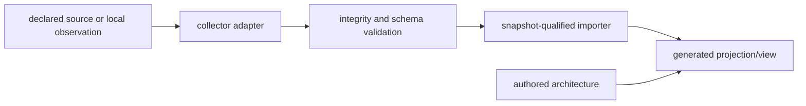

# Extension and Plugin Architecture

The AKB is extensible through collectors, importers, generators, schemas, and
documentation views. An extension is a bounded adapter around a declared input
contract; it must not silently elevate new data into reviewed architectural
facts.

| Extension point | Contract | Safety boundary |
| --- | --- | --- |
| Collector | Produces a documented, versioned observation format | Never execute untrusted package metadata or recipes merely to collect fields |
| Importer | Validates hashes, record counts, schema, and references | Preserve unknown/ambiguous data as explicit unresolved records |
| Vocabulary/schema | Adds typed entity/relationship kinds with validation | Do not repurpose an existing kind to make unrelated facts appear compatible |
| Generator | Derives indexes, reports, explorer routes, and diagrams from composed data | Generated output is not a hand-authored authority source |
| Documentation view | Explains scope, assumptions, and usage | Must distinguish observed data from architectural interpretation |
| External plugin | Isolated integration with declared credentials and permissions | Do not include secrets, arbitrary environment variables, or implicit network side effects in an evidence snapshot |

## Concrete extension implementations

Every extension point above already has at least one real implementation in
this repository, not just a described contract:

| Extension point | Concrete implementation(s) | Input/output contract |
| --- | --- | --- |
| Collector | `tools/catalog-msys2-packages.ps1`, `tools/collect_runtime_observation.py`, `tools/collect_toolchain_build_observation.py`, `tools/collect_recipe_tree.py`, `tools/deep_inventory.py`/`Collect-AkbDeepInventory.ps1`, `tools/analyze_package_archive.py`, `tools/verify_recipe_sources.py` | Each writes a documented JSON/JSONL observation format; none executes untrusted package recipes to collect fields, per `docs/DEEP-INVENTORY-CONTRACT.md` and `docs/RUNTIME-OBSERVATION-CONTRACT.md` |
| Importer | `tools/import_package_catalog.py`, `tools/import_repository_db.py`, `tools/import_repository_file_db.py`, `tools/import_recipe_tree.py`, `tools/import_deep_inventory.py`, `tools/import_package_archives.py`, `tools/import_runtime_observation.py` | Each validates its collector's output against a declared schema before producing typed entities/relationships; unresolved references are retained explicitly (for example, `generated/unresolved-dependencies.json`, per `docs/SELF-UPDATING-KNOWLEDGE-BASE.md`) rather than dropped |
| Vocabulary/schema | `model/schema/architecture-graph.schema.json`, `model/schema/deep-inventory.schema.json`, `model/schema/runtime-observation.schema.json`, `model/vocabularies/entity-kinds.json`, `model/vocabularies/relationship-types.json` | Each carries its own `schema_version`/`version` field (see Compatibility rules below) |
| Generator | `tools/akb.py generate`, `tools/build_catalog_views.py`, `tools/build_explorer.py`, `tools/assess_akb_coverage.py`, `tools/benchmark_akb.py` | Each reads only the composed model and writes to `generated/`; none is a hand-authored source of truth |
| Documentation view | Every `docs/*.md` page's frontmatter (`status`, `model_refs`, `evidence_refs`) | Distinguishes authored architecture from generated projections per `docs/DOCUMENTATION-STANDARD.md` |
| External plugin | Not yet implemented in this repository | No external-service integration exists yet; the contract row above is aspirational until one is built |

## Compatibility and migration status

The mechanism for incompatible changes exists and is enforced today:
`model/schema/deep-inventory.schema.json` and
`model/schema/runtime-observation.schema.json` both pin `schema_version` to
a fixed `const: "1.0.0"` (any incompatible collector change would require
bumping that constant and the importer that validates against it), and
`model/graph.json`'s `schema_version` and both vocabulary files' `version`
fields follow semver (currently `0.1.0` across all three). As of this
snapshot, however, none of these version fields has ever been bumped in
this repository's history — there is no exercised migration case to point
to yet, only the designed mechanism. This is stated plainly rather than
inferred from the mechanism's existence: a compatibility rule that has
never been exercised is not the same evidence as one that has survived a
real breaking change.

## Lifecycle

1. Register the source and refresh policy before collecting data.
2. Define a standard, non-executing input contract and fixture tests.
3. Capture immutable or content-addressed raw evidence where retention allows.
4. Validate and import only snapshot-qualified, typed objects.
5. Regenerate views and verify that a clean checkout reproduces tracked output.
6. Review the resulting claim/evidence boundary before treating it as
   architecture guidance.

## Compatibility rules

- Additive fields are preferred; incompatible meaning changes require a new
  schema/collector version and migration path.
- Stable IDs must derive from observed, non-secret identity inputs.
- An extension may add relationships only when both endpoints and evidence are
  present in the same qualified scope.
- Local-only extensions may retain large raw evidence, but published tooling
  must be reproducible without those files.

## Related views

- [Self-updating knowledge base](SELF-UPDATING-KNOWLEDGE-BASE.md)
- [Local-only evidence retention](LOCAL-EVIDENCE-RETENTION.md)
- [Documentation standard](DOCUMENTATION-STANDARD.md)
- [Threat model and supply chain](THREAT-MODEL-AND-SUPPLY-CHAIN.md)
