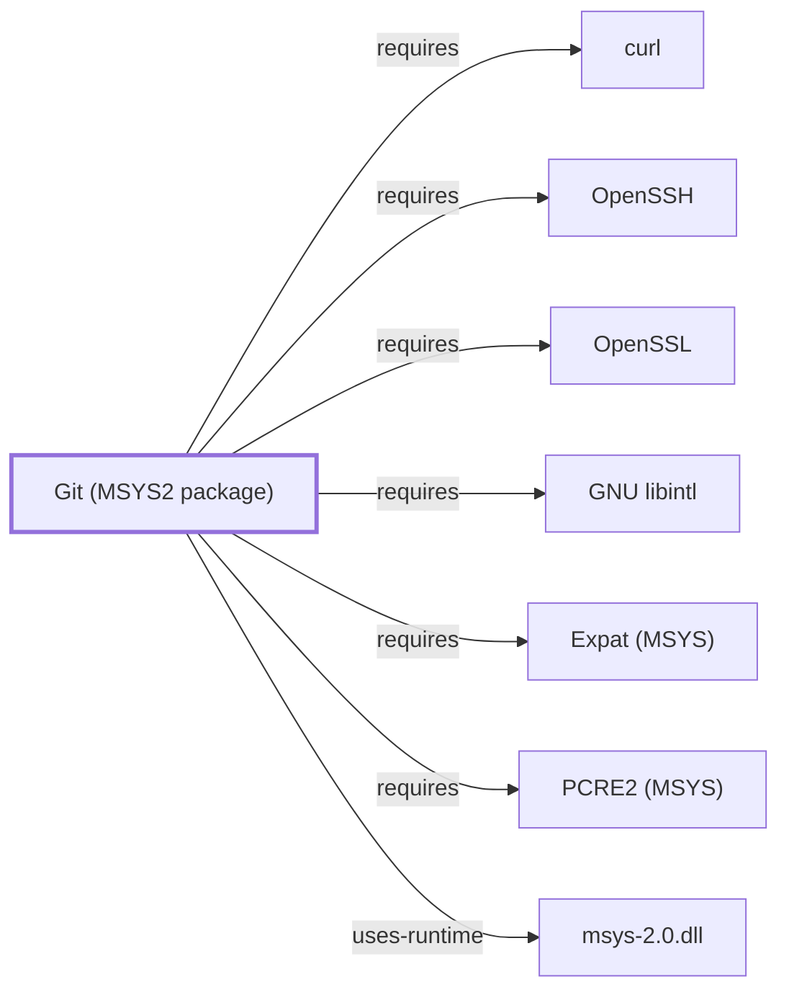

# Git for Windows Credential Manager

<!-- BEGIN GENERATED object-facts -->

| Model fact | Value |
| --- | --- |
| Object | `component:git:git` |
| Kind | `component` |
| Status | `partial` |
| Confidence | `high` |
| Authority | Linus Torvalds / Git community (Junio C Hamano, maintainer) |
| Environments | `msys` |
| Upstream | <https://git-scm.com/> |
| Packaged as | `package:msys2:git` |
| Version (observed) | 2.55.0-1 |
| License (observed) | spdx:GPL-2.0-only |
| Architecture (observed) | x86_64 |
| Installed size (observed) | 40.51 MiB |

**Evidence on this object**

- `evidence:catalog:current` — MSYS2 pacman package catalog (`observed`, retrieved 2026-08-05)
- `evidence:git:project-site-2026-07-30` — Git (official project site) (`primary`, retrieved 2026-07-30)

**Claims about this object**

- `claim:component:git:msys-package-boundary` (`fact`, `high`) — The git component modeled in this volume is the plain MSYS2-packaged git, distinct from the separately distributed Git for Windows product documented in Volume 9; both distributions track upstream Git 2.55.0 as of their respective 2026-07-29 and 2026-07-30 observations, but have separate package and release provenance.
- `claim:component:git:nano-fallback-editor` (`inference`, `high`) — Git's runtime dependency on nano reflects its use as a guaranteed-present fallback editor for commit messages and interactive commands when no EDITOR/core.editor/VISUAL is configured, not a build-time requirement of Git's own functionality.

Generated from the composed model by `tools/build_object_facts.py`. Observed values come from the catalog snapshot and change when it is refreshed.
Edits between the surrounding markers are overwritten on the next build.

<!-- END GENERATED object-facts -->

## Purpose

Git obtains credentials through **helper** programs rather than storing them
itself. This page documents that protocol and the helper Git for Windows
ships — the **credential manager** the charter names and this volume had not
covered.

## Architectural Classification

`gitcredentials(7)` documents the helper mechanism: `credential.helper`
names a program, helpers are conventionally named `git-credential-$NAME` and
placed on `PATH` so they can be referred to by the short name alone, and Git
invokes them for **get**, **store**, and **erase**.

The same page states that **Git Credential Manager** is cross platform and
**included in Git for Windows**. It also names `git-credential-wincred` as a
Windows helper, and `cache` and `store` as built-ins — the latter storing
credentials indefinitely on disk.

This knowledge base documents the **MSYS2 package** `git`
([Git (MSYS2 package)](GIT-MSYS-PACKAGE.md)) as a Volume 5 component. Git for
Windows is a **separate distribution** — a curated subset of MSYS2 packaged
and shipped independently, at version 2.55.0.3 per its own site. Facts about
one are not automatically facts about the other, and this volume exists
because they diverge. See
[distribution boundary](GIT-FOR-WINDOWS-BOUNDARY.md).

## Responsibilities

- Supplying credentials to Git on demand rather than requiring them in a
  remote URL or a file Git reads directly.
- Persisting them, where the helper chooses to, in whatever store the helper
  fronts.
- Erasing them when Git reports them rejected.

## Boundaries

Git delegates; it does not implement storage. The security properties of
credential handling are the **helper's**, not Git's — which is why "Git
stores my password securely" is not a well-formed claim without naming the
helper.

The built-in `store` helper writes credentials to disk indefinitely and is
documented as doing so. Choosing it is a decision about durability, not a
default to accept unexamined.

## Interfaces

The helper protocol exchanges key-value lines — `protocol=`, `username=`,
`password=` — over the helper's standard input and output, invoked with one
of `get`, `store`, or `erase`.

## Dependencies

A configured helper. Git for Windows ships Git Credential Manager; the
platform also offers `wincred`.

## Reverse Dependencies

Every authenticated fetch or push over
[HTTP transport](GIT-FOR-WINDOWS-HTTP-TRANSPORT.md). SSH authenticates by
key rather than through this path.

## Configuration

`credential.helper`, settable globally, per-URL, or per-remote. Which helper
a given Git for Windows installation has configured is not recorded here.

## Initialization and Execution Flow

Git needs a credential, runs the configured helper with `get`, uses what it
returns, and reports back with `store` or `erase` depending on the outcome.

## Runtime Behavior

Not observed. No Git for Windows credential exchange has been captured.

## Compatibility and Variants

Multiple helpers may be configured; the protocol is uniform across them.
Git Credential Manager is the cross-platform one shipped with the
distribution.

## Security Considerations

This is Volume 9's security-critical page. Credentials in flight and at rest
are the helper's responsibility, and this knowledge base has **not**
established which helper any Git for Windows installation uses, what backing
store it fronts, or what its properties are. Recorded as a gap rather than
assumed favourably. See
[Threat model and supply chain](THREAT-MODEL-AND-SUPPLY-CHAIN.md).

## Failure Modes and Diagnostics

Repeated credential prompts usually mean `store` is failing or no persistent
helper is configured, not that authentication is wrong. Establish the
configured helper before treating it as a server-side problem.

## Evidence, Assumptions, and Open Questions

The helper protocol, naming convention, operations, the named Windows
helpers, and the statement that Git Credential Manager is included in Git
for Windows are all from
[gitcredentials(7)](https://git-scm.com/docs/gitcredentials)
(`evidence:git:gitcredentials-7-2026-08-02`). `credential.helper` is from
[git-config](https://git-scm.com/docs/git-config)
(`evidence:git:git-config-2026-08-02`).

Open: Git Credential Manager's own repository could not be retrieved from
this environment, so its internals, backing stores, and version are
**not** independently verified here — only its inclusion, which git-scm.com
states.

<!-- BEGIN GENERATED dependency-subgraph -->

## Dependency Diagram

Dependencies and dependents of `component:git:git` in the composed graph: 0 dependents and 7 dependencies.

Generated from the composed model by `tools/build_object_diagrams.py`.
Edits between the surrounding markers are overwritten on the next build.

<!-- END GENERATED dependency-subgraph -->

## Related Objects

- [Distribution boundary](GIT-FOR-WINDOWS-BOUNDARY.md)
- [HTTP transport](GIT-FOR-WINDOWS-HTTP-TRANSPORT.md)
- [Transport boundaries](GIT-FOR-WINDOWS-TRANSPORT-BOUNDARIES.md)
