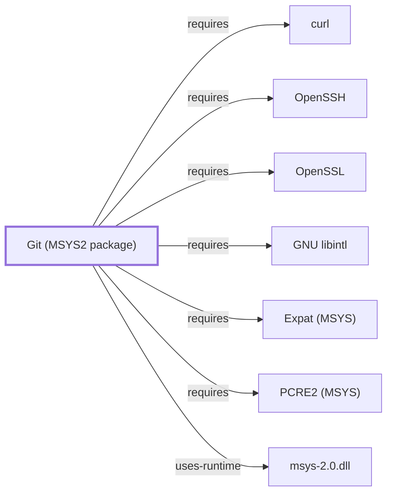

# Git for Windows DLL Loading

## Purpose

**DLL loading** is the charter's last uncovered Git for Windows concern, and
in a distribution that mixes MSYS-linked and native executables it is not a
routine one: which DLLs a process resolves depends on which side of the
MSYS boundary it sits on and what precedes it on `PATH`.

## Architectural Classification

Git for Windows ships both MSYS-linked executables (bash and the POSIX
userland) and native ones (Git and its helpers). The two resolve their
imports differently in one respect that matters: MSYS-linked binaries
additionally require [`msys-2.0.dll`](MSYS-2-0-DLL.md), and native ones do
not.

This knowledge base documents the **MSYS2 package** `git`
([Git (MSYS2 package)](GIT-MSYS-PACKAGE.md)) as a Volume 5 component. Git for
Windows is a **separate distribution** — a curated subset of MSYS2 packaged
and shipped independently, at version 2.55.0.3 per its own site. See
[distribution boundary](GIT-FOR-WINDOWS-BOUNDARY.md).

## Responsibilities

Not the distribution's own subsystem — resolution is the Windows image
loader's. What the distribution controls is **what is on `PATH`** when a
process starts, which is what determines the outcome.

## Boundaries

The consequential case is a system with both Git for Windows and a separate
MSYS2 installation, or another distribution shipping similarly named DLLs.
Both provide `msys-2.0.dll` and a set of library DLLs; whichever appears
first on `PATH` is the one an MSYS-linked process gets.

Mixing them is not a supported configuration and is a known class of
breakage. This knowledge base's model treats Git for Windows and MSYS2 as
distinct distributions for exactly this reason.

## Interfaces

`PATH`, and the launcher's initial environment — which the
[launcher and startup model](GIT-FOR-WINDOWS-LAUNCHER-STARTUP.md) already
identifies as requiring observed evidence per installation.

## Dependencies

The Windows image loader, described at boundary level in
[Windows platform boundaries](WINDOWS-PLATFORM-BOUNDARIES.md). Volume 2 is
one page, so the loader's search order is named rather than characterized
anywhere in this knowledge base.

## Reverse Dependencies

Every executable in the distribution.

## Configuration

Effectively `PATH`. No Git for Windows installation's `PATH` is captured
here.

## Initialization and Execution Flow

Resolution happens at image load, before the program runs — so a wrong DLL
is bound before any of the program's own logic executes.

## Runtime Behavior

Not observed. No PE import analysis of any Git for Windows binary has been
performed. The
[deep-inventory pipeline](DEEP-INVENTORY-CONTRACT.md) that extracts PE
imports exists and has been run against 2 of 15,711 MSYS2 packages, none of
them from this distribution.

## Compatibility and Variants

A single machine may hold several MSYS2-derived installations. They are not
interchangeable at the DLL level even where file names match.

## Security Considerations

DLL search order is a well-known attack surface generally. This page does
not assess Git for Windows' exposure, because doing so requires the import
and search-order evidence just noted as absent. See
[Threat model and supply chain](THREAT-MODEL-AND-SUPPLY-CHAIN.md).

## Failure Modes and Diagnostics

A process failing at startup with a missing or wrong DLL, or behaving as
though it were a different build, points at resolution rather than at the
program. Establish the resolved path of every loaded DLL before treating it
as a defect — which is precisely the evidence this knowledge base cannot
currently produce for this distribution.

## Evidence, Assumptions, and Open Questions

Distribution identity is from the
[official site](https://gitforwindows.org/)
(`evidence:git-for-windows:site-2026-08-02`).

Open, and this page is mostly open: no PE import analysis, no captured
`PATH`, no loader search-order documentation in Volume 2, and no observation
of a mixed-installation failure. The mechanism is stated from the
distribution's structure; the specifics are not established.

<!-- BEGIN GENERATED dependency-subgraph -->

## Dependency Diagram

Dependencies and dependents of `component:git:git` in the composed graph: 0 dependents and 7 dependencies.

Generated from the composed model by `tools/build_object_diagrams.py`.
Edits between the surrounding markers are overwritten on the next build.

<!-- END GENERATED dependency-subgraph -->

## Related Objects

- [Distribution boundary](GIT-FOR-WINDOWS-BOUNDARY.md)
- [Launcher and startup model](GIT-FOR-WINDOWS-LAUNCHER-STARTUP.md)
- [Git Bash and MSYS interaction](GIT-FOR-WINDOWS-GIT-BASH.md)
- [Binary-to-DLL dependency graph](BINARY-DLL-DEPENDENCY-GRAPH.md)
