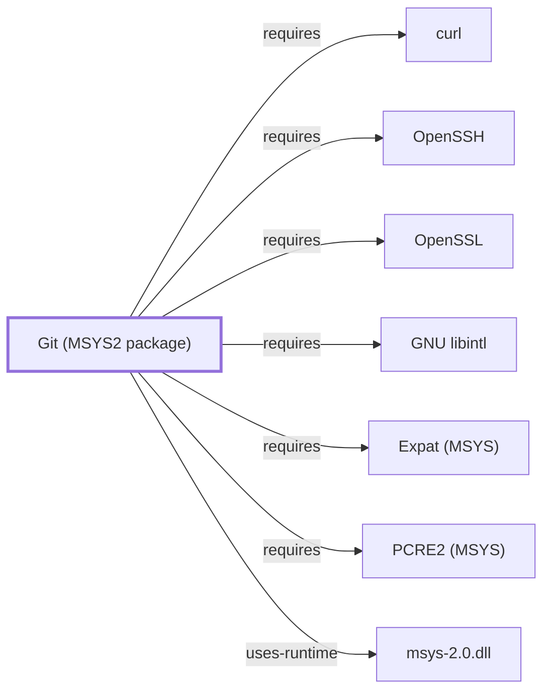

# Git Bash and MSYS Interaction

<!-- BEGIN GENERATED object-facts -->

| Model fact | Value |
| --- | --- |
| Object | `component:git:git` |
| Kind | `component` |
| Status | `partial` |
| Confidence | `high` |
| Authority | Linus Torvalds / Git community (Junio C Hamano, maintainer) |
| Environments | `msys` |
| Upstream | <https://git-scm.com/> |
| Packaged as | `package:msys2:git` |
| Version (observed) | 2.55.0-1 |
| License (observed) | spdx:GPL-2.0-only |
| Architecture (observed) | x86_64 |
| Installed size (observed) | 40.51 MiB |

**Evidence on this object**

- `evidence:catalog:current` — MSYS2 pacman package catalog (`observed`, retrieved 2026-08-05)
- `evidence:git:project-site-2026-07-30` — Git (official project site) (`primary`, retrieved 2026-07-30)

**Claims about this object**

- `claim:component:git:msys-package-boundary` (`fact`, `high`) — The git component modeled in this volume is the plain MSYS2-packaged git, distinct from the separately distributed Git for Windows product documented in Volume 9; both distributions track upstream Git 2.55.0 as of their respective 2026-07-29 and 2026-07-30 observations, but have separate package and release provenance.
- `claim:component:git:nano-fallback-editor` (`inference`, `high`) — Git's runtime dependency on nano reflects its use as a guaranteed-present fallback editor for commit messages and interactive commands when no EDITOR/core.editor/VISUAL is configured, not a build-time requirement of Git's own functionality.

Generated from the composed model by `tools/build_object_facts.py`. Observed values come from the catalog snapshot and change when it is refreshed.
Edits between the surrounding markers are overwritten on the next build.

<!-- END GENERATED object-facts -->

## Purpose

Git Bash is the shell Git for Windows ships: a BASH emulation, in the
distribution's own words, that lets Git be driven from a POSIX-style command
line on Windows. This page documents it and the **MSYS interaction** it
implies — the boundary where a POSIX-emulated shell drives a mix of
MSYS-linked and native executables.

## Architectural Classification

Git for Windows describes Git Bash as "a BASH emulation used to run Git from
the command line", alongside Git GUI, in a "lightweight, native set of
tools". The emulation is MSYS2's: Git Bash is
[GNU Bash](GNU-BASH.md) linked against
[`msys-2.0.dll`](MSYS-2-0-DLL.md).

This knowledge base documents the **MSYS2 package** `git`
([Git (MSYS2 package)](GIT-MSYS-PACKAGE.md)) as a Volume 5 component. Git for
Windows is a **separate distribution** — a curated subset of MSYS2 packaged
and shipped independently, at version 2.55.0.3 per its own site. Facts about
one are not automatically facts about the other, and this volume exists
because they diverge. See
[distribution boundary](GIT-FOR-WINDOWS-BOUNDARY.md).

## Responsibilities

- Providing an interactive POSIX shell from which Git and supporting tools
  are invoked.
- Processing shell startup files, which are user and site configuration
  rather than package metadata.
- Hosting the mixed execution the next section describes.

## Boundaries — MSYS interaction

This is the concern the charter names and this volume had not documented.
A Git for Windows session mixes two kinds of executable in one process tree:

| | MSYS-linked | Native |
| --- | --- | --- |
| Links `msys-2.0.dll` | yes | no |
| Sees | POSIX paths, POSIX signals, PTY | Win32 paths, console |
| Examples in the distribution | bash and the POSIX userland | the Git executable and its native helpers |

Three consequences follow, each a real source of confusion:

1. **Path forms differ across the boundary.** A POSIX path handed from the
   shell to a native program is translated by
   [path conversion](MSYS-PATH-CONVERSION.md) — including arguments that
   merely resemble paths, which is where silent rewriting occurs.
2. **Terminal behavior differs.** A native program invoked from an
   MSYS terminal may not detect an interactive console; see
   [PTY and console](MSYS-PTY-AND-CONSOLE.md).
3. **Signals do not carry POSIX meaning across it.** See
   [signal manager](MSYS-SIGNAL-MANAGER.md).

## Interfaces

The shell command surface, shell startup files, and the environment passed
across the MSYS/native boundary.

## Dependencies

[GNU Bash](GNU-BASH.md), [`msys-2.0.dll`](MSYS-2-0-DLL.md), and the terminal
host — commonly [mintty](MINTTY.md), which the
[launcher and startup model](GIT-FOR-WINDOWS-LAUNCHER-STARTUP.md) places
between the launcher and the shell.

## Reverse Dependencies

Every interactive Git for Windows session.

## Configuration

Shell startup files, and `core.symlinks` on the Git side — documented as
defaulting to true except where the filesystem does not support symbolic
links, which interacts directly with the
[filesystem layer's](MSYS-FILESYSTEM-LAYER.md) symlink representation.

## Initialization and Execution Flow

Launcher, terminal host, bash, startup files, then Git — the sequence the
[launcher and startup model](GIT-FOR-WINDOWS-LAUNCHER-STARTUP.md) already
documents.

## Runtime Behavior

Not observed for Git for Windows. The bounded MSYS runtime probes this
knowledge base holds were run against an MSYS2 installation, not a Git for
Windows one, and the two are separate distributions.

## Compatibility and Variants

Git Bash is Git for Windows'. An MSYS2 installation's own bash is a
different deployment of the same component.

## Security Considerations

The MSYS/native boundary is a trust-relevant surface: argument rewriting
changes what a native program receives. See
[Threat model and supply chain](THREAT-MODEL-AND-SUPPLY-CHAIN.md).

## Failure Modes and Diagnostics

A command that behaves differently under Git Bash than under `cmd.exe` is
usually a boundary effect rather than a Git defect. Establish which side
each executable is on before attributing behavior to Git.

## Evidence, Assumptions, and Open Questions

Git Bash's description and the 2.55.0.3 version are from the
[official Git for Windows site](https://gitforwindows.org/)
(`evidence:git-for-windows:site-2026-08-02`). MSYS boundary mechanics are
attributed to this knowledge base's own Volume 3 pages.

Open: no controlled observation of a Git for Windows installation. That
Git Bash is MSYS2's bash specifically is inference from the distribution's
documented MSYS2 basis, not verified against a shipped binary's imports here.

<!-- BEGIN GENERATED dependency-subgraph -->

## Dependency Diagram

Dependencies and dependents of `component:git:git` in the composed graph: 0 dependents and 7 dependencies.

Generated from the composed model by `tools/build_object_diagrams.py`.
Edits between the surrounding markers are overwritten on the next build.

<!-- END GENERATED dependency-subgraph -->

## Related Objects

- [Distribution boundary](GIT-FOR-WINDOWS-BOUNDARY.md)
- [Launcher and startup model](GIT-FOR-WINDOWS-LAUNCHER-STARTUP.md)
- [mintty](MINTTY.md)
- [msys-2.0.dll](MSYS-2-0-DLL.md)
- [Path conversion](MSYS-PATH-CONVERSION.md)
