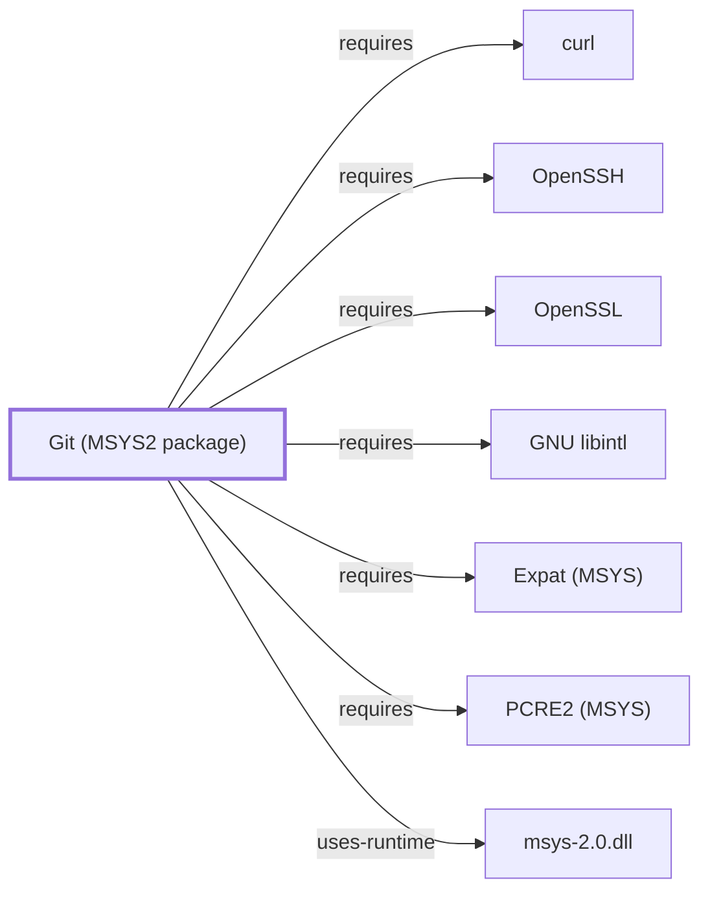

# Git for Windows HTTP Transport

## Purpose

**HTTP transport** is how Git fetches and pushes over `https://`, and on
Windows it is the transport with a genuine architectural choice underneath:
which TLS backend performs verification. This page documents that choice —
the charter names HTTP transport, OpenSSL, and libcurl, and this volume had
covered none of them.

## Architectural Classification

Git's HTTP transport is implemented over cURL. `git-config` documents
`http.sslBackend` as "Name of the SSL backend to use (e.g. \"openssl\" or
\"schannel\")", with the important qualifier that the option **is ignored if
cURL lacks support for choosing the SSL backend at runtime**.

That makes the effective backend a property of how the shipped cURL was
built, not only of configuration — a distinction that matters because
setting the option is not the same as having it take effect.

This knowledge base documents the **MSYS2 package** `git`
([Git (MSYS2 package)](GIT-MSYS-PACKAGE.md)) as a Volume 5 component. Git for
Windows is a **separate distribution** — a curated subset of MSYS2 packaged
and shipped independently, at version 2.55.0.3 per its own site. See
[distribution boundary](GIT-FOR-WINDOWS-BOUNDARY.md).

## Responsibilities

- Performing HTTP and HTTPS fetch and push.
- Verifying TLS through the selected backend.
- Obtaining credentials through the
  [credential helper](GIT-FOR-WINDOWS-CREDENTIAL-MANAGER.md) when the remote
  requires authentication.

## Boundaries

The two backends verify against **different trust stores**, and that is the
architecturally significant consequence:

| Backend | Trust anchors |
| --- | --- |
| `openssl` | A CA bundle shipped with or configured for the distribution |
| `schannel` | The Windows certificate store |

A certificate that verifies under one may fail under the other. An
enterprise CA installed into the Windows store is visible to `schannel` and
invisible to `openssl` unless separately added to its bundle — the common
real-world case.

`http.sslCertType` is likewise backend-dependent: PEM and DER are documented
for openssl and gnutls, P12 for schannel among others.

## Interfaces

`http.sslBackend`, `http.sslCertType`, `GIT_SSL_CAPATH`, and the rest of the
`http.*` configuration surface.

## Dependencies

cURL, the selected TLS backend, and — for OpenSSL — a CA bundle. This
knowledge base models [libcurl](LIBCURL.md) and [OpenSSL](OPENSSL.md) as
MSYS2 packages; whether Git for Windows ships those exact builds is a
distribution-boundary question this page does not answer.

## Reverse Dependencies

Every `https://` remote operation.

## Configuration

`http.sslBackend` where the shipped cURL supports runtime selection. Which
backend a given Git for Windows installation actually uses is not recorded
here.

## Initialization and Execution Flow

Git invokes the HTTP transport, cURL establishes the connection, the backend
verifies the certificate chain, and credentials are requested if the remote
demands them.

## Runtime Behavior

Not observed. No Git for Windows TLS handshake has been captured.

## Compatibility and Variants

The openssl/schannel choice is Windows-specific and has no equivalent in the
MSYS2 `git` package's usual Unix-style configuration, which is one of the
concrete ways the two distributions diverge.

## Security Considerations

Trust-store divergence is a security property, not a preference: the answer
to "does this installation trust our internal CA" depends on which backend
is active, and this knowledge base has not established which that is for any
installation. See
[Threat model and supply chain](THREAT-MODEL-AND-SUPPLY-CHAIN.md).

## Failure Modes and Diagnostics

A certificate that verifies in a browser but fails in Git is the signature
symptom of backend divergence — the browser used the Windows store,
`openssl` did not. Check `http.sslBackend` before treating it as a server
misconfiguration, and remember the setting may be ignored if the shipped
cURL cannot switch at runtime.

## Evidence, Assumptions, and Open Questions

`http.sslBackend`, its runtime-selection caveat, and `http.sslCertType` are
from [git-config](https://git-scm.com/docs/git-config)
(`evidence:git:git-config-2026-08-02`). Distribution identity is from the
[official site](https://gitforwindows.org/)
(`evidence:git-for-windows:site-2026-08-02`).

Open: which backend Git for Windows ships as default, whether its cURL
supports runtime selection, and which CA bundle accompanies an OpenSSL
build — none established here.

<!-- BEGIN GENERATED dependency-subgraph -->

## Dependency Diagram

Dependencies and dependents of `component:git:git` in the composed graph: 0 dependents and 7 dependencies.

Generated from the composed model by `tools/build_object_diagrams.py`.
Edits between the surrounding markers are overwritten on the next build.

<!-- END GENERATED dependency-subgraph -->

## Related Objects

- [Transport boundaries](GIT-FOR-WINDOWS-TRANSPORT-BOUNDARIES.md)
- [Credential manager](GIT-FOR-WINDOWS-CREDENTIAL-MANAGER.md)
- [libcurl](LIBCURL.md)
- [OpenSSL](OPENSSL.md)
- [ca-certificates](CA-CERTIFICATES.md)
