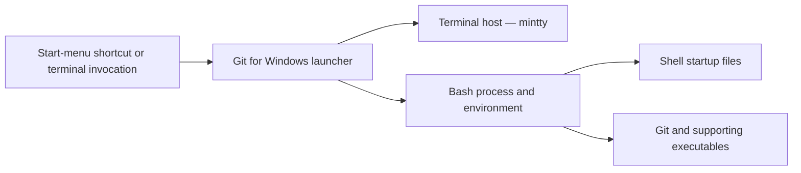

# Git for Windows Launcher and Shell Startup Model

| Component | Responsibility | Boundary |
| --- | --- | --- |
| Launcher | Selects executable, arguments, working directory, and initial environment | Installation-specific launch details require observed evidence |
| Terminal host | Provides interactive terminal/session behavior | Console/PTY integration is distinct from Git process behavior. The terminal host is [mintty](MINTTY.md); PTY behavior is documented on [PTY and console](MSYS-PTY-AND-CONSOLE.md) |
| Bash | Interprets commands and processes startup configuration | Shell profiles are user/site configuration, not package metadata |
| Git executable | Performs Git operations and invokes configured helpers | Transport, credentials, SSH, and DLL loading are separate domains |

## Diagnostic Rules

Capture the actual launcher command, environment, startup files, terminal host,
and resolved executable path before attributing a failure to Git Bash. A native
Git invocation outside Git Bash may follow different startup and DLL-resolution
paths.

## Related Views

- [Git for Windows boundary](GIT-FOR-WINDOWS-BOUNDARY.md)
- [Git Bash and MSYS interaction](GIT-FOR-WINDOWS-GIT-BASH.md)
- [DLL loading](GIT-FOR-WINDOWS-DLL-LOADING.md)
- [mintty](MINTTY.md)
- [GNU userland role model](GNU-USERLAND-ROLE-MODEL.md)
