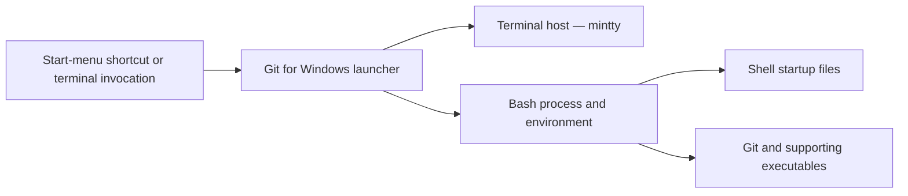

# Git for Windows Launcher and Shell Startup Model

| Component | Responsibility | Boundary |
| --- | --- | --- |
| Launcher | Selects executable, arguments, working directory, and initial environment | Installation-specific launch details require observed evidence |
| Terminal host | Provides interactive terminal/session behavior | Console/PTY integration is distinct from Git process behavior. The terminal host is [mintty](MINTTY.md); PTY behavior is documented on [PTY and console](MSYS-PTY-AND-CONSOLE.md) |
| Bash | Interprets commands and processes startup configuration | Shell profiles are user/site configuration, not package metadata |
| Git executable | Performs Git operations and invokes configured helpers | Transport, credentials, SSH, and DLL loading are separate domains |

## Diagnostic Rules

Capture the actual launcher command, environment, startup files, terminal host,
and resolved executable path before attributing a failure to Git Bash. A native
Git invocation outside Git Bash may follow different startup and DLL-resolution
paths.

## Controlled local installation observation

On 2026-07-30, this diagram's launcher artifacts were confirmed present and
hash-recorded at
`C:\Program Files\Git`: `git-bash.exe` (the launcher, 139,080 bytes),
`usr\bin\mintty.exe` (the terminal host, 1,266,680 bytes), and
`usr\bin\bash.exe` (GNU bash `5.3.15(1)-release`, 2,456,832 bytes). This
confirms artifact presence and version only; it does not observe the
runtime parent/child process chain between them.

A concrete, directly observed launcher-path effect: a Git Bash session's
`$PATH` prepends `/mingw64/bin` and `/usr/bin` ahead of the inherited
Windows `PATH`, while a plain PowerShell session's inherited `PATH` places
`C:\Windows\System32` and `C:\Windows\System32\OpenSSH\` earlier than
either Git directory. This single PATH-ordering difference is sufficient
to change which `ssh.exe` and `curl.exe` binary a command by that name
resolves to — a directly observed instance of this page's own Diagnostic
Rule, not an inference from distribution branding. See
[Transport, Credentials, and DLL Boundaries](GIT-FOR-WINDOWS-TRANSPORT-BOUNDARIES.md#controlled-local-installation-observation)
for the resulting version and DLL-level consequences.

## Related Views

- [Git for Windows boundary](GIT-FOR-WINDOWS-BOUNDARY.md)
- [Git Bash and MSYS interaction](GIT-FOR-WINDOWS-GIT-BASH.md)
- [DLL loading](GIT-FOR-WINDOWS-DLL-LOADING.md)
- [mintty](MINTTY.md)
- [GNU userland role model](GNU-USERLAND-ROLE-MODEL.md)

<!-- BEGIN GENERATED dependency-subgraph -->

## Dependency Diagram

Dependencies and dependents of `ecosystem:msys2:msys2` in the composed graph: 0 dependents and 1 dependency.

Generated from the composed model by `tools/build_object_diagrams.py`.
Edits between the surrounding markers are overwritten on the next build.

<!-- END GENERATED dependency-subgraph -->
