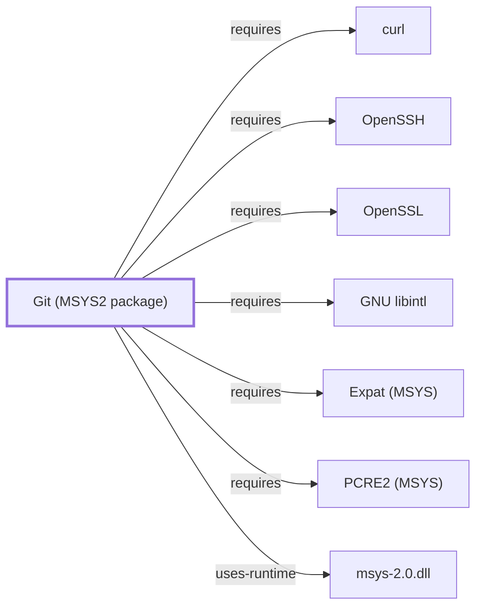

# Git (MSYS2 package)

<!-- BEGIN GENERATED object-facts -->

| Model fact | Value |
| --- | --- |
| Object | `component:git:git` |
| Kind | `component` |
| Status | `partial` |
| Confidence | `high` |
| Authority | Linus Torvalds / Git community (Junio C Hamano, maintainer) |
| Environments | `msys` |
| Upstream | <https://git-scm.com/> |
| Packaged as | `package:msys2:git` |
| Version (observed) | 2.55.0-1 |
| License (observed) | spdx:GPL-2.0-only |
| Architecture (observed) | x86_64 |
| Installed size (observed) | 40.51 MiB |

**Evidence on this object**

- `evidence:catalog:current` — MSYS2 pacman package catalog (`observed`, retrieved 2026-08-05)
- `evidence:git:project-site-2026-07-30` — Git (official project site) (`primary`, retrieved 2026-07-30)

**Claims about this object**

- `claim:component:git:msys-package-boundary` (`fact`, `high`) — The git component modeled in this volume is the plain MSYS2-packaged git, distinct from the separately distributed Git for Windows product documented in Volume 9; both distributions track upstream Git 2.55.0 as of their respective 2026-07-29 and 2026-07-30 observations, but have separate package and release provenance.
- `claim:component:git:nano-fallback-editor` (`inference`, `high`) — Git's runtime dependency on nano reflects its use as a guaranteed-present fallback editor for commit messages and interactive commands when no EDITOR/core.editor/VISUAL is configured, not a build-time requirement of Git's own functionality.

Generated from the composed model by `tools/build_object_facts.py`. Observed values come from the catalog snapshot and change when it is refreshed.
Edits between the surrounding markers are overwritten on the next build.

<!-- END GENERATED object-facts -->

## Purpose

This page documents `package:msys2:git`, the plain MSYS2 package for Git —
its dependency footprint and its distinction from the separately
distributed Git for Windows product. It deliberately does not restate
Git for Windows's own distribution boundary, launcher, or transport
architecture, which are canonical to Volume 9; see
[Git for Windows Distribution Boundary](GIT-FOR-WINDOWS-BOUNDARY.md) for
that material and the [official Git project site](https://git-scm.com/)
for command and internals documentation.

## Architectural Classification

`component:git:git` is packaged as `package:msys2:git` (version `2.55.0-1`
in the current catalog snapshot, license `GPL-2.0-only`), belonging to the
MSYS environment. Git was originally authored by Linus Torvalds and is
maintained by the Git community (Junio C Hamano as current maintainer).
Per `claim:component:git:msys-package-boundary`, this is a **distinct**
distribution from Git for Windows: Volume 9's controlled observation
recorded the installed Git for Windows as `2.55.0.windows.3` at
`C:\Program Files\Git\cmd\git.exe`, tracking the same upstream `2.55.0`
release as this MSYS2 package but with separate package and release
provenance, per
[Git for Windows Distribution Boundary](GIT-FOR-WINDOWS-BOUNDARY.md#decision-rules).

## Responsibilities

- Distributed version control: commit history, branching, merging, and
  remote synchronization over the transports documented below.

## Boundaries

This page covers the plain MSYS2 `git` package's architecture and
dependencies only. Git for Windows's launcher, bundled Git Bash, and
transport-integration specifics are Volume 9's canonical material, per the
[Master Volume Index](MASTER-VOLUME-INDEX.md#cross-volume-rules)'s rule
that a concept is defined once and referenced elsewhere by stable object ID.

## Interfaces

- The `git` command-line porcelain and plumbing commands, remote-URL
  schemes (`https://`, `ssh://`/`user@host:path`, local paths) each backed
  by a specific dependency documented below.

## Dependencies

The catalog snapshot records fourteen `runtime-depends-on` edges for
`package:msys2:git` — the largest dependency footprint of any single
component documented across this entire volume, spanning both transport
backends and Git's Perl-scripted subcommands:

| Dependency | Package | Architectural reason |
| --- | --- | --- |
| HTTPS transport | `package:msys2:curl` | Backs Git's `https://` remote URLs (`relationship:ssh-curl-git:git-requires-curl`), documented fully in [curl](CURL.md). |
| SSH transport | `package:msys2:openssh` | Backs Git's `ssh://`/`user@host:path` remote URLs (`relationship:ssh-curl-git:git-requires-openssh`), documented fully in [OpenSSH](OPENSSH.md). |
| Cryptography | `package:msys2:openssl` | Backs Git's own use of TLS/cryptographic primitives beyond what curl/openssh already provide. |
| Regex engine | `package:msys2:libpcre2_8` | Backs Perl-compatible regular expressions in commands such as `git grep --perl-regexp`. Documented fully in [PCRE2 (MSYS)](PCRE2-MSYS.md). |
| XML parsing | `package:msys2:libexpat` | Backs Git's `git-svn` and remote-helper XML handling. Documented fully in [Expat (MSYS)](EXPAT-MSYS.md). |
| Native-language messages | `package:msys2:libintl` | gettext-based message translation (NLS). Documented fully in [GNU libintl](GNU-LIBINTL.md). |
| Fallback commit-message editor | `package:msys2:nano` | Backs Git's guaranteed-present fallback editor when no `EDITOR`/`core.editor`/`VISUAL` is configured, not a build-time requirement of Git's own functionality (`claim:component:git:nano-fallback-editor`). |
| Perl interpreter and modules | `package:msys2:perl`, `perl-Error`, `perl-Authen-SASL`, `perl-libwww`, `perl-MIME-tools`, `perl-Net-SMTP-SSL`, `perl-TermReadKey` | Back Git's Perl-implemented subcommands, most notably `git send-email` (SASL authentication, MIME message construction, SMTP-over-TLS) and `git-cvsserver`/related tooling. |

Optional dependencies on `python` (various helper scripts), `subversion`
(`git svn`), and `aspell` (spell checking in `git gui`) extend specific
subcommands without being required for Git's core functionality.

## Reverse Dependencies

The snapshot records 9 relationships targeting `package:msys2:git`. See
the [reverse dependency impact analysis](REVERSE-DEPENDENCY-IMPACT-ANALYSIS.md)
for the current full list.

## Configuration

`~/.gitconfig` (user) and `.git/config` (repository) are genuine standing
configuration files using Git's own INI-like format, with `core.editor`
selecting the interactive editor (falling back to the `nano` dependency
above when unset).

## Initialization and Execution Flow

The `git` porcelain commands are invoke-run-exit processes, adapted from
POSIX semantics onto Windows process primitives by `msys-2.0.dll` per
[MSYS Runtime Initialization](MSYS-RUNTIME-INITIALIZATION.md). Perl-scripted
subcommands (`git send-email`) launch the Perl interpreter as part of that
same process rather than a separate execution model.

## Runtime Behavior

Which of Git's many dependencies are actually exercised depends entirely on
the operation performed: a purely local `git commit` touches none of the
transport or Perl-scripting dependencies, while `git send-email` exercises
the full Perl/SASL/MIME/SMTP stack.

## Compatibility and Variants

This MSYS2 package and the Git for Windows product both track upstream Git
releases but are packaged, tested, and released independently
(`claim:component:git:msys-package-boundary`); assuming identical behavior
between the two without checking the actual installed provenance is a
documented risk this page exists specifically to flag.

## Security Considerations

Git's remote-transport surface inherits the security posture of
[curl](CURL.md#security-considerations) and
[OpenSSH](OPENSSH.md#security-considerations) for HTTPS and SSH remotes
respectively; Git itself has also had documented historical vulnerability
classes around submodule and hook handling from untrusted repositories. See
[Threat Model and Supply Chain](THREAT-MODEL-AND-SUPPLY-CHAIN.md) for the
project's general supply-chain posture; no version-qualified CVE review has
been performed for the recorded `2.55.0-1` version.

## Failure Modes and Diagnostics

Remote-operation failures should first be triaged against the specific
transport in use — [curl](CURL.md#failure-modes-and-diagnostics) diagnostics
for `https://` remotes, [OpenSSH](OPENSSH.md#failure-modes-and-diagnostics)
diagnostics for `ssh://` remotes — rather than assumed to be a Git-specific
defect.

## Evidence, Assumptions, and Open Questions

Command and subcommand behavior are backed by the official Git project site
(`evidence:git:project-site-2026-07-30`), matching the `project_url`
already recorded for `package:msys2:git` in the catalog. Package identity,
version, license, and all recorded dependency edges are backed by the
pacman catalog snapshot (`evidence:catalog:current`) via
`claim:component:git:nano-fallback-editor` and
`claim:component:git:msys-package-boundary`. No open items beyond the
general version-qualified security review noted above.

<!-- BEGIN GENERATED dependency-subgraph -->

## Dependency Diagram

Dependencies and dependents of `component:git:git` in the composed graph: 0 dependents and 7 dependencies.

Generated from the composed model by `tools/build_object_diagrams.py`.
Edits between the surrounding markers are overwritten on the next build.

<!-- END GENERATED dependency-subgraph -->

## Related Objects

- [GNU Userland Role Model](GNU-USERLAND-ROLE-MODEL.md)
- [Git for Windows Distribution Boundary](GIT-FOR-WINDOWS-BOUNDARY.md)
- [curl](CURL.md)
- [OpenSSH](OPENSSH.md)
- [OpenSSL](OPENSSL.md)
- [GNU Nano](GNU-NANO.md)
- [GNU libintl](GNU-LIBINTL.md)
- [PCRE2 (MSYS)](PCRE2-MSYS.md)
- [Expat (MSYS)](EXPAT-MSYS.md)
