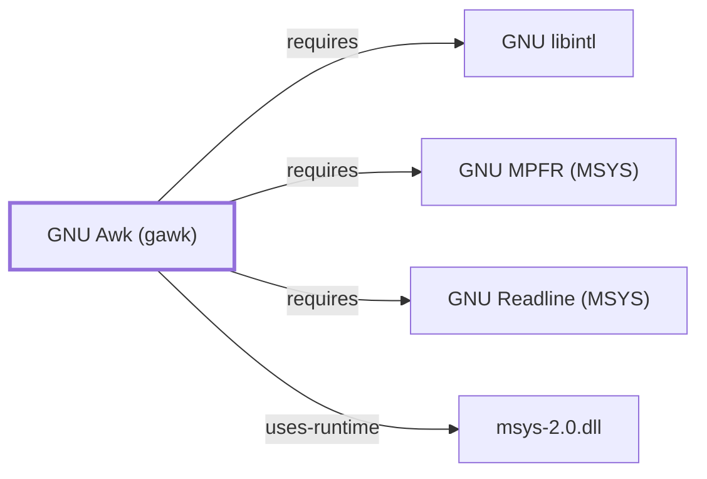

# GNU Awk (gawk)

<!-- BEGIN GENERATED object-facts -->

| Model fact | Value |
| --- | --- |
| Object | `component:gnu:gawk` |
| Kind | `component` |
| Status | `partial` |
| Confidence | `high` |
| Authority | Free Software Foundation |
| Environments | `msys` |
| Upstream | <https://www.gnu.org/software/gawk/> |
| Packaged as | `package:msys2:gawk` |
| Version (observed) | 5.4.1-1 |
| License (observed) | spdx:GPL-3.0-or-later |
| Architecture (observed) | x86_64 |
| Installed size (observed) | 5239.24 KiB |

**Evidence on this object**

- `evidence:catalog:current` — MSYS2 pacman package catalog (`observed`, retrieved 2026-08-05)
- `evidence:gnu:gawk-manual-2026-07-30` — GNU Awk User's Guide (gawk manual) (`primary`, retrieved 2026-07-30)

**Claims about this object**

- `claim:component:gawk:provides-awk` (`fact`, `verified`) — The MSYS gawk package provides the `awk` command.

Generated from the composed model by `tools/build_object_facts.py`. Observed values come from the catalog snapshot and change when it is refreshed.
Edits between the surrounding markers are overwritten on the next build.

<!-- END GENERATED object-facts -->

## Purpose

Gawk is GNU's implementation of the POSIX awk pattern-scanning and
processing language: a full programming language (variables, arrays,
functions, control flow) built around field-based text records. This page
documents its architectural role, its notably feature-driven dependency set,
and its POSIX/GNU-extension boundary; see the
[official GNU Awk user's guide](https://www.gnu.org/software/gawk/manual/gawk.html)
for the language reference.

## Architectural Classification

`component:gnu:gawk` is a GNU-userland component packaged as
`package:msys2:gawk` (version `5.4.1-1` in the current catalog snapshot,
license `GPL-3.0-or-later`), belonging to the MSYS environment. The package
provides the `awk` command (`claim:component:gawk:provides-awk`). Unlike
[GNU Sed](GNU-SED.md), it is a general-purpose language, not a
transformation-command mini-language.

## Responsibilities

- Field-and-record-based text processing driven by pattern/action pairs.
- Providing the `awk` implementation used by any script with an
  `#!/usr/bin/awk`-style invocation in this environment.
- Optional arbitrary-precision arithmetic and an interactive debugger, both
  distinct execution modes documented below.

## Boundaries

Gawk is a full language: logic that would require awkward workarounds in
sed (arrays, functions, arithmetic) is idiomatically expressed in gawk
instead. It is not a filesystem-traversal tool ([GNU Findutils](GNU-FINDUTILS.md))
or a read-only search tool ([GNU Grep](GNU-GREP.md)), though it commonly
composes with both in pipelines.

## Interfaces

- `-F` (field separator), `-v` (variable assignment), `-f` (program file),
  and built-in variables (`NR`, `NF`, `FS`, `OFS`, `RS`, `ORS`) per the
  manual.
- GNU extensions beyond POSIX awk: `gensub()`, `asort()`/`asorti()`,
  `@include`, and dynamically loaded extension libraries (`-l`), all
  documented in the user's guide's "Extensions" material.

## Dependencies

The catalog snapshot records three `runtime-depends-on` edges for
`package:msys2:gawk`, each mapping to a specific documented gawk feature:

| Dependency | Package | Architectural reason |
| --- | --- | --- |
| Arbitrary-precision arithmetic | `package:msys2:mpfr` | Backs gawk's `--bignum` arbitrary-precision integer/floating-point mode, documented in the user's guide's arbitrary-precision-arithmetic chapter. Documented fully in [GNU MPFR (MSYS)](GNU-MPFR-MSYS.md). |
| Interactive line editing | `package:msys2:libreadline` | Used by gawk's built-in interactive debugger (`gawk --debug`), documented in the user's guide's debugger chapter, for its readline-based command prompt. Documented fully in [GNU Readline (MSYS)](GNU-READLINE-MSYS.md). |
| Native-language messages | `package:msys2:libintl` | gettext-based message translation (NLS). Documented fully in [GNU libintl](GNU-LIBINTL.md). |

gawk's declared package dependencies also list `sh`, a virtual capability
provided by `package:msys2:bash` rather than an actual package name; it
does not resolve to a `runtime-depends-on` edge and is instead retained in
`generated/unresolved-dependencies.json`, per the same explanation given for
[GNU Grep](GNU-GREP.md#dependencies).

## Reverse Dependencies

The snapshot records 7 relationships targeting `package:msys2:gawk`. See the
[reverse dependency impact analysis](REVERSE-DEPENDENCY-IMPACT-ANALYSIS.md)
for the current full list.

## Configuration

`AWKPATH` sets the search path for `-f` and `@include`; `POSIXLY_CORRECT`
disables GNU extensions. There is no persistent configuration file; gawk
programs are configured per invocation.

## Initialization and Execution Flow

Gawk is ordinarily an invoke-run-exit process, adapted from POSIX semantics
onto Windows process primitives by `msys-2.0.dll` per
[MSYS Runtime Initialization](MSYS-RUNTIME-INITIALIZATION.md). `gawk --debug`
is a distinct, longer-lived interactive execution mode with a readline-based
command prompt (backed by the `libreadline` dependency above), unlike gawk's
default single-pass batch execution.

## Runtime Behavior

Enabling arbitrary-precision mode (`--bignum`, or the equivalent program
directive) changes numeric semantics for the whole program, not just
performance: integer and floating-point overflow/precision behavior differs
materially from gawk's default double-precision arithmetic, per the user's
guide.

## Compatibility and Variants

Programs using gawk-specific extensions (`gensub()`, `asort()`, `@include`,
loadable extensions) are not portable to POSIX awk, `mawk`, or `nawk`; gawk's
`--posix` mode disables these extensions to approximate strict POSIX
behavior. Since this package provides the environment's `awk`, scripts
written against a `#!/usr/bin/awk` shebang in this environment run under
gawk rather than a distinct minimal awk implementation — the same
provides-based substitution pattern documented for
[GNU Bash](GNU-BASH.md)'s `sh`.

## Security Considerations

The `--bignum`/arbitrary-precision mode accepting untrusted numeric input
could in principle be driven toward expensive computation with very large
exponents; this is a general characteristic of arbitrary-precision
arithmetic rather than a gawk-specific defect. The interactive debugger is
not part of gawk's normal batch execution path and has limited operational
exposure. See
[Threat Model and Supply Chain](THREAT-MODEL-AND-SUPPLY-CHAIN.md) for the
project's general supply-chain posture; no gawk-specific CVE review has been
performed for the recorded `5.4.1-1` version.

## Failure Modes and Diagnostics

Locale-dependent numeric parsing — specifically `LC_NUMERIC` changing the
expected decimal-point character during string-to-number conversions — is a
commonly documented cross-locale gawk gotcha and the recommended first check
for numeric-processing scripts that behave differently across machines.

## Evidence, Assumptions, and Open Questions

Language semantics, arbitrary-precision arithmetic, the debugger, and the
POSIX/GNU-extension boundary are backed by the official GNU Awk user's guide
(`evidence:gnu:gawk-manual-2026-07-30`). Package identity, version, license,
`provides: awk`, and dependency edges are backed by the pacman catalog
snapshot (`evidence:catalog:current`). The unresolved `sh` dependency is
explained by `generated/unresolved-dependencies.json`, not merely asserted.
Open: whether the MSYS2 build enables dynamically loaded extensions (`-l`)
by default has not been directly observed.

<!-- BEGIN GENERATED dependency-subgraph -->

## Dependency Diagram

Dependencies and dependents of `component:gnu:gawk` in the composed graph: 0 dependents and 4 dependencies.

Generated from the composed model by `tools/build_object_diagrams.py`.
Edits between the surrounding markers are overwritten on the next build.

<!-- END GENERATED dependency-subgraph -->

## Related Objects

- [GNU Userland Role Model](GNU-USERLAND-ROLE-MODEL.md)
- [GNU Sed](GNU-SED.md)
- [GNU Bash](GNU-BASH.md)
- [GNU libintl](GNU-LIBINTL.md)
- [GNU Readline (MSYS)](GNU-READLINE-MSYS.md)
- [GNU MPFR (MSYS)](GNU-MPFR-MSYS.md)
- [MSYS Runtime Initialization](MSYS-RUNTIME-INITIALIZATION.md)
