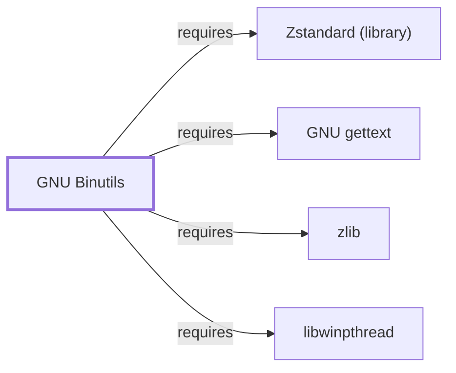

# GNU Binutils

## Purpose

Binutils provides the assembler, linker, and object-file inspection tools
that [GCC](GNU-GCC.md) invokes as its backend. This page documents its
architectural role and its compressed-debug-section dependencies; see the
[official GNU Binutils project page](https://www.gnu.org/software/binutils/)
for the full tool and format reference.

## Architectural Classification

`component:gnu:binutils` is a GNU-userland toolchain component, packaged
per native environment: this page cites the UCRT64 build,
`package:msys2:mingw-w64-ucrt-x86_64-binutils` (version `2.47-1` in the
current catalog snapshot, license
`GPL-3.0-or-later AND GPL-2.0-or-later AND LGPL-3.0-or-later AND LGPL-2.0-or-later`
— binutils bundles several tools under slightly different GNU license
terms rather than a single uniform license). Per the
[MSYS2 Toolchain Role Model](TOOLCHAIN-ROLE-MODEL.md), it is GCC's default
linker backend; [LLD](LLD.md) plays the equivalent role for
[Clang](CLANG.md).

## Responsibilities

- Assembling (`as`) compiler-generated assembly into object files.
- Linking (`ld`) object files and libraries into executables and DLLs.
- Object-file inspection and manipulation (`objdump`, `nm`, `ar`,
  `readelf`/`objdump`-equivalent PE inspection, `strip`, `ranlib`).

## Boundaries

Binutils operates on object-file formats and linking; it does not perform
compilation itself (that is [GCC](GNU-GCC.md)'s role) and, like GCC, does
**not** depend on `msys-2.0.dll` as a native MinGW-w64 package — it runs
against Windows-facing runtime behavior directly, per the
[MSYS2 and MinGW-w64 role model](MSYS2-AND-MINGW-W64-ROLE-MODEL.md).

## Interfaces

- `as` (assembler), `ld` (linker, invoked by GCC's driver rather than
  typically called directly), `objdump`/`nm`/`ar`/`strip`/`ranlib`
  (inspection and archive manipulation), per the documentation.

## Dependencies

The catalog snapshot records four `runtime-depends-on` edges for
`package:msys2:mingw-w64-ucrt-x86_64-binutils`:

| Dependency | Package | Architectural reason |
| --- | --- | --- |
| Native-language messages | `mingw-w64-ucrt-x86_64-gettext-runtime` | gettext-based message translation (NLS) for this native-environment build. Documented fully in [GNU gettext](GNU-GETTEXT.md). |
| Threading | `mingw-w64-ucrt-x86_64-libwinpthread` | Backs POSIX-threads-style threading support in the built binutils tools themselves. Documented fully in [libwinpthread](LIBWINPTHREAD.md). |
| Compressed debug sections | `mingw-w64-ucrt-x86_64-zlib`, `mingw-w64-ucrt-x86_64-zstd` | Back `--compress-debug-sections=zlib` and the newer `=zstd` compression modes respectively (`claim:component:binutils:compressed-debug-sections`). Documented fully in [zlib](ZLIB.md) and [Zstandard (library)](LIBZSTD.md). |

**Correction, 2026-07-30**: the libwinpthread dependency above was cited
by package name in this table since this page's first publication, but
had never been backed by a corresponding `requires` graph edge the way
the zlib/zstd/gettext edges were —
`relationship:toolchain:binutils-requires-libwinpthread` is now added to
close the gap.

## Reverse Dependencies

The snapshot records 5 relationships targeting
`package:msys2:mingw-w64-ucrt-x86_64-binutils`, including
[GCC](GNU-GCC.md)'s invocation dependency
(`relationship:toolchain:gcc-invokes-binutils`). See the
[reverse dependency impact analysis](REVERSE-DEPENDENCY-IMPACT-ANALYSIS.md)
for the current full list.

## Configuration

Binutils tools are configured entirely through command-line flags; there is
no persistent configuration file. Linker behavior can additionally be
scripted via linker-script files (`-T`) for advanced memory-layout control,
per the documentation.

## Initialization and Execution Flow

`as` and `ld` are ordinarily invoked as GCC's backend subprocesses
(`relationship:toolchain:gcc-invokes-binutils`) rather than run standalone,
though they can be invoked directly. As native MinGW-w64 programs, their
process model is Windows-facing directly rather than mediated by
`msys-2.0.dll`, per the Boundaries section above.

## Runtime Behavior

The linker's output format, entry point, and import/export table
construction determine the resulting PE's runtime loading behavior; this
architectural detail is documented in [Toolchain Role Model](TOOLCHAIN-ROLE-MODEL.md)
and the broader build-artifact mapping material rather than restated here.

## Compatibility and Variants

Binutils is not the only backend available in this environment: LLVM's
[LLD](LLD.md) linker plays the equivalent role for
[Clang](CLANG.md)-oriented environments and is not necessarily
drop-in-compatible in every edge case (linker-script support, some flag
semantics); this page does not claim interchangeability beyond what the
[Toolchain Role Model](TOOLCHAIN-ROLE-MODEL.md) already states.

## Security Considerations

Binutils tools process untrusted object/archive files during builds and
binary analysis; malformed input handling in binary-format parsers is a
documented general risk class for this kind of tooling. See
[Threat Model and Supply Chain](THREAT-MODEL-AND-SUPPLY-CHAIN.md) for the
project's general supply-chain posture; no version-qualified CVE review has
been performed for the recorded `2.47-1` version.

## Failure Modes and Diagnostics

Undefined-reference linker errors are the most common failure this tool
family surfaces; verbose linker output (`-v` passed through GCC, or direct
`ld` invocation) is the documented diagnostic path for link-order and
missing-symbol problems.

## Evidence, Assumptions, and Open Questions

Tool responsibilities and format support are backed by the official GNU
Binutils project page (`evidence:gnu:binutils-manual-2026-07-30`), matching
the `project_url` already recorded for
`package:msys2:mingw-w64-ucrt-x86_64-binutils` in the catalog. Package
identity, version, license, and all recorded dependency edges are backed by
the pacman catalog snapshot (`evidence:catalog:current`) via
`claim:component:binutils:compressed-debug-sections`. No open items beyond
the general version-qualified security review noted above.

<!-- BEGIN GENERATED dependency-subgraph -->

## Dependency Diagram

Dependencies and dependents of `component:gnu:binutils` in the composed graph: 0 dependents and 4 dependencies.

Generated from the composed model by `tools/build_object_diagrams.py`.
Edits between the surrounding markers are overwritten on the next build.

<!-- END GENERATED dependency-subgraph -->

## Related Objects

- [MSYS2 Toolchain Role Model](TOOLCHAIN-ROLE-MODEL.md)
- [GCC](GNU-GCC.md)
- [GDB](GNU-GDB.md)
- [LLD](LLD.md)
- [GNU gettext](GNU-GETTEXT.md)
- [zlib](ZLIB.md)
- [Zstandard (library)](LIBZSTD.md)
- [libwinpthread](LIBWINPTHREAD.md)
