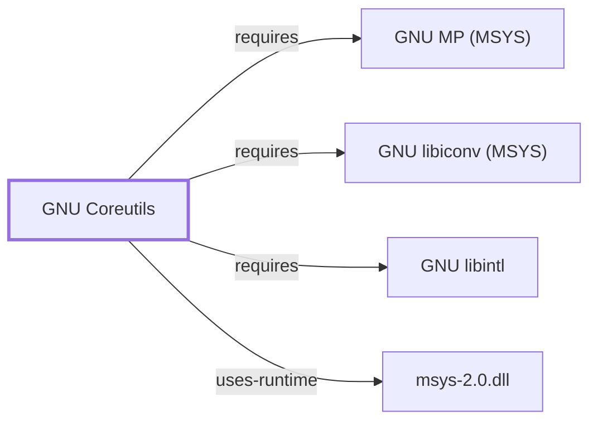

# GNU Coreutils

<!-- BEGIN GENERATED object-facts -->

| Model fact | Value |
| --- | --- |
| Object | `component:gnu:coreutils` |
| Kind | `component` |
| Status | `partial` |
| Confidence | `high` |
| Authority | Free Software Foundation |
| Environments | `msys` |
| Upstream | <https://www.gnu.org/software/coreutils/> |
| Packaged as | `package:msys2:coreutils` |
| Version (observed) | 8.32-5 |
| License (observed) | GPL3 |
| Architecture (observed) | x86_64 |
| Installed size (observed) | 25.78 MiB |

**Evidence on this object**

- `evidence:catalog:current` — MSYS2 pacman package catalog (`observed`, retrieved 2026-08-05)
- `evidence:gnu:coreutils-manual-2026-07-30` — GNU Coreutils Manual (`primary`, retrieved 2026-07-30)

**Claims about this object**

- `claim:component:coreutils:posix-utilities` (`fact`, `verified`) — GNU Coreutils packages the core POSIX-oriented file, shell, and text manipulation utilities for the MSYS environment.

Generated from the composed model by `tools/build_object_facts.py`. Observed values come from the catalog snapshot and change when it is refreshed.
Edits between the surrounding markers are overwritten on the next build.

<!-- END GENERATED object-facts -->

## Purpose

Coreutils supplies the baseline file, shell, and text-manipulation commands
(`ls`, `cp`, `mv`, `rm`, `cat`, `sort`, `cut`, and similar) that MSYS2 scripts
and interactive sessions depend on. This page documents its architectural
role, dependency footprint, and locale/configuration surface; see the
[official GNU Coreutils manual](https://www.gnu.org/software/coreutils/manual/coreutils.html)
for per-command option semantics.

## Architectural Classification

`component:gnu:coreutils` is a GNU-userland component packaged as
`package:msys2:coreutils` (version `8.32-5` in the current catalog snapshot,
license `GPL3`, classified `msys-package`). Like Bash, it belongs to the
MSYS environment: it is a POSIX-oriented tool set used across every native
environment session, not a per-environment (UCRT64/CLANG64/MinGW) build.

## Responsibilities

- Provide the individual file, shell-utility, and text-processing programs
  that make up the "core" POSIX-oriented command set (`claim:component:coreutils:posix-utilities`).
- Present consistent, documented option handling and locale-aware behavior
  (collation, encoding, number/date formatting) across those programs.

## Boundaries

Coreutils programs are ordinary MSYS-dependent executables; they are not a
shell, a package manager, or a build tool, and none of them manage process
lifecycle beyond their own invocation. GNU/MSYS2 coreutils is distinct from
BusyBox-style toolsets: per the GNU Coreutils manual, the project builds one
executable per utility rather than a single multi-call binary; whether the
MSYS2 package installs them as fully independent binaries or via another
mechanism (e.g. hard links) is a packaging-layer fact that requires the
package's file inventory (`docs/PACKAGE-FILE-INVENTORY.md`) to confirm and is
not yet observed for this snapshot.

## Interfaces

- A large family of independently invoked command-line programs, each with
  its own argument grammar, sharing common GNU-style long-option conventions
  (`--help`, `--version`, `--`) documented in the manual's "Common Options"
  section.
- Standard streams and POSIX exit-status conventions as the interface
  contract with calling shells and scripts.

## Dependencies

The catalog snapshot records three `runtime-depends-on` edges for
`package:msys2:coreutils`:

| Dependency | Package | Architectural reason |
| --- | --- | --- |
| Arbitrary-precision arithmetic | `package:msys2:gmp` | Used by `factor` (and related numeric utilities) for bignum support, per the GNU Coreutils manual. Documented fully in [GNU MP (MSYS)](GNU-GMP-MSYS.md). |
| Character-set conversion | `package:msys2:libiconv` | The MSYS C library (Cygwin-derived) does not provide built-in `iconv` conversion the way glibc does, so coreutils links the standalone GNU libiconv for portable multibyte/character-set handling. Documented fully in [GNU libiconv (MSYS)](GNU-LIBICONV-MSYS.md). |
| Native-language messages | `package:msys2:libintl` | Provides gettext-based message translation (NLS) for coreutils' translated diagnostic and help output. Documented fully in [GNU libintl](GNU-LIBINTL.md). |

These are recorded observed facts from `evidence:catalog:current`; the
architectural "reason" column is a documented-upstream inference
(`classification: inference` in spirit, not a formal graph claim) connecting
each dependency to the coreutils feature that needs it, rather than a
directly observed call-site analysis.

## Reverse Dependencies

The same snapshot records 7 relationships targeting `package:msys2:coreutils`
— far fewer than Bash's 46, since most consumers depend on individual
higher-level tools or on Bash itself rather than declaring a package-level
dependency on coreutils. See the
[reverse dependency impact analysis](REVERSE-DEPENDENCY-IMPACT-ANALYSIS.md)
for the current full list.

## Configuration

Behavior is controlled per-invocation through command-line flags and a small
set of well-documented environment variables: `LC_ALL`/`LANG`/`LC_COLLATE`
(locale and collation), `TIME_STYLE` and `BLOCK_SIZE` (`ls`/`df`/`du`
formatting), and `COLUMNS` (`ls` column layout), all per the GNU Coreutils
manual. There is no shared coreutils-wide configuration file; each program is
independently configured.

## Initialization and Execution Flow

Unlike Bash, coreutils programs have no persistent session: each is a
single invoke-run-exit process launched directly by a caller (typically the
shell). Process creation for these MSYS-dependent binaries is adapted from
POSIX semantics onto Windows process primitives by `msys-2.0.dll`, per
[MSYS Runtime Initialization](MSYS-RUNTIME-INITIALIZATION.md); this page does
not restate that mechanism.

## Compatibility and Variants

Coreutils implements GNU extensions beyond POSIX in many utilities (for
example, `ls --color`, long-option forms, and extended `sort`/`date` format
specifiers). Scripts intended to be portable to non-GNU environments should
not assume these extensions are present, per the manual's stated GNU/POSIX
divergence notes.

## Security Considerations

No coreutils-specific vulnerability review has been performed for this
volume; see [Threat Model and Supply Chain](THREAT-MODEL-AND-SUPPLY-CHAIN.md)
for the project's general supply-chain posture. A version-qualified CVE
review against the recorded `8.32-5` package version is open work.

## Failure Modes and Diagnostics

Locale-dependent output differences (sort order, date/number formatting) are
the most common source of coreutils behavioral surprises across machines;
confirming the active `LC_ALL`/`LANG` values is the recommended first
diagnostic step, consistent with the general startup/environment-capture
guidance in [GNU Userland Role Model](GNU-USERLAND-ROLE-MODEL.md).

## Evidence, Assumptions, and Open Questions

Command architecture, common-option conventions, and locale behavior are
backed by the official GNU Coreutils manual
(`evidence:gnu:coreutils-manual-2026-07-30`). Package identity, version,
license, and dependency edges are backed by the pacman catalog snapshot
(`evidence:catalog:current`). Open: whether the package installs independent
binaries versus hard-linked equivalents is unconfirmed pending file-inventory
evidence; the dependency-to-feature mapping in Dependencies is a documented
inference rather than a directly observed call-site analysis; and no
version-qualified security review has been performed.

<!-- BEGIN GENERATED dependency-subgraph -->

## Dependency Diagram

Dependencies and dependents of `component:gnu:coreutils` in the composed graph: 0 dependents and 4 dependencies.

Generated from the composed model by `tools/build_object_diagrams.py`.
Edits between the surrounding markers are overwritten on the next build.

<!-- END GENERATED dependency-subgraph -->

## Related Objects

- [GNU Userland Role Model](GNU-USERLAND-ROLE-MODEL.md)
- [GNU Bash](GNU-BASH.md)
- [GNU Grep](GNU-GREP.md)
- [GNU Sed](GNU-SED.md)
- [GNU Awk (gawk)](GNU-AWK.md)
- [GNU Findutils](GNU-FINDUTILS.md)
- [GNU libintl](GNU-LIBINTL.md)
- [GNU MP (MSYS)](GNU-GMP-MSYS.md)
- [GNU libiconv (MSYS)](GNU-LIBICONV-MSYS.md)
- [MSYS Runtime Initialization](MSYS-RUNTIME-INITIALIZATION.md)
- [Package File Inventory](PACKAGE-FILE-INVENTORY.md)
