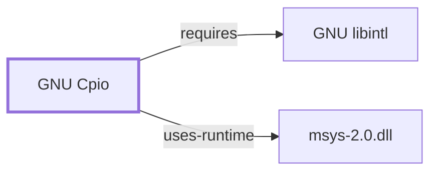

# GNU Cpio

<!-- BEGIN GENERATED object-facts -->

| Model fact | Value |
| --- | --- |
| Object | `component:gnu:cpio` |
| Kind | `component` |
| Status | `partial` |
| Confidence | `high` |
| Authority | Free Software Foundation |
| Environments | `msys` |
| Upstream | <https://www.gnu.org/software/cpio/> |
| Packaged as | `package:msys2:cpio` |
| Version (observed) | 2.15-1 |
| License (observed) | GPLv3 |
| Architecture (observed) | x86_64 |
| Installed size (observed) | 1008.64 KiB |

**Evidence on this object**

- `evidence:catalog:current` — MSYS2 pacman package catalog (`observed`, retrieved 2026-08-05)
- `evidence:gnu:cpio-manual-2026-07-30` — GNU Cpio Manual (`primary`, retrieved 2026-07-30)

Generated from the composed model by `tools/build_object_facts.py`. Observed values come from the catalog snapshot and change when it is refreshed.
Edits between the surrounding markers are overwritten on the next build.

<!-- END GENERATED object-facts -->

## Purpose

Cpio copies files to and from a cpio- or tar-format archive stream, reading
the list of files to include from standard input rather than as command-
line arguments. This page documents its architectural role and dependency
footprint; see the
[official GNU Cpio manual](https://www.gnu.org/software/cpio/manual/cpio.html)
for the full option and format reference.

## Architectural Classification

`component:gnu:cpio` is a GNU-userland component packaged as
`package:msys2:cpio` (version `2.15-1` in the current catalog snapshot,
license `GPLv3`), belonging to the MSYS environment.

## Responsibilities

- Copying files into (`-o`/copy-out) or out of (`-i`/copy-in) a cpio- or
  tar-format archive, driven by a filename list read from standard input
  rather than shell-glob arguments.
- Passing files directly between directory trees (`-p`/pass-through mode)
  without an intermediate archive file.

## Boundaries

Cpio's copy-out mode is conventionally driven by [GNU Findutils](GNU-FINDUTILS.md)'
`find` piping a filename list into it (`find . | cpio -o`), the same
composition pattern documented for `find`/`xargs`; cpio does not itself
select which files to include beyond the stream it is given.

## Interfaces

- `-o` (copy-out, create archive), `-i` (copy-in, extract archive), `-p`
  (pass-through between directories), `-v` (verbose), and archive-format
  selection (the classic binary/newc formats or tar-compatible format), per
  the manual.

## Dependencies

The catalog snapshot records one `runtime-depends-on` edge for
`package:msys2:cpio`: [GNU libintl](GNU-LIBINTL.md)
(`package:msys2:libintl`,
`relationship:gnu-userland:cpio-requires-libintl`, added 2026-07-30),
the same gettext-based message-translation (NLS) rationale documented
for [GNU Coreutils](GNU-COREUTILS.md).

## Reverse Dependencies

The snapshot records 4 relationships targeting `package:msys2:cpio`. See
the [reverse dependency impact analysis](REVERSE-DEPENDENCY-IMPACT-ANALYSIS.md)
for the current full list.

## Configuration

Cpio has no persistent configuration file; behavior is controlled entirely
through command-line flags and the filename list it reads from standard
input.

## Initialization and Execution Flow

Cpio is an invoke-run-exit process, adapted from POSIX semantics onto
Windows process primitives by `msys-2.0.dll` per
[MSYS Runtime Initialization](MSYS-RUNTIME-INITIALIZATION.md). It is
commonly the downstream stage of a `find | cpio` pipeline rather than
invoked standalone with a manually typed file list.

## Runtime Behavior

Because cpio reads filenames from standard input rather than shell-glob
arguments, its correctness under filenames containing whitespace or
newlines depends on how the upstream producer delimits them — the same
NUL-delimiter safety consideration documented for
[GNU Findutils](GNU-FINDUTILS.md#security-considerations)'s `find`/`xargs`
pairing applies equally to a `find -print0 | cpio` pipeline using cpio's
`--null` (finger flag naming per the option to accept NUL-separated input).

## Compatibility and Variants

Cpio supports multiple archive-format variants (odc, newc, binary, and a
tar-compatible mode); archives produced by one format are not always
readable by tools expecting another without the matching format flag, per
the manual.

## Security Considerations

Extracting an untrusted cpio archive inherits the same general
path-traversal and decompression-scale risks documented for
[GNU Tar](GNU-TAR.md#security-considerations); see
[Threat Model and Supply Chain](THREAT-MODEL-AND-SUPPLY-CHAIN.md) for the
project's general supply-chain posture.

## Failure Modes and Diagnostics

Format-mismatch errors (attempting to read a cpio archive with the wrong
format flag) are the most common usage error; the whitespace/newline
filename-delimiter mismatch noted above under Runtime Behavior is the most
common pipeline-composition error.

## Evidence, Assumptions, and Open Questions

Archive format and option semantics are backed by the official GNU Cpio
manual (`evidence:gnu:cpio-manual-2026-07-30`). Package identity, version,
license, and the libintl dependency are backed by the pacman catalog
snapshot (`evidence:catalog:current`). No open items beyond the general
version-qualified security review implied above.

<!-- BEGIN GENERATED dependency-subgraph -->

## Dependency Diagram

Dependencies and dependents of `component:gnu:cpio` in the composed graph: 0 dependents and 2 dependencies.

Generated from the composed model by `tools/build_object_diagrams.py`.
Edits between the surrounding markers are overwritten on the next build.

<!-- END GENERATED dependency-subgraph -->

## Related Objects

- [GNU Userland Role Model](GNU-USERLAND-ROLE-MODEL.md)
- [GNU Tar](GNU-TAR.md)
- [GNU Findutils](GNU-FINDUTILS.md)
- [GNU libintl](GNU-LIBINTL.md)
