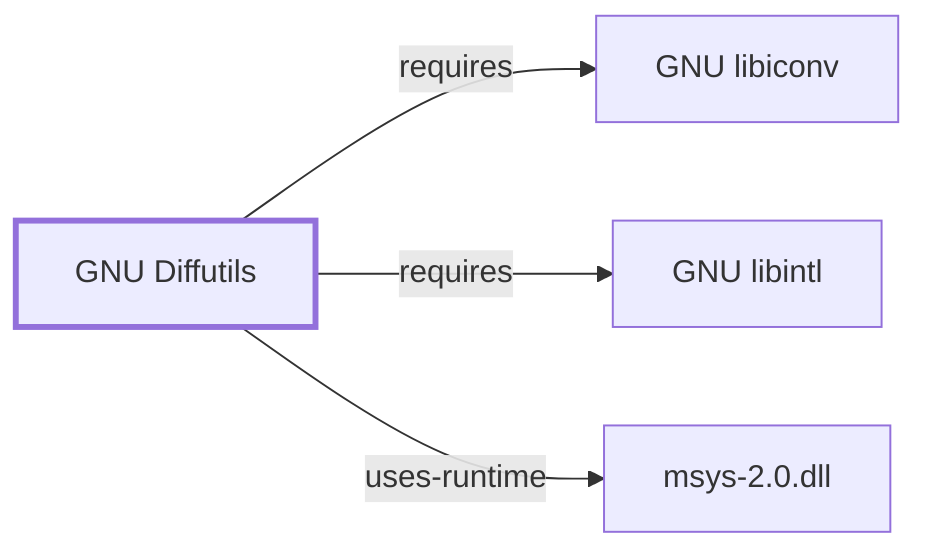

# GNU Diffutils

<!-- BEGIN GENERATED object-facts -->

| Model fact | Value |
| --- | --- |
| Object | `component:gnu:diffutils` |
| Kind | `component` |
| Status | `partial` |
| Confidence | `high` |
| Authority | Free Software Foundation |
| Environments | `msys` |
| Upstream | <https://www.gnu.org/software/diffutils> |
| Packaged as | `package:msys2:diffutils` |
| Version (observed) | 3.12-1 |
| License (observed) | spdx:GPL-3.0-or-later |
| Architecture (observed) | x86_64 |
| Installed size (observed) | 1705.80 KiB |

**Evidence on this object**

- `evidence:catalog:current` — MSYS2 pacman package catalog (`observed`, retrieved 2026-08-05)
- `evidence:gnu:diff-1-2026-08-02` — diff(1) manual page (`primary`, retrieved 2026-08-02)

Generated from the composed model by `tools/build_object_facts.py`. Observed values come from the catalog snapshot and change when it is refreshed.
Edits between the surrounding markers are overwritten on the next build.

<!-- END GENERATED object-facts -->

## Purpose

Diffutils compares files line by line and emits the differences in a
machine-applicable format. In this ecosystem that output is not
incidental: it is the interchange format that
[GNU Patch](GNU-PATCH.md) consumes, and therefore the mechanism by which
every MSYS2 package recipe carries its source modifications. A patch file
sitting beside a `PKGBUILD` is diff's output.

## Architectural Classification

`component:gnu:diffutils` is a GNU-userland component packaged as
`package:msys2:diffutils` (version `3.12-1` in the current catalog
snapshot, license `GPL-3.0-or-later`, 1,746,735 bytes installed),
belonging to the MSYS environment. Its declared runtime dependencies are
`sh`, `libiconv`, and `libintl`.

It sits on the MSYS side, so it links `msys-2.0.dll` and sees POSIX paths.
That matters for the CRLF discussion below.

## Responsibilities

- Comparing two files line by line and reporting the differences (`diff`).
- Comparing three files for a merge base (`diff3`).
- Side-by-side interactive merging (`sdiff`).
- Byte-level comparison, without line semantics (`cmp`).
- Emitting differences in a format another program can apply.

## Output Formats

The format is a deliberate choice, not a default. Per `diff(1)`:

| Option | Output |
| --- | --- |
| `--normal` | a normal diff (the default) |
| `-c`, `-C NUM`, `--context[=NUM]` | `NUM` (default 3) lines of copied context |
| `-u`, `-U NUM`, `--unified[=NUM]` | `NUM` (default 3) lines of unified context |
| `-e`, `--ed` | an `ed` script |
| `-n`, `--rcs` | an RCS format diff |
| `-y`, `--side-by-side` | two columns |
| `-q`, `--brief` | only whether files differ |
| `-D`, `--ifdef=NAME` | merged file with `#ifdef NAME` diffs |

**Unified is the format to produce for packaging.** `patch` can apply
normal, context, and unified diffs itself; an `ed` script it does not
apply — it pipes it to `ed(1)`, which is why `package:msys2:patch`
declares `ed` as an optional dependency. See [GNU Ed](GNU-ED.md).

`-p`/`--show-c-function` annotates each hunk with the enclosing C function
name, which materially improves a patch's readability when it is reviewed
months later against a moved source tree.

## Exit Status

Three-valued, and the middle value is not an error:

> Exit status is 0 if inputs are the same, 1 if different, 2 if trouble.

A script that treats non-zero as failure will treat "the files differ" —
the normal, expected outcome — as an error. This is the single most common
`diff` scripting bug and it is worth stating plainly.

## Line Endings: the MSYS2-Relevant Behavior

This is where the Windows host stops being incidental. Three options
govern it:

| Option | Effect |
| --- | --- |
| `--strip-trailing-cr` | strip trailing carriage return on input |
| `-a`, `--text` | treat all files as text |
| `--binary` | read and write files in binary mode |

The consumer side states the reason explicitly. From `patch(1)`:

> On POSIX systems, file reads and writes never transform line endings.
> On Windows, reads and writes do transform line endings by default, and
> patches should be generated by `diff --binary` when line endings are
> significant.

So a patch generated on Windows without `--binary` may not represent the
bytes on disk, and a patch generated on Linux may not apply cleanly to a
Windows checkout that has CRLF endings. `--strip-trailing-cr` makes `diff`
ignore the difference; `--binary` makes it preserve it. **Which one is
correct depends on whether the line endings are part of what you are
patching**, and that is a per-case judgment rather than a setting.

The complication specific to this ecosystem is that MSYS2 has mount
options affecting text/binary treatment, and this knowledge base has not
captured MSYS2's effective mount table. See
[MSYS Mount Manager](MSYS-MOUNT-MANAGER.md). So the above states the tool
behavior, not the composed behavior on a real MSYS2 install.

## Directory Comparison

`-r`/`--recursive` compares subdirectories, and two options change what
"missing file" means:

- `-N`, `--new-file` — treat absent files as empty, so a new file appears
  as an addition rather than being skipped.
- `--unidirectional-new-file` — treat absent *first* files as empty.

`-N` is what makes a recursive diff usable as a patch that adds files.
Without it, new files silently do not appear in the output — a failure
mode that produces a patch which applies cleanly and is incomplete.

`--no-dereference` stops `diff` following symbolic links. On MSYS2 that
option interacts with the symlink strategy the runtime is using, which is
itself configurable and not observed here; see
[MSYS Filesystem Layer](MSYS-FILESYSTEM-LAYER.md).

## Dependency Footprint

| Dependency | Why |
| --- | --- |
| `libintl` | gettext-based message translation (NLS) |
| `libiconv` | character-set conversion |
| `sh` | declared; the suite includes shell-driven components |
| `msys-2.0.dll` | it is an MSYS-side package |

## Evidence and Gaps

- The option and exit-status statements come from the upstream `diff(1)`
  manual page, retrieved 2026-08-02. **gnu.org returned 403 through this
  environment's proxy**, so the page was read from man7.org's mirror of
  the same manual page rather than from the GNU project directly.
- **The MSYS2 build's actual option set has not been observed.** Nothing
  here was run against `package:msys2:diffutils`.
- Version, license, size, and dependency facts are from the catalog
  snapshot `20260729T113151Z` and are observed.
- The composed behavior of `diff`'s text/binary handling on a real MSYS2
  install is unestablished, because the effective mount table is
  uncaptured.

<!-- BEGIN GENERATED dependency-subgraph -->

## Dependency Diagram

Dependencies and dependents of `component:gnu:diffutils` in the composed graph: 0 dependents and 3 dependencies.

Generated from the composed model by `tools/build_object_diagrams.py`.
Edits between the surrounding markers are overwritten on the next build.

<!-- END GENERATED dependency-subgraph -->

## Related Objects

- [GNU Patch](GNU-PATCH.md)
- [GNU Ed](GNU-ED.md)
- [GNU Grep](GNU-GREP.md)
- [Packaging for MSYS2](DEVELOPER-PACKAGING.md)
- [MSYS Filesystem Layer](MSYS-FILESYSTEM-LAYER.md)
