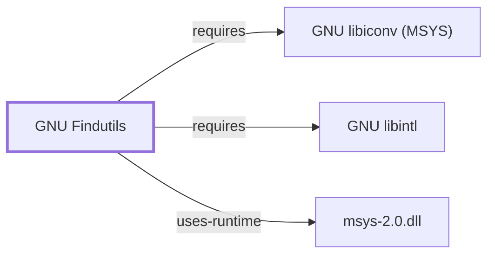

# GNU Findutils

<!-- BEGIN GENERATED object-facts -->

| Model fact | Value |
| --- | --- |
| Object | `component:gnu:findutils` |
| Kind | `component` |
| Status | `partial` |
| Confidence | `high` |
| Authority | Free Software Foundation |
| Environments | `msys` |
| Upstream | <https://www.gnu.org/software/findutils> |
| Packaged as | `package:msys2:findutils` |
| Version (observed) | 4.10.0-3 |
| License (observed) | spdx:GPL-3.0-or-later |
| Architecture (observed) | x86_64 |
| Installed size (observed) | 2189.42 KiB |

**Evidence on this object**

- `evidence:catalog:current` — MSYS2 pacman package catalog (`observed`, retrieved 2026-08-05)
- `evidence:gnu:findutils-manual-2026-07-30` — GNU Findutils Manual (`primary`, retrieved 2026-07-30)

**Claims about this object**

- `claim:component:findutils:role` (`inference`, `high`) — GNU Findutils packages the file-locating and command-construction utilities (including `find` and `xargs`) for the MSYS environment.

Generated from the composed model by `tools/build_object_facts.py`. Observed values come from the catalog snapshot and change when it is refreshed.
Edits between the surrounding markers are overwritten on the next build.

<!-- END GENERATED object-facts -->

## Purpose

Findutils locates files by predicate (`find`) and builds/executes command
lines from that output (`xargs`). This page documents its architectural
role, dependency footprint, and the NUL-delimiter safety pattern that ties
`find` and `xargs` together; see the
[official GNU Findutils manual](https://www.gnu.org/software/findutils/manual/find.html)
for the full predicate/action grammar.

## Architectural Classification

`component:gnu:findutils` is a GNU-userland component packaged as
`package:msys2:findutils` (version `4.10.0-3` in the current catalog
snapshot, license `GPL-3.0-or-later`), belonging to the MSYS environment.
The catalog snapshot's package summary ("GNU utilities to locate files")
supports its general role, but it does not itemize which individual
binaries (`find`, `xargs`, and historically `locate`/`updatedb`) the MSYS2
build installs; that finer-grained fact is recorded as an inference
(`claim:component:findutils:role`) pending package file-inventory evidence.

## Responsibilities

- Recursive filesystem traversal with predicate-based filtering (`find`):
  by name, type, modification time, permissions, and more.
- Building and executing command lines from a stream of input arguments
  (`xargs`), commonly composed with `find`'s output.

## Boundaries

Findutils operates on filesystem metadata and pathnames, not file contents:
content matching is [GNU Grep](GNU-GREP.md)'s responsibility, and content
transformation is [GNU Sed](GNU-SED.md)'s or [GNU Awk](GNU-AWK.md)'s. A
common composed pipeline (`find ... -print0 | xargs -0 grep ...`) spans all
three components without any one of them duplicating another's role.

## Interfaces

- `find` predicate/action grammar: `-name`, `-type`, `-mtime`, `-perm`, and
  actions `-print`, `-print0`, `-exec ... \;`, `-exec ... +`, per the manual.
- `xargs` argument-building semantics, notably `-0`/`--null`, which the
  manual documents as the safe pairing for `find -print0` when filenames may
  contain spaces or newlines.

## Dependencies

The catalog snapshot records two `runtime-depends-on` edges for
`package:msys2:findutils`:

| Dependency | Package | Architectural reason |
| --- | --- | --- |
| Character-set conversion | `package:msys2:libiconv` | Portable multibyte/character-set handling for filenames, matching the same rationale documented for [GNU Coreutils](GNU-COREUTILS.md). Documented fully in [GNU libiconv (MSYS)](GNU-LIBICONV-MSYS.md). |
| Native-language messages | `package:msys2:libintl` | gettext-based message translation (NLS). Documented fully in [GNU libintl](GNU-LIBINTL.md). |

## Reverse Dependencies

The snapshot records 6 relationships targeting `package:msys2:findutils`.
See the
[reverse dependency impact analysis](REVERSE-DEPENDENCY-IMPACT-ANALYSIS.md)
for the current full list.

## Configuration

Neither `find` nor `xargs` reads a persistent configuration file; behavior
is controlled entirely through command-line flags and standard locale
variables (`LC_ALL`/`LANG`) affecting name comparisons and formatted output
(`-printf`).

## Initialization and Execution Flow

Both `find` and `xargs` are invoke-run-exit processes, adapted from POSIX
semantics onto Windows process primitives by `msys-2.0.dll` per
[MSYS Runtime Initialization](MSYS-RUNTIME-INITIALIZATION.md). `find`'s
traversal is recursive and its symlink-following behavior (`-P`/`-L`/`-H`)
depends on the underlying filesystem symlink semantics rather than being a
single fixed behavior.

## Runtime Behavior

`find`'s `-type l` predicate and symlink-following flags depend on the same
symlink semantics that the
[MSYS runtime behavior map](MSYS-RUNTIME-BEHAVIOR-MAP.md#controlled-local-observation)
already flagged as an open discrepancy: its controlled observation recorded
that `ln -s` succeeded and the target was readable, but `test -L` returned
non-zero. That discrepancy is directly relevant to `find -type l` results in
this environment and is not re-derived here. Separately, `xargs`' default
argument-batching interacts with a platform command-line length limit
(POSIX `ARG_MAX` on Unix-like systems); the exact limit and batching
behavior as translated for MSYS-dependent processes on Windows has not been
directly observed and is recorded as open work.

## Compatibility and Variants

GNU find extensions such as `-printf`, `-regextype`, and `-delete` are not
present in POSIX or BSD find; `POSIXLY_CORRECT` narrows some GNU-specific
defaults toward POSIX behavior, per the manual.

## Security Considerations

The manual documents the NUL-delimiter pattern (`find -print0` paired with
`xargs -0`) specifically because filenames may contain spaces, newlines, or
a leading `-` that would otherwise be misinterpreted as an option by a
downstream command; omitting it is a well-documented source of
argument-injection-like bugs when processing untrusted or attacker-influenced
filenames. See
[Threat Model and Supply Chain](THREAT-MODEL-AND-SUPPLY-CHAIN.md) for the
project's general supply-chain posture.

## Failure Modes and Diagnostics

The single most common failure mode is a `find`/`xargs` delimiter mismatch:
piping default newline-delimited `find` output into default whitespace-
splitting `xargs` silently mishandles any filename containing whitespace.
The symlink-detection discrepancy cross-linked above is the recommended
first check when `-type l` results look wrong in this environment.

## Evidence, Assumptions, and Open Questions

Predicate/action grammar and the NUL-delimiter safety pattern are backed by
the official GNU Findutils manual
(`evidence:gnu:findutils-manual-2026-07-30`). Package identity, version,
license, and dependency edges are backed by the pacman catalog snapshot
(`evidence:catalog:current`). Open: which specific binaries the MSYS2
package installs is an inference pending file-inventory evidence; the
`-type l`/symlink-following fidelity issue already flagged in the runtime
behavior map remains open; and `xargs`' batching behavior against the
Windows-equivalent argument-length limit has not been directly observed.

<!-- BEGIN GENERATED dependency-subgraph -->

## Dependency Diagram

Dependencies and dependents of `component:gnu:findutils` in the composed graph: 0 dependents and 3 dependencies.

Generated from the composed model by `tools/build_object_diagrams.py`.
Edits between the surrounding markers are overwritten on the next build.

<!-- END GENERATED dependency-subgraph -->

## Related Objects

- [GNU Userland Role Model](GNU-USERLAND-ROLE-MODEL.md)
- [GNU Grep](GNU-GREP.md)
- [GNU libintl](GNU-LIBINTL.md)
- [GNU libiconv (MSYS)](GNU-LIBICONV-MSYS.md)
- [MSYS Runtime Behavior Map](MSYS-RUNTIME-BEHAVIOR-MAP.md)
- [MSYS Runtime Initialization](MSYS-RUNTIME-INITIALIZATION.md)
