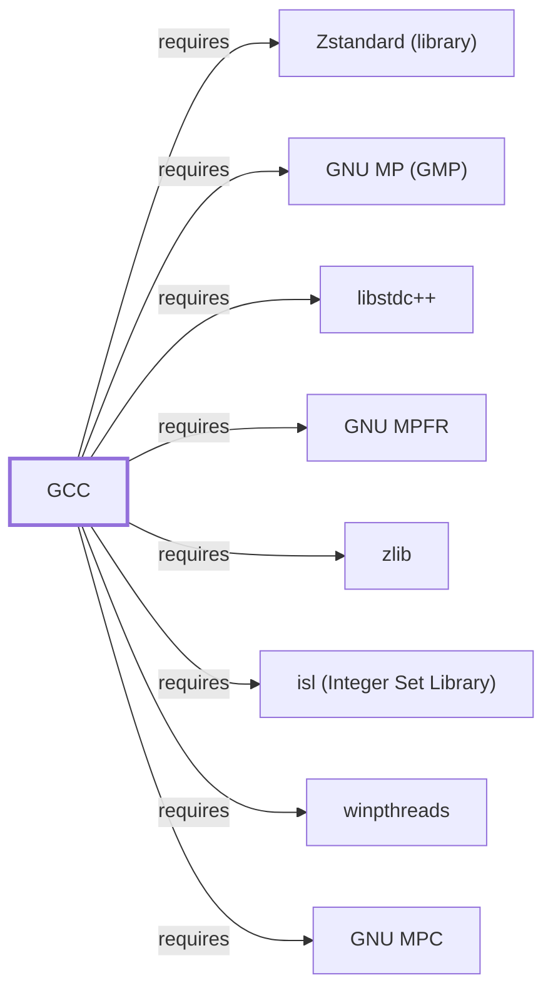

# GCC

<!-- BEGIN GENERATED object-facts -->

| Model fact | Value |
| --- | --- |
| Object | `component:gnu:gcc` |
| Kind | `component` |
| Status | `partial` |
| Confidence | `high` |
| Authority | Free Software Foundation |
| Environments | `ucrt64` |
| Upstream | <https://gcc.gnu.org> |
| Packaged as | `package:msys2:mingw-w64-ucrt-x86_64-gcc` |
| Version (observed) | 16.1.0-5 |
| License (observed) | spdx:GPL-3.0-or-later |
| Architecture (observed) | any |
| Installed size (observed) | 184.2 MB |

**Evidence on this object**

- `evidence:catalog:current` — MSYS2 pacman package catalog (`observed`, retrieved 2026-07-29)
- `evidence:gnu:gcc-manual-2026-07-30` — GCC Online Documentation (`primary`, retrieved 2026-07-30)

**Claims about this object**

- `claim:component:gcc:optimizer-arithmetic-libraries` (`inference`, `high`) — GCC's dependencies on gmp, mpfr, and mpc back arbitrary-precision arithmetic used during compilation (for example, constant folding), and its dependency on isl backs the Graphite loop-optimization framework.

Generated from the composed model by `tools/build_object_facts.py`. Observed values come from the catalog snapshot and change when it is refreshed.
Edits between the surrounding markers are overwritten on the next build.

<!-- END GENERATED object-facts -->

## Purpose

GCC is the default compiler driver for GCC-oriented MinGW-w64 environments
(UCRT64, MINGW64, MINGW32), translating C/C++/OpenMP source into native
Windows PE objects and executables. This page documents its architectural
role, its optimizer-library dependencies, and its backend invocation of
[GNU Binutils](GNU-BINUTILS.md); see the
[GCC online documentation](https://gcc.gnu.org/onlinedocs/) for the full
language and option reference.

## Architectural Classification

`component:gnu:gcc` is a GNU-userland toolchain component, packaged per
native environment rather than once for all of MSYS2: this page cites the
UCRT64 build, `package:msys2:mingw-w64-ucrt-x86_64-gcc` (version
`16.1.0-5` in the current catalog snapshot, license `GPL-3.0-or-later`).
Per the [MSYS2 Toolchain Role Model](TOOLCHAIN-ROLE-MODEL.md), GCC is the
GCC-oriented compiler driver counterpart to [Clang](CLANG.md)'s role in
LLVM-oriented environments; MINGW64, MINGW32, and other GCC-targeting
environments each have their own separately versioned GCC package, not
covered individually here.

## Responsibilities

- Driving the compilation pipeline (preprocess, compile, assemble, link)
  for C, C++, and OpenMP source, invoking [GNU Binutils](GNU-BINUTILS.md)'
  assembler and linker as backend subprocesses
  (`relationship:toolchain:gcc-invokes-binutils`).
- Providing optimization passes, including the Graphite loop-optimization
  framework backed by its `isl` dependency
  (`claim:component:gcc:optimizer-arithmetic-libraries`).

## Boundaries

Unlike the MSYS-environment tools documented in Volume 5, this UCRT64
package does **not** depend on `msys-2.0.dll`: native MinGW-w64 toolchain
output and the compiler itself run against Windows-facing runtime behavior
directly, per the
[MSYS2 and MinGW-w64 role model](MSYS2-AND-MINGW-W64-ROLE-MODEL.md). GCC
selects its target ABI (UCRT, MSVCRT) and architecture from the environment
it is packaged for, not from a runtime flag alone; rebuilding for a
different environment requires the matching environment's GCC package, per
[Runtime Environments](RUNTIME-ENVIRONMENTS.md).

## Interfaces

- The `gcc`/`g++` command-line driver (source files, `-c`/`-S`/`-E` phase
  selection, `-O`-level optimization flags, `-std=` language-standard
  selection) and the `cc` virtual-capability alias this package provides,
  per the documentation.

## Dependencies

The catalog snapshot records eleven `runtime-depends-on` edges for
`package:msys2:mingw-w64-ucrt-x86_64-gcc`:

| Dependency | Package | Architectural reason |
| --- | --- | --- |
| Assembler/linker backend | `mingw-w64-ucrt-x86_64-binutils` | Invoked as GCC's backend for assembly and linking (`relationship:toolchain:gcc-invokes-binutils`), documented fully in [GNU Binutils](GNU-BINUTILS.md). |
| Target C runtime and headers | `mingw-w64-ucrt-x86_64-crt`, `mingw-w64-ucrt-x86_64-headers` | The MinGW-w64 CRT and Windows API headers this build targets (UCRT for this environment). |
| GCC's own runtime library | `mingw-w64-ucrt-x86_64-gcc-libs` | Runtime support library (`libgcc`) needed by any program this compiler produces. Documented fully in [libstdc++](LIBSTDCXX.md). |
| Arbitrary-precision arithmetic | `mingw-w64-ucrt-x86_64-gmp`, `mingw-w64-ucrt-x86_64-mpfr`, `mingw-w64-ucrt-x86_64-mpc` | Back GCC's own internal arbitrary-precision arithmetic during compilation, such as constant folding (`claim:component:gcc:optimizer-arithmetic-libraries`). Documented fully in [GNU MP](GNU-GMP.md), [GNU MPFR](GNU-MPFR.md), and [GNU MPC](GNU-MPC.md). |
| Loop optimization | `mingw-w64-ucrt-x86_64-isl` | Backs the Graphite loop-optimization framework (`claim:component:gcc:optimizer-arithmetic-libraries`). Documented fully in [isl](LIBISL.md). |
| Windows application manifest | `mingw-w64-ucrt-x86_64-windows-default-manifest` | An MSYS2/MinGW-w64-specific package providing a default Windows application manifest embedded into produced executables. |
| Threading | `mingw-w64-ucrt-x86_64-winpthreads` | Backs POSIX-threads-style threading support for produced programs. Documented fully in [winpthreads](WINPTHREADS.md). |
| Compression | `mingw-w64-ucrt-x86_64-zlib`, `mingw-w64-ucrt-x86_64-zstd` | Back compressed debug-section support, the same rationale documented for [GNU Binutils](GNU-BINUTILS.md#dependencies). Documented fully in [zlib](ZLIB.md) and [Zstandard (library)](LIBZSTD.md). |

**Correction, 2026-07-30**: the gmp/mpfr/mpc/isl/winpthreads dependencies
above were cited by package name in this table since this page's first
publication, but had never been backed by corresponding `requires` graph
edges the way the zlib/zstd edges were — the five missing edges are now
added
(`relationship:toolchain:gcc-requires-gmp`,
`relationship:toolchain:gcc-requires-mpfr`,
`relationship:toolchain:gcc-requires-mpc`,
`relationship:toolchain:gcc-requires-isl`,
`relationship:toolchain:gcc-requires-winpthreads`). A follow-on sweep
caught a sixth: the `gcc-libs` (`libstdc++`) edge itself was also
missing despite being named in this table since publication —
`relationship:toolchain:gcc-requires-libstdcxx` is now added too.

This package also `provides` a `mingw-w64-ucrt-x86_64-gcc-base` capability
and `conflicts` with a separate `mingw-w64-ucrt-x86_64-gcc-rust` package —
MSYS2 packages a Rust-language-enabled GCC variant separately, and the two
cannot be installed together in this environment.

## Reverse Dependencies

The snapshot records 7 relationships targeting
`package:msys2:mingw-w64-ucrt-x86_64-gcc`. See the
[reverse dependency impact analysis](REVERSE-DEPENDENCY-IMPACT-ANALYSIS.md)
for the current full list.

## Configuration

GCC is configured per-invocation via command-line flags rather than a
persistent configuration file; `CFLAGS`/`CXXFLAGS`/`LDFLAGS` environment
variables are a common convention for build systems to pass default flags,
though GCC itself does not mandate them.

## Initialization and Execution Flow

GCC's driver is an invoke-run-exit process that itself spawns further
invoke-run-exit child processes for the assembler and linker stages
(`as`/`ld` from [GNU Binutils](GNU-BINUTILS.md)) unless those stages are
skipped (`-c`, `-S`). As a native MinGW-w64 program, this process
adaptation is Windows-facing directly rather than mediated by
`msys-2.0.dll`, per the Boundaries section above.

## Runtime Behavior

The [MSYS2 Toolchain Role Model](TOOLCHAIN-ROLE-MODEL.md#controlled-local-build-observations)'s
controlled local build observation recorded on 2026-07-30 that UCRT64 GCC
compiled and executed a fixed one-line C program successfully on the x86_64
observation host, producing a 126,188-byte x86_64 PE. This proves only that
exact compiler/environment/source combination, not general build-pipeline
behavior, per that page's own stated boundary.

## Compatibility and Variants

GCC's produced object files and static libraries are ABI-specific to the
environment (CRT, architecture, C++ library) they were built for; the
[Runtime Environments](RUNTIME-ENVIRONMENTS.md) comparison table documents
this compatibility boundary in full and is not restated here.

## Security Considerations

No GCC-specific vulnerability review has been performed for this volume;
compiler defects that miscompile security-relevant code are a documented,
general class of toolchain risk. See
[Threat Model and Supply Chain](THREAT-MODEL-AND-SUPPLY-CHAIN.md) for the
project's general supply-chain posture; no version-qualified CVE review has
been performed for the recorded `16.1.0-5` version.

## Failure Modes and Diagnostics

Cross-environment link failures (mixing UCRT64 and MINGW64 objects) are a
common toolchain-boundary mistake this page defers to
[Runtime Environments](RUNTIME-ENVIRONMENTS.md#compatibility-and-migration)
rather than restating; a plain assembler/linker error should first be
checked against [GNU Binutils](GNU-BINUTILS.md#failure-modes-and-diagnostics)
since GCC invokes those tools as its backend.

## Evidence, Assumptions, and Open Questions

Compilation-pipeline and optimizer-library behavior are backed by the
official GCC online documentation (`evidence:gnu:gcc-manual-2026-07-30`).
Package identity, version, license, and all recorded dependency edges are
backed by the pacman catalog snapshot (`evidence:catalog:current`) via
`claim:component:gcc:optimizer-arithmetic-libraries`. No open items beyond
the general version-qualified security review noted above.

<!-- BEGIN GENERATED dependency-subgraph -->

## Dependency Diagram

Dependencies and dependents of `component:gnu:gcc` in the composed graph: 0 dependents and 8 dependencies.

Generated from the composed model by `tools/build_object_diagrams.py`.
Edits between the surrounding markers are overwritten on the next build.

<!-- END GENERATED dependency-subgraph -->

## Related Objects

- [MSYS2 Toolchain Role Model](TOOLCHAIN-ROLE-MODEL.md)
- [GNU Binutils](GNU-BINUTILS.md)
- [GDB](GNU-GDB.md)
- [Clang](CLANG.md)
- [Runtime Environments](RUNTIME-ENVIRONMENTS.md)
- [zlib](ZLIB.md)
- [Zstandard (library)](LIBZSTD.md)
- [GNU MP](GNU-GMP.md)
- [GNU MPFR](GNU-MPFR.md)
- [GNU MPC](GNU-MPC.md)
- [isl](LIBISL.md)
- [winpthreads](WINPTHREADS.md)
