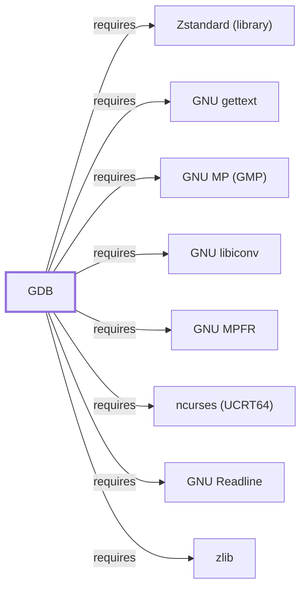

# GDB

<!-- BEGIN GENERATED object-facts -->

| Model fact | Value |
| --- | --- |
| Object | `component:gnu:gdb` |
| Kind | `component` |
| Status | `partial` |
| Confidence | `high` |
| Authority | Free Software Foundation |
| Environments | `ucrt64` |
| Upstream | <https://www.gnu.org/software/gdb/> |
| Packaged as | `package:msys2:mingw-w64-ucrt-x86_64-gdb` |
| Version (observed) | 17.2-1 |
| License (observed) | spdx:GPL-3.0-or-later |
| Architecture (observed) | any |
| Installed size (observed) | 15.53 MiB |

**Evidence on this object**

- `evidence:catalog:current` — MSYS2 pacman package catalog (`observed`, retrieved 2026-08-05)
- `evidence:gnu:gdb-manual-2026-07-30` — GNU Debugger (official project page) (`primary`, retrieved 2026-07-30)

**Claims about this object**

- `claim:component:gdb:python-scripting` (`inference`, `high`) — GDB's dependency on python backs its Python scripting API (pretty-printers, gdb.execute), and its optional dependency on python-pygments backs syntax-highlighted source-code display.

Generated from the composed model by `tools/build_object_facts.py`. Observed values come from the catalog snapshot and change when it is refreshed.
Edits between the surrounding markers are overwritten on the next build.

<!-- END GENERATED object-facts -->

## Purpose

GDB is the default debugger for GCC-oriented MinGW-w64 environments,
supporting breakpoint-based interactive debugging of native Windows PE
programs built by [GCC](GNU-GCC.md). This page documents its architectural
role and its unusually feature-rich dependency set among the toolchain
components documented so far; see the
[official GNU Debugger project page](https://www.gnu.org/software/gdb/)
for the full command reference.

## Architectural Classification

`component:gnu:gdb` is a GNU-userland toolchain component, packaged per
native environment: this page cites the UCRT64 build,
`package:msys2:mingw-w64-ucrt-x86_64-gdb` (version `17.2-1` in the current
catalog snapshot, license `GPL-3.0-or-later`). Per the
[MSYS2 Toolchain Role Model](TOOLCHAIN-ROLE-MODEL.md), it is the
GCC-oriented debugger counterpart to [LLDB](LLDB.md)'s role in
LLVM-oriented environments; debugger selection does not itself change a
program's ABI.

## Responsibilities

- Interactive and scripted debugging (breakpoints, stepping, expression
  evaluation, stack inspection) of native programs, with a Python scripting
  API for custom pretty-printers and automation
  (`claim:component:gdb:python-scripting`).

## Boundaries

GDB inspects and controls target processes; it does not build them (that is
[GCC](GNU-GCC.md)'s role). Like GCC and Binutils, this UCRT64 package does
**not** depend on `msys-2.0.dll` as a native MinGW-w64 package, per the
[MSYS2 and MinGW-w64 role model](MSYS2-AND-MINGW-W64-ROLE-MODEL.md).

## Interfaces

- Command-line debugging commands (`break`, `run`, `step`/`next`, `print`,
  `backtrace`), a Python scripting API (`python`, `.gdbinit` script
  loading), and a text-based TUI mode (`gdb -tui`), per the documentation.

## Dependencies

The catalog snapshot records twelve `runtime-depends-on` edges for
`package:msys2:mingw-w64-ucrt-x86_64-gdb` — the richest dependency set of
any toolchain component documented so far, each mapping to a specific
debugger feature (a thirteenth, `python-pygments`, is an
`optional-depends-on` edge, listed below but not counted in that
figure):

| Dependency | Package | Architectural reason |
| --- | --- | --- |
| Scripting API | `mingw-w64-ucrt-x86_64-python` | Backs GDB's Python scripting API for pretty-printers and automation (`claim:component:gdb:python-scripting`). |
| Syntax highlighting (optional) | `mingw-w64-ucrt-x86_64-python-pygments` | Backs styled source-code display when listing source alongside execution (`claim:component:gdb:python-scripting`). |
| Terminal UI | `mingw-w64-ucrt-x86_64-ncurses` | Backs GDB's TUI (text user interface) mode. This is a separate, UCRT64-native catalog entity from the MSYS-packaged ncurses documented as a hub in [ncurses (MSYS)](NCURSES.md#reverse-dependencies); documented fully in [ncurses (UCRT64)](NCURSES-UCRT64.md). |
| Interactive line editing | `mingw-w64-ucrt-x86_64-readline` | Backs command-line editing and history at GDB's interactive prompt. Documented fully in [GNU Readline](GNU-READLINE.md). |
| XML parsing | `mingw-w64-ucrt-x86_64-expat` | Backs XML-format target descriptions and remote-protocol data. Documented fully in [Expat](EXPAT.md). |
| Arbitrary-precision arithmetic | `mingw-w64-ucrt-x86_64-gmp`, `mingw-w64-ucrt-x86_64-mpfr` | Back precise evaluation of arbitrary-precision expressions during debugging sessions. Documented fully in [GNU MP](GNU-GMP.md) and [GNU MPFR](GNU-MPFR.md). |
| Character-set conversion | `mingw-w64-ucrt-x86_64-libiconv` | Portable multibyte/character-set handling, matching the same rationale documented for [GNU Coreutils](GNU-COREUTILS.md). Documented fully in [GNU libiconv](GNU-LIBICONV.md). |
| Fast hashing | `mingw-w64-ucrt-x86_64-xxhash` | Backs GDB's debug-info index/cache features, which use fast hashing to speed up repeated symbol lookups. Documented fully in [xxHash](XXHASH.md). |
| Compressed debug sections | `mingw-w64-ucrt-x86_64-xz`, `mingw-w64-ucrt-x86_64-zlib`, `mingw-w64-ucrt-x86_64-zstd` | Back reading debug information compressed with any of these algorithms, extending the compression-format support already documented for [GNU Binutils](GNU-BINUTILS.md#dependencies) with xz as an additional option. Documented fully in [liblzma](LIBLZMA.md), [zlib](ZLIB.md), and [Zstandard (library)](LIBZSTD.md). |
| Native-language messages | `mingw-w64-ucrt-x86_64-gettext-runtime` | gettext-based message translation (NLS). Documented fully in [GNU gettext](GNU-GETTEXT.md). |

## Reverse Dependencies

The snapshot records 5 relationships targeting
`package:msys2:mingw-w64-ucrt-x86_64-gdb`. See the
[reverse dependency impact analysis](REVERSE-DEPENDENCY-IMPACT-ANALYSIS.md)
for the current full list.

## Configuration

`.gdbinit` (project-local or user-home) is a genuine standing configuration
file, executed as GDB commands (optionally including Python) at startup —
similar in spirit to [GNU Emacs](GNU-EMACS.md#configuration)'s init-file
model, though GDB's default command language is its own, not a general
programming language, unless the embedded Python API is used.

## Initialization and Execution Flow

GDB is a longer-lived interactive process for the duration of a debugging
session, attaching to or launching a target process it then controls. As a
native MinGW-w64 program, its own process model is Windows-facing directly
rather than mediated by `msys-2.0.dll`, per the Boundaries section above;
the target process it debugs may itself be MSYS-dependent or native
depending on what was built.

## Runtime Behavior

Whether GDB can produce a full backtrace and variable inspection depends on
the target binary having been built with debug information (`-g`) by
[GCC](GNU-GCC.md); this is a build-time prerequisite, not a GDB
configuration option.

## Compatibility and Variants

GDB debugs native Windows PE programs in this environment rather than
Unix-style ELF/ptrace-based debugging; the underlying Windows debugging API
it uses is a materially different mechanism from GDB's more commonly
documented Linux ptrace backend, though this distinction is not elaborated
further here pending a dedicated Windows-debugging-API observation.

## Security Considerations

No GDB-specific vulnerability review has been performed for this volume;
see [Threat Model and Supply Chain](THREAT-MODEL-AND-SUPPLY-CHAIN.md) for
the project's general supply-chain posture. No version-qualified CVE review
has been performed for the recorded `17.2-1` version.

## Failure Modes and Diagnostics

Missing debug information ("no symbol table" or an unhelpful backtrace) is
the most common GDB usage friction and should first be checked against
whether the target was built with `-g`, per Runtime Behavior above, before
being treated as a GDB defect.

## Evidence, Assumptions, and Open Questions

Command and scripting behavior are backed by the official GNU Debugger
project page (`evidence:gnu:gdb-manual-2026-07-30`), matching the
`project_url` already recorded for
`package:msys2:mingw-w64-ucrt-x86_64-gdb` in the catalog. Package identity,
version, license, and all recorded dependency edges are backed by the
pacman catalog snapshot (`evidence:catalog:current`) via
`claim:component:gdb:python-scripting`. Open: the exact Windows-debugging-API
mechanism GDB uses on this platform (versus its more commonly documented
ptrace-based backend) has not been directly observed.

<!-- BEGIN GENERATED dependency-subgraph -->

## Dependency Diagram

Dependencies and dependents of `component:gnu:gdb` in the composed graph: 0 dependents and 11 dependencies, of which 3 are omitted here for legibility.

Generated from the composed model by `tools/build_object_diagrams.py`.
Edits between the surrounding markers are overwritten on the next build.

<!-- END GENERATED dependency-subgraph -->

## Related Objects

- [MSYS2 Toolchain Role Model](TOOLCHAIN-ROLE-MODEL.md)
- [GCC](GNU-GCC.md)
- [GNU Binutils](GNU-BINUTILS.md)
- [LLDB](LLDB.md)
- [ncurses (MSYS)](NCURSES.md)
- [ncurses (UCRT64)](NCURSES-UCRT64.md)
- [GNU Readline](GNU-READLINE.md)
- [Expat](EXPAT.md)
- [GNU MP (GMP)](GNU-GMP.md)
- [GNU MPFR](GNU-MPFR.md)
- [GNU libiconv](GNU-LIBICONV.md)
- [xxHash](XXHASH.md)
- [liblzma](LIBLZMA.md)
- [zlib](ZLIB.md)
- [Zstandard (library)](LIBZSTD.md)
- [GNU gettext](GNU-GETTEXT.md)
