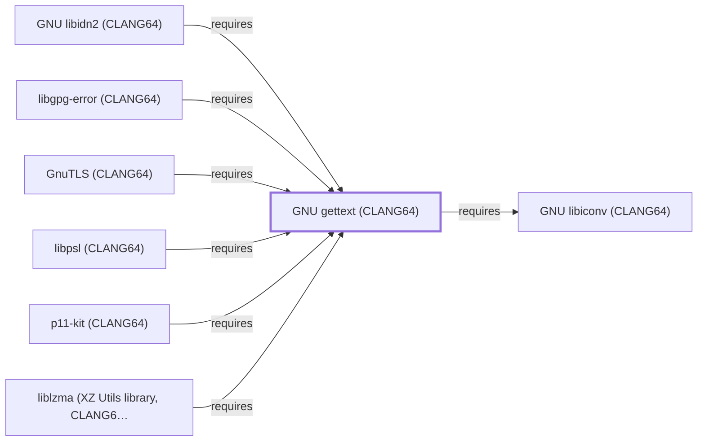

# GNU gettext (CLANG64)

<!-- BEGIN GENERATED object-facts -->

| Model fact | Value |
| --- | --- |
| Object | `library:gnu:gettext@clang64` |
| Kind | `library` |
| Status | `partial` |
| Confidence | `high` |
| Authority | Free Software Foundation |
| Environments | `clang64` |
| Upstream | <https://www.gnu.org/software/gettext/> |
| Packaged as | `package:msys2:mingw-w64-clang-x86_64-gettext-runtime` |
| Version (observed) | 1.0-1 |
| License (observed) | spdx:GPL-3.0-or-later AND LGPL-2.1-or-later |
| Architecture (observed) | any |
| Installed size (observed) | 2.6 MB |

**Evidence on this object**

- `evidence:catalog:current` — MSYS2 pacman package catalog (`observed`, retrieved 2026-07-29)
- `evidence:gnu:gettext-manual-2026-07-30` — GNU gettext Manual (`primary`, retrieved 2026-07-30)

Generated from the composed model by `tools/build_object_facts.py`. Observed values come from the catalog snapshot and change when it is refreshed.
Edits between the surrounding markers are overwritten on the next build.

<!-- END GENERATED object-facts -->

## Purpose

This page documents `package:msys2:mingw-w64-clang-x86_64-gettext-runtime`,
the CLANG64-environment build of the GNU internationalization (NLS)
runtime library, packaged separately from the `gettext-tools` and
`gettext-libtextstyle` packages. It is depended on by
[p11-kit (CLANG64)](P11-KIT-CLANG64.md), the second entity modeled in
this batch's ca-certificates (CLANG64) dependency chain. See the
[official GNU gettext project page](https://www.gnu.org/software/gettext/)
for the full reference.

## Architectural Classification

`library:gnu:gettext@clang64` is packaged as
`package:msys2:mingw-w64-clang-x86_64-gettext-runtime` (version `1.0-1`
in the current catalog snapshot, license
`GPL-3.0-or-later AND LGPL-2.1-or-later`) — a separately built, separate
catalog entity from [GNU gettext (UCRT64)](GNU-GETTEXT.md). It belongs
to the CLANG64 environment. Its sole recorded runtime dependency,
[GNU libiconv (CLANG64)](GNU-LIBICONV-CLANG64.md), was modeled earlier
in this same batch, letting this addition close its full dependency
footprint in a single pass.

## Responsibilities

- Providing native-language message translation (NLS) runtime support
  for CLANG64-native consumers, the same role
  [GNU gettext (UCRT64)](GNU-GETTEXT.md#responsibilities) documents for
  its own environment.

## Boundaries

This page's package serves CLANG64-environment consumers specifically;
[p11-kit (UCRT64)](P11-KIT-UCRT64.md) instead depends on
[GNU gettext (UCRT64)](GNU-GETTEXT.md#reverse-dependencies) — the two
are not interchangeable, matching the same distinction already drawn
throughout this volume for MSYS/UCRT64/CLANG64 sibling packages.

## Interfaces

- The gettext C API (`gettext`, `dgettext`, `ngettext`, and related
  functions), the same interface
  [GNU gettext (UCRT64)](GNU-GETTEXT.md#interfaces) documents, per the
  documentation.

## Dependencies

The catalog snapshot records one `runtime-depends-on` edge for
`package:msys2:mingw-w64-clang-x86_64-gettext-runtime`, now modeled in
this knowledge base:

| Dependency | Package | Architectural reason |
| --- | --- | --- |
| [GNU libiconv (CLANG64)](GNU-LIBICONV-CLANG64.md) | `package:msys2:mingw-w64-clang-x86_64-libiconv` | Backs character-set conversion for gettext-runtime's own message-catalog handling. |

## Reverse Dependencies

The catalog snapshot records 136 relationships targeting
`package:msys2:mingw-w64-clang-x86_64-gettext-runtime` — the widest
reverse-dependency footprint of any library added in this batch. Five
are now modeled in this knowledge base:
[p11-kit (CLANG64)](P11-KIT-CLANG64.md)
(`relationship:foundation-libraries:p11-kit-clang64-requires-gettext-clang64`,
added 2026-08-02), [liblzma (CLANG64)](LIBLZMA-CLANG64.md)
(`relationship:foundation-libraries:liblzma-clang64-requires-gettext-clang64`,
added 2026-08-02, closing a gap that page had previously left
explicitly unmodeled), [GNU libidn2 (CLANG64)](GNU-LIBIDN2-CLANG64.md)
(`relationship:foundation-libraries:libidn2-clang64-requires-gettext-clang64`,
added 2026-08-02), [libpsl (CLANG64)](LIBPSL-CLANG64.md)
(`relationship:foundation-libraries:libpsl-clang64-requires-gettext-clang64`,
added 2026-08-02), and [libgpg-error (CLANG64)](LIBGPG-ERROR-CLANG64.md)
(`relationship:foundation-libraries:libgpg-error-clang64-requires-gettext-clang64`,
added 2026-08-02). The remaining ~131 (a broad mix of CLANG64
packages including `appstream`, `atk`, `aspell`, and many others) are
not individually modeled in this knowledge base; see the
[reverse dependency impact analysis](REVERSE-DEPENDENCY-IMPACT-ANALYSIS.md)
for the current full list.

## Configuration

gettext has no persistent configuration file; message-catalog lookup is
driven by the consuming program's own locale environment variables
(`LANG`, `LC_MESSAGES`) at runtime.

## Initialization and Execution Flow

As a library, gettext has no independent process lifecycle: it
initializes and executes within the process of whatever program links
against it — [p11-kit (CLANG64)](P11-KIT-CLANG64.md) in this dependency
chain. As a native MinGW-w64 library, this process model is
Windows-facing directly rather than mediated by `msys-2.0.dll`.

## Runtime Behavior

Identical functional behavior to
[GNU gettext (UCRT64)](GNU-GETTEXT.md#runtime-behavior); see that page
for detail not specific to the CLANG64/UCRT64 packaging distinction.

## Compatibility and Variants

The CLANG64 and UCRT64 gettext-runtime packages are separately
versioned catalog entities (see Architectural Classification); code
built against one is not automatically compatible with the other
without matching the correct environment.

## Security Considerations

No gettext-specific vulnerability review has been performed for this
volume. See [Threat Model and Supply Chain](THREAT-MODEL-AND-SUPPLY-CHAIN.md)
for the project's general supply-chain posture; no version-qualified
CVE review has been performed for the recorded `1.0-1` version.

## Failure Modes and Diagnostics

A dependent program's message-translation failure (missing or
untranslated strings) should be checked against its own locale
configuration and installed message catalogs before being treated as a
gettext defect.

## Evidence, Assumptions, and Open Questions

The NLS runtime scope is backed by the official GNU gettext project
page (`evidence:gnu:gettext-manual-2026-07-30`), the same evidence
record [GNU gettext (UCRT64)](GNU-GETTEXT.md) cites. Package identity,
version, license, and the recorded dependency edge are backed by the
pacman catalog snapshot (`evidence:catalog:current`). Open: the ~131
remaining recorded reverse dependents are not individually modeled in
this knowledge base.

<!-- BEGIN GENERATED dependency-subgraph -->

## Dependency Diagram

Dependencies and dependents of `library:gnu:gettext@clang64` in the composed graph: 6 dependents and 1 dependency.

Generated from the composed model by `tools/build_object_diagrams.py`.
Edits between the surrounding markers are overwritten on the next build.

<!-- END GENERATED dependency-subgraph -->

## Related Objects

- [MSYS2 Library Architecture](LIBRARIES-ARCHITECTURE.md)
- [GNU gettext (UCRT64)](GNU-GETTEXT.md)
- [GNU libiconv (CLANG64)](GNU-LIBICONV-CLANG64.md)
- [p11-kit (CLANG64)](P11-KIT-CLANG64.md)
- [liblzma (CLANG64)](LIBLZMA-CLANG64.md)
- [GNU libidn2 (CLANG64)](GNU-LIBIDN2-CLANG64.md)
- [libpsl (CLANG64)](LIBPSL-CLANG64.md)
- [libgpg-error (CLANG64)](LIBGPG-ERROR-CLANG64.md)
