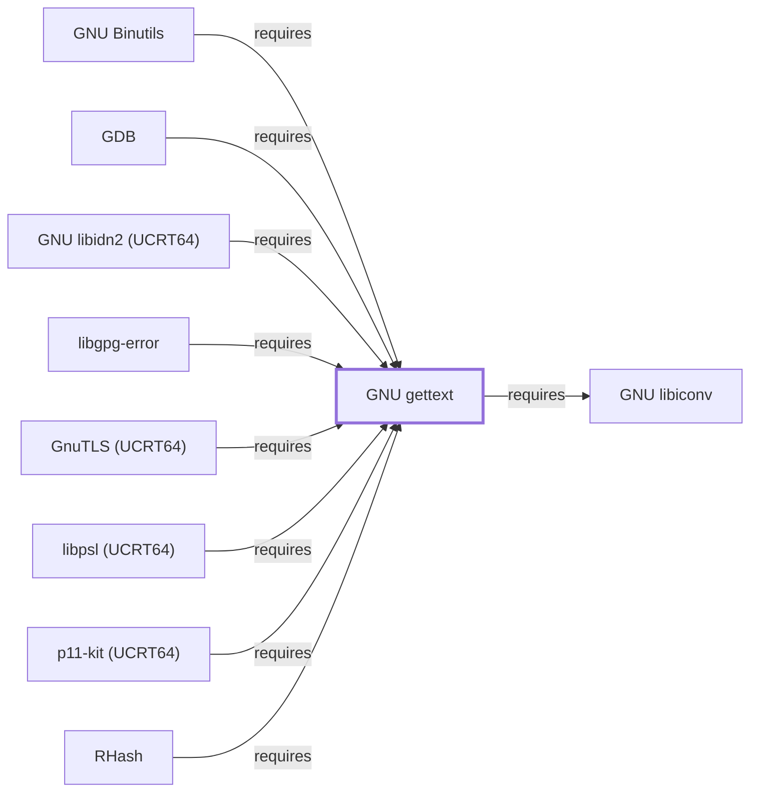

# GNU gettext

<!-- BEGIN GENERATED object-facts -->

| Model fact | Value |
| --- | --- |
| Object | `library:gnu:gettext` |
| Kind | `library` |
| Status | `partial` |
| Confidence | `high` |
| Authority | Free Software Foundation |
| Environments | `ucrt64` |
| Upstream | <https://www.gnu.org/software/gettext/> |
| Packaged as | `package:msys2:mingw-w64-ucrt-x86_64-gettext-runtime` |
| Version (observed) | 1.0-1 |
| License (observed) | spdx:GPL-3.0-or-later AND LGPL-2.1-or-later |
| Architecture (observed) | any |
| Installed size (observed) | 2.7 MB |

**Evidence on this object**

- `evidence:catalog:current` — MSYS2 pacman package catalog (`observed`, retrieved 2026-07-29)
- `evidence:gnu:gettext-manual-2026-07-30` — GNU gettext Manual (`primary`, retrieved 2026-07-30)

**Claims about this object**

- `claim:library:gettext:package-split` (`fact`, `verified`) — GNU gettext is split into three separate MSYS2 packages: gettext-runtime (the libintl runtime library), gettext-tools (msgfmt/xgettext/msginit and other CLI tools), and gettext-libtextstyle (a terminal text-styling library used by the tools); this page models the runtime component.

Generated from the composed model by `tools/build_object_facts.py`. Observed values come from the catalog snapshot and change when it is refreshed.
Edits between the surrounding markers are overwritten on the next build.

<!-- END GENERATED object-facts -->

## Purpose

Gettext provides native-language support (NLS): the `libintl` runtime
library that translated programs link against, plus the `msgfmt`/`xgettext`
tooling used to build and extract translation catalogs. This page documents
why so many other tools throughout this knowledge base cite "gettext-based
message translation (NLS)" as a dependency rationale, and a distinguishing
MSYS2 packaging split; see the
[official GNU gettext manual](https://www.gnu.org/software/gettext/manual/gettext.html)
for the full toolchain reference.

## Architectural Classification

`library:gnu:gettext` represents the GNU gettext project's runtime
component. It is **not** packaged as a single `gettext` MSYS2 package: this
page cites `package:msys2:mingw-w64-ucrt-x86_64-gettext-runtime` (version
`1.0-1` in the current catalog snapshot, license
`GPL-3.0-or-later AND LGPL-2.1-or-later`), which is only the `libintl`
runtime piece. `gettext-tools` (the `msgfmt`/`xgettext`/`msginit` CLI
programs) and `gettext-libtextstyle` (a terminal text-styling library used
by those tools) are separate packages
(`claim:library:gettext:package-split`), not covered individually by this
page.

## Responsibilities

- Providing the `libintl` runtime API (`gettext()`, `dgettext()`) that
  translated programs call to look up a message's localized string at
  runtime, the library-level half of the NLS pattern cited throughout this
  knowledge base (for example, in
  [GNU Coreutils](GNU-COREUTILS.md#dependencies) and
  [GNU Grep](GNU-GREP.md#dependencies)).

## Boundaries

This page covers the runtime library only; the `gettext-tools` package
(compiling `.po` translation files into the `.mo` format `libintl` reads,
and extracting translatable strings from source code) is a separate
package this page does not document in depth. Gettext performs message
translation, not character-set conversion — that is
[GNU libiconv](GNU-LIBICONV.md)'s role, which gettext-runtime itself
depends on (see Dependencies).

## Interfaces

- The `libintl` C API (`gettext()`, `ngettext()` for plural forms,
  `bindtextdomain()`), consumed by any NLS-enabled program's translated
  strings, per the manual. This page does not enumerate the header-level
  surface; that belongs to
  [Header and Development-Metadata Indexes](HEADER-AND-METADATA-INDEXES.md).

## Dependencies

The catalog snapshot records two `runtime-depends-on` edges for
`package:msys2:mingw-w64-ucrt-x86_64-gettext-runtime`:

| Dependency | Package | Architectural reason |
| --- | --- | --- |
| Character-set conversion | `mingw-w64-ucrt-x86_64-libiconv` | Translated message catalogs may be encoded differently from the program's runtime locale; `libintl` uses `iconv()`-based conversion to reconcile them, documented fully in [GNU libiconv](GNU-LIBICONV.md). |
| C/C++ runtime | `mingw-w64-ucrt-x86_64-cc-libs` | The virtual capability [gcc-libs provides](LIBSTDCXX.md#dependencies) in this environment (or, in CLANG64, that [libc++ provides](LIBCXX.md#dependencies)), for low-level compiler runtime support. |

The package also declares a `conflicts` constraint against
`gettext<=0.22.4-3`, an MSYS2 packaging detail marking a historical
transition point (older combined `gettext` packages below that version are
incompatible with this split runtime/tools packaging).

## Reverse Dependencies

The snapshot records **141** relationships targeting
`package:msys2:mingw-w64-ucrt-x86_64-gettext-runtime` — a substantial
dependent count, exceeding [GNU libiconv](GNU-LIBICONV.md#reverse-dependencies)'s
82 but smaller than [gcc-libs](LIBSTDCXX.md#reverse-dependencies)'s 167 and
[zlib](ZLIB.md#reverse-dependencies)'s 299. See the
[reverse dependency impact analysis](REVERSE-DEPENDENCY-IMPACT-ANALYSIS.md)
for the current full list.

## Configuration

`LANG`/`LANGUAGE`/`LC_MESSAGES` environment variables select which
translation catalog `libintl` looks up at runtime; `bindtextdomain()`
(called by the linked program, not configured externally) sets the
catalog search path for a given text domain.

## Initialization and Execution Flow

As a library, `libintl` has no independent process lifecycle: it
initializes and executes within the process of whatever program links
against it, the same model documented for [zlib](ZLIB.md#initialization-and-execution-flow)
and [GNU libiconv](GNU-LIBICONV.md#initialization-and-execution-flow).

## Runtime Behavior

Message lookup falls back to the original (typically English) string when
no translation catalog matches the active locale; this is documented
graceful-degradation behavior, not a failure condition.

## Compatibility and Variants

The `conflicts: gettext<=0.22.4-3` constraint noted in Dependencies marks a
real packaging-history compatibility boundary: projects or scripts
assuming the older combined `gettext` package structure may not translate
directly onto this split runtime/tools/libtextstyle packaging without
adjustment.

## Security Considerations

No gettext-runtime-specific vulnerability review has been performed for
this volume; parsing compiled `.mo` translation catalogs from an untrusted
source is a general parser-robustness risk class, the same category
already noted for [GNU libiconv](GNU-LIBICONV.md#security-considerations).
See [Threat Model and Supply Chain](THREAT-MODEL-AND-SUPPLY-CHAIN.md) for
the project's general supply-chain posture; no version-qualified CVE
review has been performed for the recorded `1.0-1` version.

## Failure Modes and Diagnostics

Untranslated (fallback-language) output is the most common gettext-related
observation and should first be checked against `LANG`/`LANGUAGE`/`LC_MESSAGES`
and whether a `.mo` catalog for the requested locale is actually installed,
before being treated as a defect in the calling program or in gettext
itself.

## Evidence, Assumptions, and Open Questions

The NLS runtime model and the runtime/tools/libtextstyle package split are
backed by the official GNU gettext manual
(`evidence:gnu:gettext-manual-2026-07-30`) and the pacman catalog snapshot
(`evidence:catalog:current`) via `claim:library:gettext:package-split`.
Package identity, version, license, and dependency edges are backed by the
catalog snapshot as well. Open, and explicitly out of scope for this page:
the `gettext-tools` and `gettext-libtextstyle` packages are not documented
individually, and header-level API surface / PE import-export evidence per
the [Library Family Classification](LIBRARY-FAMILY-CLASSIFICATION.md)
methodology remains open.

<!-- BEGIN GENERATED dependency-subgraph -->

## Dependency Diagram

Dependencies and dependents of `library:gnu:gettext` in the composed graph: 9 dependents and 1 dependency, of which 1 are omitted here for legibility.

Generated from the composed model by `tools/build_object_diagrams.py`.
Edits between the surrounding markers are overwritten on the next build.

<!-- END GENERATED dependency-subgraph -->

## Related Objects

- [MSYS2 Library Architecture](LIBRARIES-ARCHITECTURE.md)
- [GNU libiconv](GNU-LIBICONV.md)
- [zlib](ZLIB.md)
- [GNU Coreutils](GNU-COREUTILS.md)
- [GNU Binutils](GNU-BINUTILS.md)
- [GDB](GNU-GDB.md)
- [GNU gettext (CLANG64)](GNU-GETTEXT-CLANG64.md)
