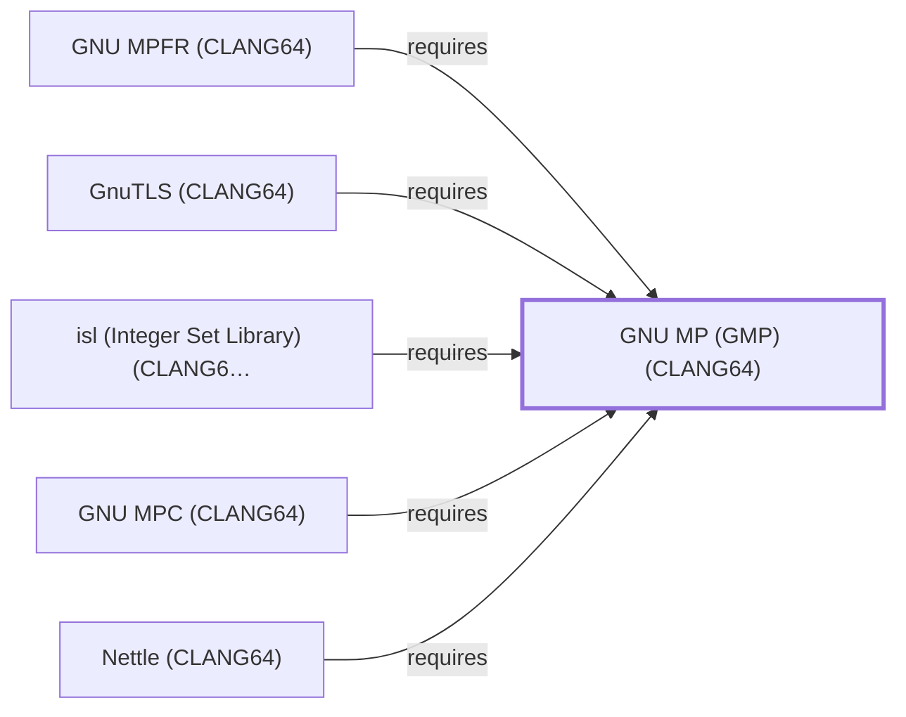

# GNU MP (GMP) (CLANG64)

<!-- BEGIN GENERATED object-facts -->

| Model fact | Value |
| --- | --- |
| Object | `library:gnu:gmp@clang64` |
| Kind | `library` |
| Status | `partial` |
| Confidence | `high` |
| Authority | GNU Project |
| Environments | `clang64` |
| Upstream | <https://gmplib.org/> |
| Packaged as | `package:msys2:mingw-w64-clang-x86_64-gmp` |
| Version (observed) | 6.3.0-2 |
| License (observed) | LGPL3;GPL |
| Architecture (observed) | any |
| Installed size (observed) | 2520.93 KiB |

**Evidence on this object**

- `evidence:catalog:current` — MSYS2 pacman package catalog (`observed`, retrieved 2026-08-05)
- `evidence:gnu:gmp-manual-2026-07-30` — GNU MP (official project site) (`primary`, retrieved 2026-07-30)

Generated from the composed model by `tools/build_object_facts.py`. Observed values come from the catalog snapshot and change when it is refreshed.
Edits between the surrounding markers are overwritten on the next build.

<!-- END GENERATED object-facts -->

## Purpose

This page documents `package:msys2:mingw-w64-clang-x86_64-gmp`, the
CLANG64-environment build of the GNU Multiple Precision Arithmetic
Library — a separately built, separate catalog entity from
[GMP (UCRT64)](GNU-GMP.md) and [GMP (MSYS)](GNU-GMP-MSYS.md), whose 60
recorded reverse dependents include the CLANG64 siblings of
[GNU MPFR](GNU-MPFR.md), [GNU MPC](GNU-MPC.md), [isl](LIBISL.md), and
[Nettle](NETTLE.md), none yet modeled in this knowledge base. See the
[official GMP project site](https://gmplib.org/) for the API reference.

## Architectural Classification

`library:gnu:gmp@clang64` is packaged as
`package:msys2:mingw-w64-clang-x86_64-gmp` (version `6.3.0-2` in the
current catalog snapshot, license `LGPL3;GPL`) — the same version
number as the UCRT64 and MSYS siblings, but a separately built, separate
catalog entity. It belongs to the CLANG64 environment.

## Responsibilities

- Providing arbitrary-precision integer, rational, and floating-point
  arithmetic as a foundation library for CLANG64-native consumers, the
  same role [GMP (UCRT64)](GNU-GMP.md#responsibilities) documents for
  its own environment.

## Boundaries

This page's package serves CLANG64-environment consumers specifically;
[GCC](GNU-GCC.md) and [GDB](GNU-GDB.md) instead link
[GMP (UCRT64)](GNU-GMP.md#reverse-dependencies) — the two are not
interchangeable, matching the same distinction already drawn throughout
this volume for MSYS/UCRT64/CLANG64 sibling triples.

## Interfaces

- The `mpz_*` (integers), `mpq_*` (rationals), and `mpf_*`
  (floating-point) C function families, the same interface
  [GMP (UCRT64)](GNU-GMP.md#interfaces) documents, per the
  documentation.

## Dependencies

The catalog snapshot records no `runtime-depends-on` edges for
`package:msys2:mingw-w64-clang-x86_64-gmp` beyond its membership in the
CLANG64 repository and environment — the same zero-dependency footprint
already documented for [GMP (UCRT64)](GNU-GMP.md#dependencies).

## Reverse Dependencies

The catalog snapshot records 60 relationships targeting
`package:msys2:mingw-w64-clang-x86_64-gmp`. Five are now modeled in
this knowledge base: [GNU MPFR (CLANG64)](GNU-MPFR-CLANG64.md)
(`relationship:foundation-libraries:mpfr-clang64-requires-gmp-clang64`,
added 2026-08-02), [Nettle (CLANG64)](NETTLE-CLANG64.md)
(`relationship:foundation-libraries:nettle-clang64-requires-gmp-clang64`,
added 2026-08-02), [isl (CLANG64)](LIBISL-CLANG64.md)
(`relationship:foundation-libraries:isl-clang64-requires-gmp-clang64`,
added 2026-08-02), [GNU MPC (CLANG64)](GNU-MPC-CLANG64.md)
(`relationship:foundation-libraries:mpc-clang64-requires-gmp-clang64`,
added 2026-08-02), and [GnuTLS (CLANG64)](GNUTLS-CLANG64.md)
(`relationship:foundation-libraries:gnutls-clang64-requires-gmp-clang64`,
added 2026-08-02). The remaining 55 are not individually
modeled in this knowledge base. See the
[reverse dependency impact analysis](REVERSE-DEPENDENCY-IMPACT-ANALYSIS.md)
for the current full list.

## Configuration

GMP has no persistent configuration file or environment variables;
behavior (precision, memory allocation functions) is controlled through
its C API at the point of use, the same model documented for
[GMP (UCRT64)](GNU-GMP.md#configuration).

## Initialization and Execution Flow

As a library, GMP has no independent process lifecycle: it initializes
and executes within the process of whatever program links against it.
As a native MinGW-w64 library, this process model is Windows-facing
directly rather than mediated by `msys-2.0.dll`.

## Runtime Behavior

Identical functional behavior to [GMP (UCRT64)](GNU-GMP.md); see that
page for detail not specific to the CLANG64/UCRT64 packaging
distinction.

## Compatibility and Variants

The CLANG64, UCRT64, and MSYS GMP packages are three separately
versioned catalog entities (see Architectural Classification); code
built against one is not automatically compatible with another without
matching the correct package/environment.

## Security Considerations

No GMP-specific vulnerability review has been performed for this
volume; given its 60 recorded dependents, a defect here would have a
meaningfully wide blast radius within the CLANG64 environment. See
[Threat Model and Supply Chain](THREAT-MODEL-AND-SUPPLY-CHAIN.md) for
the project's general supply-chain posture; no version-qualified CVE
review has been performed for the recorded `6.3.0-2` version.

## Failure Modes and Diagnostics

GMP itself has no user-facing CLI; arithmetic-related failures in a
dependent tool should be triaged against that dependent's own
documentation first, the same guidance already given for
[GMP (UCRT64)](GNU-GMP.md#failure-modes-and-diagnostics).

## Evidence, Assumptions, and Open Questions

The arithmetic model is backed by the official GMP project site
(`evidence:gnu:gmp-manual-2026-07-30`), the same evidence record
[GMP (UCRT64)](GNU-GMP.md) cites. Package identity, version, license,
and reverse-dependency count are backed by the pacman catalog snapshot
(`evidence:catalog:current`). Open: 56 of the 60 recorded reverse dependents
are not individually modeled in this knowledge base, though the CLANG64
siblings of MPFR, MPC, isl, and Nettle are flagged above as candidates
for a future batch, per this volume's ongoing gap-closing methodology.

<!-- BEGIN GENERATED dependency-subgraph -->

## Dependency Diagram

Dependencies and dependents of `library:gnu:gmp@clang64` in the composed graph: 5 dependents and 0 dependencies.

Generated from the composed model by `tools/build_object_diagrams.py`.
Edits between the surrounding markers are overwritten on the next build.

<!-- END GENERATED dependency-subgraph -->

## Related Objects

- [MSYS2 Library Architecture](LIBRARIES-ARCHITECTURE.md)
- [GMP (UCRT64)](GNU-GMP.md)
- [GMP (MSYS)](GNU-GMP-MSYS.md)
- [GNU MPFR](GNU-MPFR.md)
- [GNU MPC](GNU-MPC.md)
- [isl (Integer Set Library)](LIBISL.md)
- [Nettle](NETTLE.md)
- [GNU MPFR (CLANG64)](GNU-MPFR-CLANG64.md)
- [Nettle (CLANG64)](NETTLE-CLANG64.md)
- [isl (CLANG64)](LIBISL-CLANG64.md)
- [GNU MPC (CLANG64)](GNU-MPC-CLANG64.md)
- [GnuTLS (CLANG64)](GNUTLS-CLANG64.md)
