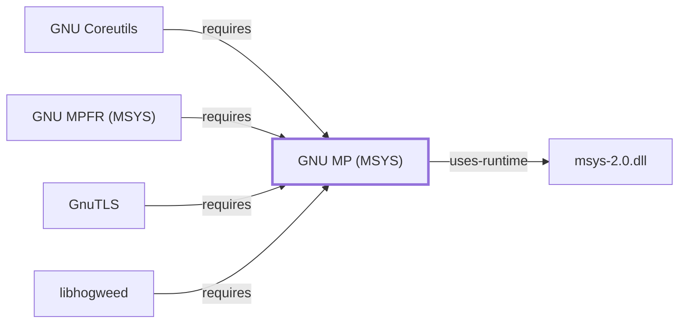

# GNU MP (MSYS)

## Purpose

This page documents the **MSYS-environment** GNU Multiple Precision
Arithmetic Library (GMP) package specifically, as a correction to an
explicitly flagged gap: [GnuTLS's own page](GNUTLS.md#dependencies)
stated it deliberately did not add a dependency edge to this knowledge
base's UCRT64 GMP entity because "those are the UCRT64-packaged versions
of the same-named libraries, not this MSYS package's actual
dependencies" — this page is that missing MSYS package, closing the
loop. It is also depended on by [GNU Coreutils's](GNU-COREUTILS.md)
`factor` utility for bignum support. See the
[official GMP project page](https://gmplib.org/) for the full reference.

## Architectural Classification

`library:gnu:gmp@msys` is packaged in the MSYS environment as
`package:msys2:gmp` (version `6.3.0-2` in the current catalog snapshot)
— the same version number as the UCRT64 sibling documented on
[GNU MP (UCRT64)](GNU-GMP.md), but a separately built, separate catalog
entity. This is the package [GnuTLS](GNUTLS.md) and
[GNU Coreutils](GNU-COREUTILS.md) actually depend on.

## Responsibilities

- Providing arbitrary-precision (bignum) arithmetic, consumed by
  [GnuTLS](GNUTLS.md) for public-key cryptographic operations and by
  [GNU Coreutils's](GNU-COREUTILS.md) `factor` utility for
  arbitrary-precision integer factorization.

## Boundaries

This page's package serves MSYS-environment consumers specifically; the
UCRT64 toolchain (documented on [GNU MP (UCRT64)](GNU-GMP.md)) links a
separate GMP package instead — the two are not interchangeable, matching
the same distinction already made for
[GNU libiconv (MSYS)](GNU-LIBICONV-MSYS.md) and other MSYS/UCRT64 pairs
in this volume.

## Interfaces

- The GMP C API (`mpz_*`, `mpq_*`, `mpf_*` function families for integer,
  rational, and floating-point arbitrary-precision arithmetic), the same
  interface [GNU MP (UCRT64)](GNU-GMP.md#interfaces) documents, per the
  documentation.

## Dependencies

The catalog snapshot records no `runtime-depends-on` edges for
`package:msys2:gmp` beyond standard MSYS runtime support.

## Reverse Dependencies

The catalog snapshot records 12 relationships targeting
`package:msys2:gmp`. Four are already modeled in this knowledge base:
`package:msys2:libgnutls`
(`relationship:foundation-libraries:gnutls-msys-requires-gmp-msys`),
`package:msys2:coreutils`
(`relationship:gnu-userland:coreutils-requires-gmp-msys`),
`package:msys2:mpfr`
(`relationship:foundation-libraries:mpfr-msys-requires-gmp-msys`,
documented fully in [GNU MPFR (MSYS)](GNU-MPFR-MSYS.md)), and
`package:msys2:libhogweed`
(`relationship:foundation-libraries:libhogweed-msys-requires-gmp-msys`,
documented fully in [Hogweed (MSYS)](LIBHOGWEED-MSYS.md)). The
remaining ~8 recorded dependents (`autogen`, `cocom`, `isl`, `libguile`,
and others, including the MSYS-native `gcc` and `mpc` toolchain packages)
are not individually modeled in this knowledge base; see the
[reverse dependency impact analysis](REVERSE-DEPENDENCY-IMPACT-ANALYSIS.md)
for the current full list.

## Configuration

GMP has no persistent configuration file; precision and rounding
behavior are set entirely through its C API by the calling program.

## Initialization and Execution Flow

As a library, GMP has no independent process lifecycle: it initializes
and executes within the process of whatever program links against it —
[GnuTLS](GNUTLS.md) or [GNU Coreutils's](GNU-COREUTILS.md) `factor` in
this dependency chain. As an MSYS-dependent library, this is adapted
from POSIX semantics onto Windows process primitives by `msys-2.0.dll`
per [MSYS Runtime Initialization](MSYS-RUNTIME-INITIALIZATION.md).

## Runtime Behavior

Identical functional behavior to [GNU MP (UCRT64)](GNU-GMP.md); see that
page for detail not specific to the MSYS/UCRT64 packaging distinction.

## Compatibility and Variants

The MSYS and native (UCRT64/CLANG64/i686) GMP packages are separately
versioned catalog entities (see Architectural Classification); code
built against one is not automatically compatible with the other
without matching the correct environment.

## Security Considerations

GMP is not itself a cryptographic library, but GnuTLS's use of it for
public-key arithmetic makes correctness here indirectly security-relevant
to GnuTLS's cryptographic operations. See
[Threat Model and Supply Chain](THREAT-MODEL-AND-SUPPLY-CHAIN.md) for the
project's general supply-chain posture; no version-qualified CVE review
has been performed for the recorded `6.3.0-2` version.

## Failure Modes and Diagnostics

GMP itself has no user-facing CLI; arbitrary-precision arithmetic
failures in a calling program (GnuTLS, `factor`) should be checked
against that program's own error handling before being treated as a GMP
defect.

## Evidence, Assumptions, and Open Questions

Arbitrary-precision arithmetic scope is backed by the official GMP
project page (`evidence:gnu:gmp-manual-2026-07-30`), the same evidence
record [GNU MP (UCRT64)](GNU-GMP.md) cites. Package identity, version,
and the two modeled dependent edges are backed by the pacman catalog
snapshot (`evidence:catalog:current`). Open, and explicitly out of scope
for this page: the ~10 remaining recorded dependents not individually
modeled, and header-level API surface / PE import/export-level evidence,
per the [Library Family Classification](LIBRARY-FAMILY-CLASSIFICATION.md)
methodology.

<!-- BEGIN GENERATED dependency-subgraph -->

## Dependency Diagram

Dependencies and dependents of `library:gnu:gmp@msys` in the composed graph: 4 dependents and 1 dependency.

Generated from the composed model by `tools/build_object_diagrams.py`.
Edits between the surrounding markers are overwritten on the next build.

<!-- END GENERATED dependency-subgraph -->

## Related Objects

- [MSYS2 Library Architecture](LIBRARIES-ARCHITECTURE.md)
- [GNU MP (UCRT64)](GNU-GMP.md)
- [GnuTLS](GNUTLS.md)
- [GNU Coreutils](GNU-COREUTILS.md)
- [GNU MPFR (MSYS)](GNU-MPFR-MSYS.md)
- [Hogweed (MSYS)](LIBHOGWEED-MSYS.md)
- [GMP (CLANG64)](GNU-GMP-CLANG64.md)
