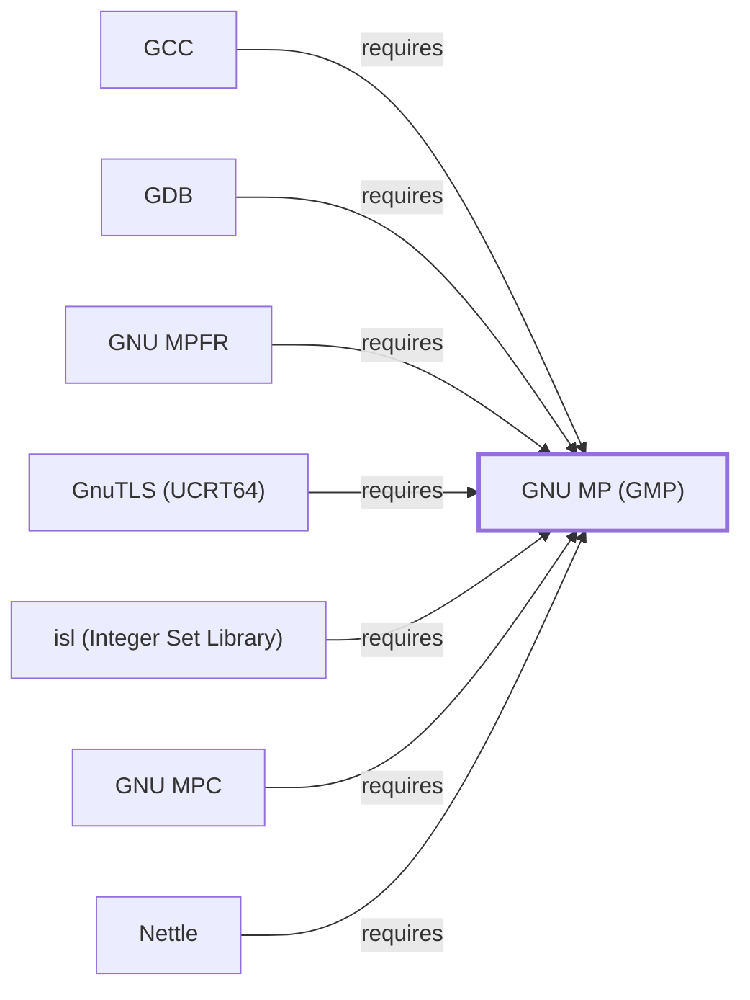

# GNU MP (GMP)

<!-- BEGIN GENERATED object-facts -->

| Model fact | Value |
| --- | --- |
| Object | `library:gnu:gmp` |
| Kind | `library` |
| Status | `partial` |
| Confidence | `high` |
| Authority | Free Software Foundation |
| Environments | `ucrt64` |
| Upstream | <https://gmplib.org/> |
| Packaged as | `package:msys2:mingw-w64-ucrt-x86_64-gmp` |
| Version (observed) | 6.3.0-2 |
| License (observed) | LGPL3;GPL |
| Architecture (observed) | any |
| Installed size (observed) | 3053.64 KiB |

**Evidence on this object**

- `evidence:catalog:current` — MSYS2 pacman package catalog (`observed`, retrieved 2026-08-05)
- `evidence:gnu:gmp-manual-2026-07-30` — GNU MP (official project site) (`primary`, retrieved 2026-07-30)

Generated from the composed model by `tools/build_object_facts.py`. Observed values come from the catalog snapshot and change when it is refreshed.
Edits between the surrounding markers are overwritten on the next build.

<!-- END GENERATED object-facts -->

## Purpose

GMP provides arbitrary-precision arithmetic on integers, rationals, and
floating-point numbers, and it is the base library underneath [GCC](GNU-GCC.md)'s
and [GDB](GNU-GDB.md)'s own arbitrary-precision needs as well as
[MPFR](GNU-MPFR.md), [MPC](GNU-MPC.md), and [isl](LIBISL.md), all of which
this page cites as dependents. This page documents its architectural role;
see the [official GMP project site](https://gmplib.org/) for the API
reference.

## Architectural Classification

`library:gnu:gmp` is a GNU-userland library, packaged per native
environment: this page cites the UCRT64 build,
`package:msys2:mingw-w64-ucrt-x86_64-gmp` (version `6.3.0-2` in the
current catalog snapshot, license `LGPL3;GPL`). This page is scoped to
Volume 6's package/dependency-level evidence; the fuller
[Library Family Classification](LIBRARY-FAMILY-CLASSIFICATION.md)
methodology has not been applied here and remains open.

## Responsibilities

- Providing arbitrary-precision integer, rational, and floating-point
  arithmetic as a foundation library that [MPFR](GNU-MPFR.md),
  [MPC](GNU-MPC.md), and [isl](LIBISL.md) all build on rather than
  reimplement, and that [GCC](GNU-GCC.md#dependencies) and
  [GDB](GNU-GDB.md#dependencies) use directly.

## Boundaries

GMP provides the arithmetic primitives; correctly-rounded floating-point
semantics are [MPFR](GNU-MPFR.md)'s added responsibility, and complex
numbers are [MPC](GNU-MPC.md)'s — GMP itself covers integers, rationals,
and floating-point without a rounding-mode guarantee.

## Interfaces

- The `mpz_*` (integers), `mpq_*` (rationals), and `mpf_*`
  (floating-point) C function families, per the documentation. This page
  does not enumerate the header-level surface; that belongs to
  [Header and Development-Metadata Indexes](HEADER-AND-METADATA-INDEXES.md).

## Dependencies

The catalog snapshot records no `runtime-depends-on` edges for
`package:msys2:mingw-w64-ucrt-x86_64-gmp` beyond its membership in the
UCRT64 repository and environment — GMP sits at the base of this
knowledge base's arbitrary-precision-arithmetic dependency chain, with
nothing beneath it.

## Reverse Dependencies

The snapshot records **71** relationships targeting
`package:msys2:mingw-w64-ucrt-x86_64-gmp`, including
[MPFR](GNU-MPFR.md#dependencies), [MPC](GNU-MPC.md#dependencies), and
[isl](LIBISL.md#dependencies) — each of which further extends this
library's reach to their own dependents, most notably
[GCC](GNU-GCC.md#dependencies). See the
[reverse dependency impact analysis](REVERSE-DEPENDENCY-IMPACT-ANALYSIS.md)
for the current full list.

## Configuration

GMP has no persistent configuration file or environment variables;
behavior (precision, memory allocation functions) is controlled through
its C API at the point of use.

## Initialization and Execution Flow

As a library, GMP has no independent process lifecycle: it initializes
and executes within the process of whatever program links against it, the
same model documented for [zlib](ZLIB.md#initialization-and-execution-flow).

## Runtime Behavior

GMP's arithmetic operations trade fixed-width integer performance for
unbounded precision; a program using GMP unnecessarily for small,
fixed-size values pays a real (if usually small) performance cost
relative to native integer types, a documented general trade-off of
arbitrary-precision libraries.

## Compatibility and Variants

GMP's C API is the base every dependent library in this cluster (MPFR,
MPC, isl) builds on; version compatibility across GMP releases is
documented in the project's own release notes and not restated here.

## Security Considerations

No GMP-specific vulnerability review has been performed for this volume;
given its 71 recorded dependents and its role underneath GCC's own
compilation process, a defect here would have a meaningfully wide blast
radius. See [Threat Model and Supply Chain](THREAT-MODEL-AND-SUPPLY-CHAIN.md)
for the project's general supply-chain posture; no version-qualified CVE
review has been performed for the recorded `6.3.0-2` version.

## Failure Modes and Diagnostics

GMP itself has no user-facing CLI; arithmetic-related failures in a
dependent tool (unexpected precision loss, allocation failures on very
large operands) should be triaged against that dependent's own
documentation first.

## Evidence, Assumptions, and Open Questions

The arithmetic model is backed by the official GMP project site
(`evidence:gnu:gmp-manual-2026-07-30`), matching the `project_url`
already recorded for `package:msys2:mingw-w64-ucrt-x86_64-gmp` in the
catalog. Package identity, version, license, and reverse-dependency count
are backed by the pacman catalog snapshot (`evidence:catalog:current`).
Open, and explicitly out of scope for this page: header-level API surface
and PE import/export-level evidence, per the
[Library Family Classification](LIBRARY-FAMILY-CLASSIFICATION.md)
methodology.

<!-- BEGIN GENERATED dependency-subgraph -->

## Dependency Diagram

Dependencies and dependents of `library:gnu:gmp` in the composed graph: 7 dependents and 0 dependencies.

Generated from the composed model by `tools/build_object_diagrams.py`.
Edits between the surrounding markers are overwritten on the next build.

<!-- END GENERATED dependency-subgraph -->

## Related Objects

- [MSYS2 Library Architecture](LIBRARIES-ARCHITECTURE.md)
- [GNU MPFR](GNU-MPFR.md)
- [GNU MPC](GNU-MPC.md)
- [isl (Integer Set Library)](LIBISL.md)
- [GCC](GNU-GCC.md)
- [GDB](GNU-GDB.md)
- [GnuTLS (UCRT64)](GNUTLS-UCRT64.md)
- [GMP (CLANG64)](GNU-GMP-CLANG64.md)
