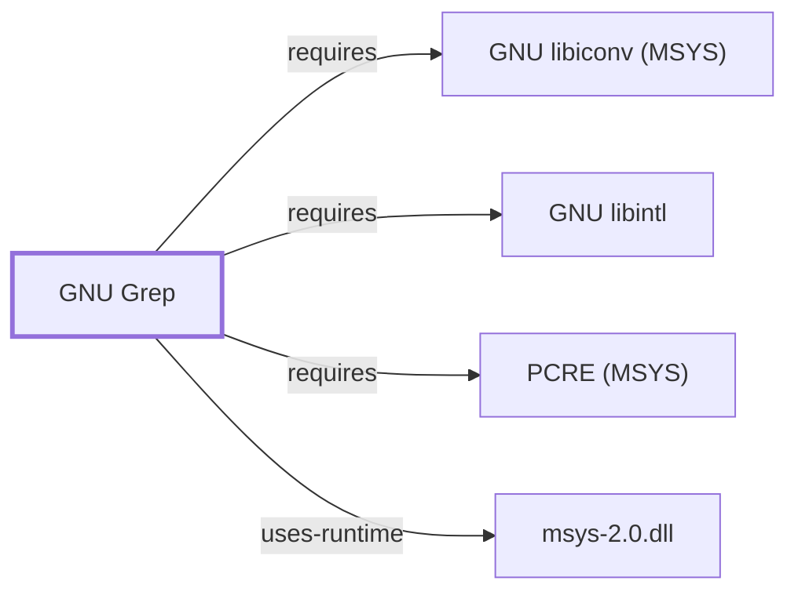

# GNU Grep

<!-- BEGIN GENERATED object-facts -->

| Model fact | Value |
| --- | --- |
| Object | `component:gnu:grep` |
| Kind | `component` |
| Status | `partial` |
| Confidence | `high` |
| Authority | Free Software Foundation |
| Environments | `msys` |
| Upstream | <https://www.gnu.org/software/grep/> |
| Packaged as | `package:msys2:grep` |
| Version (observed) | 1~3.0-7 |
| License (observed) | GPL3 |
| Architecture (observed) | x86_64 |
| Installed size (observed) | 849.5 KB |

**Evidence on this object**

- `evidence:catalog:current` — MSYS2 pacman package catalog (`observed`, retrieved 2026-07-29)
- `evidence:gnu:grep-manual-2026-07-30` — GNU Grep Manual (`primary`, retrieved 2026-07-30)

Generated from the composed model by `tools/build_object_facts.py`. Observed values come from the catalog snapshot and change when it is refreshed.
Edits between the surrounding markers are overwritten on the next build.

<!-- END GENERATED object-facts -->

## Purpose

Grep searches text streams and files for lines matching a pattern. This page
documents its architectural role, dependency footprint, and matching-engine
selection; see the
[official GNU Grep manual](https://www.gnu.org/software/grep/manual/grep.html)
for full regular-expression syntax.

## Architectural Classification

`component:gnu:grep` is a GNU-userland component packaged as
`package:msys2:grep` (version `1~3.0-7` in the current catalog snapshot,
license `GPL3`), belonging to the MSYS environment. It is a read-only,
single-purpose filter: unlike sed, it does not transform its input, and
unlike gawk, it has no scripting language of its own.

## Responsibilities

- Line-oriented pattern search using selectable regular-expression dialects
  (basic, extended, and Perl-compatible).
- Reporting match location, count, or context (`-n`, `-c`, `-A`/`-B`/`-C`) as
  read-only operations over its input.
- Recursive directory search (`-r`/`-R`) as a common composition point with
  `find`.

## Boundaries

Grep does not modify the files it searches. Composed pipelines that both
locate and edit content (for example `find ... -exec grep ...` followed by an
editing step) split those responsibilities across
[GNU Findutils](GNU-FINDUTILS.md) and [GNU Sed](GNU-SED.md) rather than
inside grep itself.

## Interfaces

- Matching-engine selection: `-G` (basic, default), `-E` (extended), `-F`
  (fixed strings), and `-P` (Perl-compatible, PCRE-backed), per the GNU Grep
  manual's discussion of supported regular-expression dialects.
- Exit status is a documented programmatic contract: `0` on a match found,
  `1` on no match, `2` on an error (bad option, unreadable file); scripts
  should check this distinction explicitly rather than treating any non-zero
  status as failure.
- `egrep`/`fgrep` are documented as deprecated aliases for `-E`/`-F` in
  current GNU grep.

## Dependencies

The catalog snapshot records three `runtime-depends-on` edges for
`package:msys2:grep`:

| Dependency | Package | Architectural reason |
| --- | --- | --- |
| Character-set conversion | `package:msys2:libiconv` | Portable multibyte/character-set handling, matching the same rationale documented for [GNU Coreutils](GNU-COREUTILS.md). Documented fully in [GNU libiconv (MSYS)](GNU-LIBICONV-MSYS.md). |
| Native-language messages | `package:msys2:libintl` | gettext-based message translation (NLS). Documented fully in [GNU libintl](GNU-LIBINTL.md). |
| Perl-compatible regex | `package:msys2:libpcre` | Backs grep's `-P`/`--perl-regexp` matching engine, per the GNU Grep manual's description of the PCRE-based matcher. Documented fully in [PCRE (MSYS)](PCRE-MSYS.md). |

grep's declared package dependencies also list `sh`, but this does not
appear as a fourth `runtime-depends-on` edge: `sh` is a virtual capability
(provided by `package:msys2:bash`, per
`claim:component:bash:provides-sh`), not an actual package name, so the
catalog import step cannot resolve it to a package ID and instead retains it
in `generated/unresolved-dependencies.json` rather than asserting a false
relationship, per the documented behavior in
[Self-Updating Knowledge Base](SELF-UPDATING-KNOWLEDGE-BASE.md). The
underlying fact — grep's build declares a dependency satisfied by whatever
package provides `sh` — is real; only its resolution to a specific package
ID is what remains unautomated.

## Reverse Dependencies

The snapshot records 4 relationships targeting `package:msys2:grep`. See the
[reverse dependency impact analysis](REVERSE-DEPENDENCY-IMPACT-ANALYSIS.md)
for the current full list.

## Configuration

Grep has no persistent configuration file. Behavior is controlled through
command-line flags and a small set of environment variables documented in
the manual: `GREP_COLORS` (match highlighting), `POSIXLY_CORRECT` (disables
some GNU extensions), and `LC_ALL`/`LANG` (locale-sensitive character
classes and collation in pattern matching). The historical `GREP_OPTIONS`
variable is documented as removed in current GNU grep.

## Initialization and Execution Flow

Grep is an invoke-run-exit process with no persistent session, launched
directly by a caller such as [GNU Bash](GNU-BASH.md) or a script. Process
creation for this MSYS-dependent binary is adapted from POSIX semantics onto
Windows process primitives by `msys-2.0.dll`, per
[MSYS Runtime Initialization](MSYS-RUNTIME-INITIALIZATION.md); this page does
not restate that mechanism.

## Runtime Behavior

The exit-status contract (`0`/`1`/`2`) above is grep's primary
runtime-behavior surface for scripting. Recursive search (`-r`) traverses the
filesystem through the same MSYS path-translation boundary described in the
[MSYS runtime behavior map](MSYS-RUNTIME-BEHAVIOR-MAP.md); this page does not
restate that boundary.

## Compatibility and Variants

The three matching dialects (BRE, ERE, PCRE) have materially different
metacharacter semantics per the manual; scripts moving from `-G` to `-E`
often need pattern rewrites (e.g. unescaped `+`/`?`/`|`). `-P` availability
depends on the build having PCRE support; the MSYS2 package's `libpcre`
dependency indicates it is built with `-P` support, but this has not been
directly exercised as a controlled observation for this snapshot.

## Security Considerations

Complex `-P`/PCRE patterns built from untrusted input can exhibit
catastrophic backtracking (ReDoS), a documented general risk of
backtracking regex engines rather than a grep-specific defect. See
[Threat Model and Supply Chain](THREAT-MODEL-AND-SUPPLY-CHAIN.md) for the
project's general supply-chain posture; no grep-specific CVE review has been
performed for the recorded `1~3.0-7` version.

## Failure Modes and Diagnostics

The most common scripting error is conflating "no match" (exit `1`) with an
actual error (exit `2`); scripts that only test for a zero/non-zero exit
status lose that distinction. Confirming the active locale (`LC_ALL`/`LANG`)
is the recommended first diagnostic step for unexpected character-class or
collation behavior.

## Evidence, Assumptions, and Open Questions

Matching-engine, exit-status, and option semantics are backed by the
official GNU Grep manual (`evidence:gnu:grep-manual-2026-07-30`). Package
identity, version, license, and dependency edges are backed by the pacman
catalog snapshot (`evidence:catalog:current`). The unresolved `sh` dependency
is explained by `generated/unresolved-dependencies.json`, not merely
asserted. Open: `-P` availability has not been directly exercised as a
controlled observation.

<!-- BEGIN GENERATED dependency-subgraph -->

## Dependency Diagram

Dependencies and dependents of `component:gnu:grep` in the composed graph: 0 dependents and 4 dependencies.

Generated from the composed model by `tools/build_object_diagrams.py`.
Edits between the surrounding markers are overwritten on the next build.

<!-- END GENERATED dependency-subgraph -->

## Related Objects

- [GNU Userland Role Model](GNU-USERLAND-ROLE-MODEL.md)
- [GNU Sed](GNU-SED.md)
- [GNU Findutils](GNU-FINDUTILS.md)
- [GNU libintl](GNU-LIBINTL.md)
- [PCRE (MSYS)](PCRE-MSYS.md)
- [GNU libiconv (MSYS)](GNU-LIBICONV-MSYS.md)
- [MSYS Runtime Initialization](MSYS-RUNTIME-INITIALIZATION.md)
