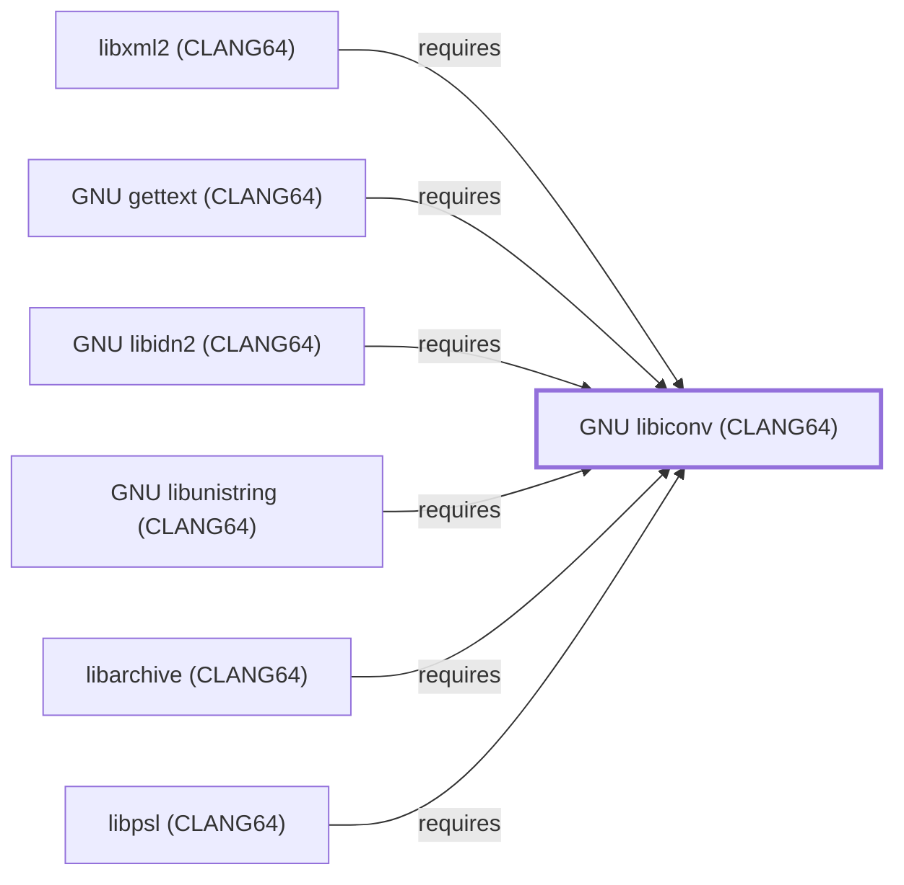

# GNU libiconv (CLANG64)

## Purpose

This page documents `package:msys2:mingw-w64-clang-x86_64-libiconv`,
the CLANG64-environment build of GNU libiconv — a character-set
conversion library, depended on by
[GNU gettext (CLANG64)](GNU-GETTEXT-CLANG64.md), the first entity
modeled from this batch's ca-certificates (CLANG64) dependency chain.
See the
[official GNU libiconv project page](https://www.gnu.org/software/libiconv/)
for the full reference.

## Architectural Classification

`library:gnu:libiconv@clang64` is packaged as
`package:msys2:mingw-w64-clang-x86_64-libiconv` (version `1.19-1` in
the current catalog snapshot, license `LGPL-2.1-or-later`) — a
separately built, separate catalog entity from
[GNU libiconv (UCRT64)](GNU-LIBICONV.md) and
[GNU libiconv (MSYS)](GNU-LIBICONV-MSYS.md). It belongs to the CLANG64
environment.

## Responsibilities

- Providing character-set conversion for CLANG64-native consumers, the
  same role [GNU libiconv (UCRT64)](GNU-LIBICONV.md#responsibilities)
  documents for its own environment.

## Boundaries

This page's package serves CLANG64-environment consumers specifically;
[GNU gettext (UCRT64)](GNU-GETTEXT.md) instead depends on
[GNU libiconv (UCRT64)](GNU-LIBICONV.md#reverse-dependencies) — the
two are not interchangeable, matching the same distinction already
drawn throughout this volume for MSYS/UCRT64/CLANG64 sibling packages.

## Interfaces

- The iconv C API (`iconv_open`, `iconv`, `iconv_close`), the same
  interface [GNU libiconv (UCRT64)](GNU-LIBICONV.md#interfaces)
  documents, per the documentation.

## Dependencies

The catalog snapshot records no `runtime-depends-on` edges for
`package:msys2:mingw-w64-clang-x86_64-libiconv` beyond standard
toolchain runtime support.

## Reverse Dependencies

The catalog snapshot records 78 relationships targeting
`package:msys2:mingw-w64-clang-x86_64-libiconv`. Six are now modeled
in this knowledge base: [libarchive (CLANG64)](LIBARCHIVE-CLANG64.md)
(`relationship:foundation-libraries:libarchive-clang64-requires-libiconv-clang64`,
added 2026-08-02), [GNU gettext (CLANG64)](GNU-GETTEXT-CLANG64.md)
(`relationship:foundation-libraries:gettext-clang64-requires-libiconv-clang64`,
added 2026-08-02), [libxml2 (CLANG64)](LIBXML2-CLANG64.md)
(`relationship:foundation-libraries:libxml2-clang64-requires-libiconv-clang64`,
added 2026-08-02, closing a gap that page had previously left
explicitly unmodeled), [GNU libunistring (CLANG64)](GNU-LIBUNISTRING-CLANG64.md)
(`relationship:foundation-libraries:libunistring-clang64-requires-libiconv-clang64`,
added 2026-08-02), [GNU libidn2 (CLANG64)](GNU-LIBIDN2-CLANG64.md)
(`relationship:foundation-libraries:libidn2-clang64-requires-libiconv-clang64`,
added 2026-08-02), and [libpsl (CLANG64)](LIBPSL-CLANG64.md)
(`relationship:foundation-libraries:libpsl-clang64-requires-libiconv-clang64`,
added 2026-08-02). The remaining ~72 are not individually modeled in
this knowledge base; see the
[reverse dependency impact analysis](REVERSE-DEPENDENCY-IMPACT-ANALYSIS.md)
for the current full list.

## Configuration

libiconv has no persistent configuration file; conversion behavior is
set entirely through its C API by the calling program.

## Initialization and Execution Flow

As a library, libiconv has no independent process lifecycle: it
initializes and executes within the process of whatever program links
against it — [GNU gettext (CLANG64)](GNU-GETTEXT-CLANG64.md) in this
dependency chain. As a native MinGW-w64 library, this process model is
Windows-facing directly rather than mediated by `msys-2.0.dll`.

## Runtime Behavior

Identical functional behavior to
[GNU libiconv (UCRT64)](GNU-LIBICONV.md#runtime-behavior); see that
page for detail not specific to the CLANG64/UCRT64 packaging
distinction.

## Compatibility and Variants

The CLANG64, UCRT64, and MSYS libiconv packages are three separately
versioned catalog entities (see Architectural Classification); code
built against one is not automatically compatible with another without
matching the correct package/environment.

## Security Considerations

No libiconv-specific vulnerability review has been performed for this
volume. See [Threat Model and Supply Chain](THREAT-MODEL-AND-SUPPLY-CHAIN.md)
for the project's general supply-chain posture; no version-qualified
CVE review has been performed for the recorded `1.19-1` version.

## Failure Modes and Diagnostics

A dependent program's character-conversion failure should be checked
against the actual source/target encodings requested before being
treated as a libiconv defect.

## Evidence, Assumptions, and Open Questions

Character-set conversion scope is backed by the official GNU libiconv
project page (`evidence:gnu:libiconv-manual-2026-07-30`), the same
evidence record [GNU libiconv (UCRT64)](GNU-LIBICONV.md) cites. Package
identity, version, license, and the six modeled dependent edges are
backed by the pacman catalog snapshot (`evidence:catalog:current`).
Open: the ~72 remaining recorded dependents are not individually
modeled in this knowledge base.

<!-- BEGIN GENERATED dependency-subgraph -->

## Dependency Diagram

Dependencies and dependents of `library:gnu:libiconv@clang64` in the composed graph: 6 dependents and 0 dependencies.

Generated from the composed model by `tools/build_object_diagrams.py`.
Edits between the surrounding markers are overwritten on the next build.

<!-- END GENERATED dependency-subgraph -->

## Related Objects

- [MSYS2 Library Architecture](LIBRARIES-ARCHITECTURE.md)
- [GNU libiconv (UCRT64)](GNU-LIBICONV.md)
- [GNU libiconv (MSYS)](GNU-LIBICONV-MSYS.md)
- [GNU gettext (CLANG64)](GNU-GETTEXT-CLANG64.md)
- [libxml2 (CLANG64)](LIBXML2-CLANG64.md)
- [GNU libunistring (CLANG64)](GNU-LIBUNISTRING-CLANG64.md)
- [GNU libidn2 (CLANG64)](GNU-LIBIDN2-CLANG64.md)
- [libarchive (CLANG64)](LIBARCHIVE-CLANG64.md)
- [libpsl (CLANG64)](LIBPSL-CLANG64.md)
